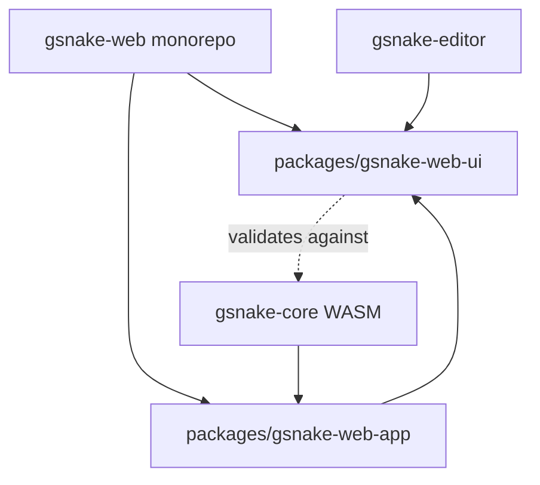

## Overview

This document describes the key developer and CI workflows for the shared design system architecture. The flows ensure seamless artstyle synchronization between gsnake-web and gsnake-editor while supporting both root repository and standalone checkout modes.

## Dependency Architecture

______________________________________________________________________

## Flow 1: Initial Setup - Root Repository Mode

**Trigger:** Developer clones the root gSnake repository with submodules

**Steps:**

1. Developer runs git clone with `--recurse-submodules` flag
1. Developer navigates to root directory and runs `npm install`
1. npm workspaces installs dependencies for all packages in gsnake-web monorepo
1. Auto-detection script in gsnake-web detects root repository context (checks for parent `.git` and sibling `gsnake-core`)
1. Auto-detection script in gsnake-editor detects root repository context
1. gsnake-editor's dependency is configured to use local path to gsnake-web-ui
1. Developer can now run dev servers for both gsnake-web-app and gsnake-editor simultaneously

**Outcome:** Both projects are ready for development with local file dependencies, enabling hot-reload across the shared design system

______________________________________________________________________

## Flow 2: Initial Setup - Standalone gsnake-editor Mode

**Trigger:** Developer clones only the gsnake-editor repository

**Steps:**

1. Developer runs git clone for gsnake-editor repository
1. Developer navigates to gsnake-editor directory and runs `npm install`
1. Auto-detection script runs as preinstall hook
1. Script detects standalone mode (no parent `.git` or sibling gsnake-web)
1. Script detects standalone mode and downloads a gsnake-web-ui snapshot archive from GitHub (main branch)
1. Script extracts the archive into a local vendor directory
1. npm installs gsnake-web-ui via a local file dependency to the vendored directory

**Outcome:** gsnake-editor is ready for standalone development with a vendored gsnake-web-ui snapshot from the main branch

______________________________________________________________________

## Flow 3: Updating Artstyle in Root Repository

**Trigger:** Developer wants to update styles, assets, or base components

**Steps:**

1. Developer opens gsnake-web-ui source files (CSS, SVG assets, or Svelte components)
1. Developer makes changes to styles or assets
1. Developer has both gsnake-web-app and gsnake-editor dev servers running
1. Vite hot-reload detects changes in gsnake-web-ui source files
1. Changes are immediately reflected in both running applications (dev workflow keeps gsnake-web-ui build/watch in sync so the experience is effectively hot-reload)
1. Developer visually verifies changes in both the game interface and level editor
1. Developer commits changes to gsnake-web repository
1. Changes are automatically available to gsnake-editor on next pull from main

**Outcome:** Artstyle updates propagate instantly during root-repo development and flow to standalone consumers via updated vendored snapshots (pulled from main)

______________________________________________________________________

## Flow 4: Adding New Game Object with Visual Element

**Trigger:** Developer adds a new game object type that needs visual representation

**Steps:**

1. Developer adds new enum value to WASM CellType definition
1. Developer creates corresponding SVG sprite in gsnake-web-ui assets with matching ID
1. Developer runs build for gsnake-web-ui
1. Build process triggers bidirectional validation check
1. Validation verifies every WASM CellType has a sprite AND no orphaned sprites exist
1. If validation passes, build succeeds
1. If validation fails, build fails with clear error message indicating missing or extra sprites
1. Developer fixes discrepancies and rebuilds until validation passes

**Outcome:** Game objects and visual elements stay perfectly synchronized, preventing runtime errors from missing sprites

______________________________________________________________________

## Flow 5: gsnake-web CI - Standalone Build

**Trigger:** Pull request or push to gsnake-web repository

**Steps:**

1. CI checks out gsnake-web repository
1. CI runs npm install with npm workspaces
1. CI builds gsnake-web-ui package
1. Build process runs game objects validation (WASM types ↔ SVG sprites)
1. If validation fails, CI fails with error details
1. CI builds gsnake-web-app package (depends on gsnake-web-ui)
1. CI runs tests for both packages
1. CI runs E2E tests if applicable

**Outcome:** Ensures gsnake-web monorepo builds correctly in isolation and maintains sprite-WASM synchronization

______________________________________________________________________

## Flow 6: gsnake-editor CI - Standalone Build

**Trigger:** Pull request or push to gsnake-editor repository

**Steps:**

1. CI checks out gsnake-editor repository
1. CI runs npm install
1. Auto-detection script detects standalone mode
1. Script downloads and vendors gsnake-web-ui from GitHub (latest main branch snapshot)
1. npm installs dependencies including the vendored gsnake-web-ui via local file dependency
1. CI builds gsnake-editor
1. CI runs tests
1. If gsnake-web-ui introduced breaking changes, build or tests may fail
1. Developer must update gsnake-editor to fix compatibility

**Outcome:** Validates gsnake-editor can build standalone with latest gsnake-web-ui from main branch

______________________________________________________________________

## Flow 7: Root Repository E2E Integration Tests

**Trigger:** Pull request or push to root gSnake repository

**Steps:**

1. CI checks out root repository with all submodules
1. CI builds WASM from gsnake-core
1. CI installs dependencies for all projects using npm workspaces
1. CI builds gsnake-web monorepo (both packages)
1. CI builds gsnake-editor with local gsnake-web-ui dependency
1. CI starts both gsnake-web-app and gsnake-editor servers
1. CI runs Playwright E2E tests that interact with both applications
1. Tests verify visual consistency and integration between game and editor

**Outcome:** Ensures the complete system works together with shared design system in root repository mode

______________________________________________________________________

## Flow 8: Handling Breaking Changes in gsnake-web-ui

**Trigger:** Developer makes breaking changes to gsnake-web-ui (e.g., renaming CSS classes, changing component APIs)

**Steps:**

1. Developer updates gsnake-web-ui with breaking changes
1. Developer updates gsnake-web-app to accommodate changes
1. Developer tests locally in root repository mode
1. Developer commits and pushes changes to gsnake-web
1. gsnake-web CI passes (both packages updated together)
1. gsnake-editor CI runs against latest main branch
1. gsnake-editor CI fails due to breaking changes
1. Developer (same or different) updates gsnake-editor to fix compatibility
1. Developer commits fix to gsnake-editor
1. gsnake-editor CI passes

**Outcome:** Breaking changes are acceptable and expected; gsnake-editor must be updated to maintain compatibility

______________________________________________________________________

## Flow 9: Atomic Migration of gsnake-editor

**Trigger:** Initial implementation of shared design system dependency

**Steps:**

1. Developer creates feature branch in gsnake-editor
1. Developer adds gsnake-web-ui dependency with auto-detection script
1. Developer removes all existing editor styles (dark theme)
1. Developer imports gsnake-web-ui styles (light theme)
1. Developer rebuilds all editor components from scratch using gsnake-web-ui base components
1. Developer updates all editor-specific components to use shared Modal and Overlay
1. Developer tests complete editor functionality with new styling
1. Developer verifies visual consistency with gsnake-web-app
1. Developer creates single pull request with complete migration
1. After review and approval, migration is merged atomically

**Outcome:** Editor completely adopts shared design system in one coordinated change, ensuring no partial migration state

______________________________________________________________________

## Key Design Decisions

### Hot-Reload Development Experience

Changes to gsnake-web-ui source files are immediately visible in both consuming applications without rebuild, enabling rapid iteration on shared styles and components.

### Bidirectional Validation

The validation check ensures perfect synchronization between WASM game object types and visual sprites, preventing both missing sprites and orphaned assets.

### No Version Pinning

gsnake-editor always uses latest gsnake-web-ui from main branch, accepting that breaking changes may require updates. This keeps the design system unified without version drift.

### Precompiled Consumption

For cross-repo reliability, gsnake-web-ui components are consumed as precompiled JS (while still providing shared styles and assets). In root-repo development, the workflow preserves an effectively hot-reload experience by keeping gsnake-web-ui outputs in sync during development.

### npm Workspaces

The monorepo uses npm workspaces for simple, standard dependency management without additional tooling complexity.
