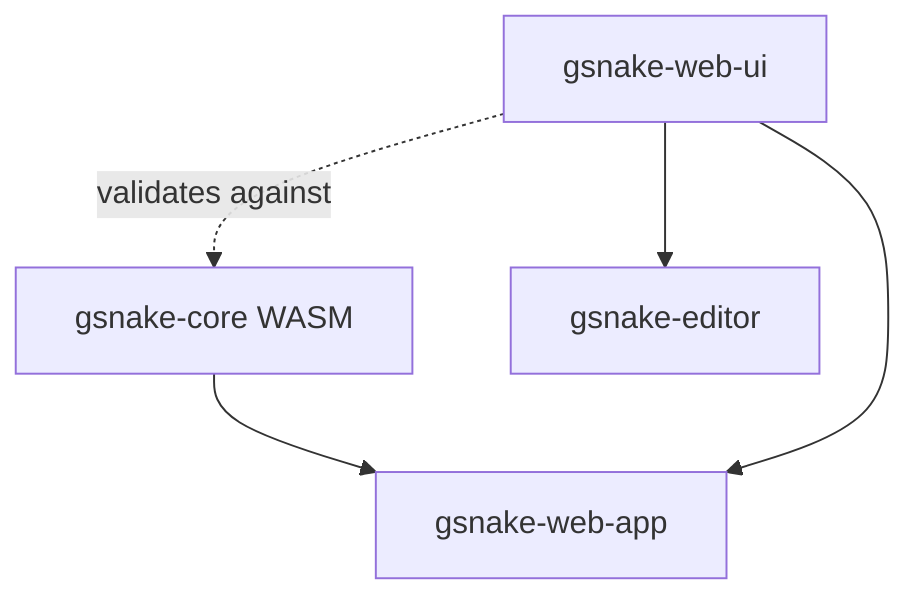

## Architectural Approach

### Monorepo Strategy

**Decision:** Transform gsnake-web into an npm workspaces monorepo with two packages:

- `packages/gsnake-web-ui` - Shared design system library (styles, assets, base components)
- `packages/gsnake-web-app` - Game application (consumes gsnake-web-ui)

**Rationale:**

- **Single source of truth**: All visual design lives in one place (gsnake-web-ui)
- **Unified toolchain**: Aligning both apps on Svelte 5 reduces integration risk for shared UI primitives
- **Simplified dependency management**: npm workspaces handles internal linking automatically
- **Reliable consumption**: gsnake-web-ui provides precompiled outputs so consumers don’t need to compile Svelte from dependencies

**Trade-offs:**

- ✅ Simpler than separate repositories (no version management, no publishing)
- ✅ Faster development (hot-reload across packages)
- ❌ Larger checkout size for standalone gsnake-web (includes both packages)
- ❌ Breaking changes in gsnake-web-ui immediately affect gsnake-web-app

### Svelte Version Alignment

**Decision:** Upgrade gsnake-web-app to Svelte 5 so gsnake-web and gsnake-editor share the same major Svelte version.

**Rationale:**

- Avoids cross-version compilation/runtime mismatches when sharing UI primitives
- Simplifies gsnake-web-ui packaging and consumption

### Dependency Resolution Strategy

**Decision:** Use auto-detection scripts to switch between local file paths and git dependencies based on repository context.

**Root Repository Mode:**

- gsnake-editor detects parent `.git` and sibling `gsnake-web` directory
- Configures dependency: `"gsnake-web-ui": "../gsnake-web/packages/gsnake-web-ui"`
- Changes in gsnake-web-ui immediately visible via hot-reload

**Standalone Mode:**

- gsnake-editor detects absence of root repository
- Downloads a gsnake-web-ui snapshot archive from GitHub (main branch) into `vendor/gsnake-web-ui`
- Configures dependency: `"gsnake-web-ui": "./vendor/gsnake-web-ui"`

**Rationale:**

- Mirrors existing pattern in gsnake-web's `detect-local-deps.js`
- No manual configuration needed - works automatically in both modes
- Always uses latest from main (no version drift)

**Trade-offs:**

- ✅ Seamless developer experience in both modes
- ✅ No version pinning complexity
- ❌ Breaking changes in gsnake-web-ui can break gsnake-editor CI
- ❌ Requires network access for standalone builds

### Validation Strategy

**Decision:** Bidirectional validation ensuring perfect synchronization between WASM CellType enum and SVG sprite symbols.

**Validation Process:**

1. Parse TypeScript types file to extract CellType union values
1. Parse SVG file using XML/DOM parser to extract symbol IDs
1. Check every CellType has corresponding sprite
1. Check no orphaned sprites exist (no sprite without CellType)
1. Fail build if any mismatch detected

**Script Location:** Root `gsnake-web/scripts/validate-sprites.js`

**Execution:** Runs as part of gsnake-web-ui build process (prebuild hook)

**Rationale:**

- Prevents runtime errors from missing sprites
- Catches design drift early (at build time, not runtime)
- Enforces contract between WASM and UI layers
- TypeScript types are canonical source (auto-generated from Rust)

**Trade-offs:**

- ✅ Catches errors before deployment
- ✅ Self-documenting (validation script shows exact requirements)
- ❌ Requires adding missing FallingFood sprite
- ❌ Build fails if sprites and types diverge

### Precompiled Consumption Pattern

**Decision:** gsnake-web-ui is built into precompiled JS (for components) and emitted CSS/assets, so consuming apps do not need to compile `.svelte` files from dependencies.

**Rationale:**

- Improves cross-repo reliability (standalone editor doesn’t need special Vite/Svelte dependency compilation config)
- Still supports rapid iteration in root-repo mode by running gsnake-web-ui in watch mode during development

**Trade-offs:**

- ✅ Consumers import plain JS + CSS
- ✅ Reduces Svelte-tooling coupling across repos
- ❌ Adds a build step for gsnake-web-ui
- ❌ Dev workflow must keep gsnake-web-ui outputs up to date (watch)

______________________________________________________________________

## Data Model

### Package Structure

```
gsnake-web/
├── package.json                    # Root workspace configuration
├── scripts/
│   └── validate-sprites.js         # Sprite-WASM validation script
├── packages/
│   ├── gsnake-web-ui/
│   │   ├── package.json            # Shared library package
│   │   ├── index.js                # Single entry point (exports everything)
│   │   ├── styles/
│   │   │   └── app.css             # Base styles (light theme)
│   │   ├── assets/
│   │   │   └── sprites.svg         # Game object sprites (+ FallingFood)
│   │   └── components/
│   │       ├── Modal.svelte        # Generic modal with slots
│   │       └── Overlay.svelte      # Generic overlay with slots
│   └── gsnake-web-app/
│       ├── package.json            # Game application package
│       ├── components/             # Game-specific components
│       ├── engine/                 # WASM integration
│       ├── stores/                 # Game state management
│       └── types/                  # TypeScript types (from WASM)
```

### npm Workspaces Configuration

**Root package.json:**

```json
{
  "name": "gsnake-web",
  "private": true,
  "workspaces": [
    "packages/gsnake-web-ui",
    "packages/gsnake-web-app"
  ]
}
```

**gsnake-web-app/package.json:**

```json
{
  "dependencies": {
    "gsnake-web-ui": "../gsnake-web-ui",
    "gsnake-wasm": "../../gsnake-core/engine/bindings/wasm/pkg"
  }
}
```

**gsnake-web-ui/package.json:**

```json
{
  "name": "gsnake-web-ui",
  "version": "0.1.0",
  "type": "module",
  "main": "index.js",
  "scripts": {
    "prebuild": "node ../../scripts/validate-sprites.js"
  }
}
```

### Dependency Graph



**Key Relationships:**

- gsnake-web-ui has NO dependencies (pure UI library)
- gsnake-web-app depends on both gsnake-web-ui and gsnake-wasm
- gsnake-editor depends only on gsnake-web-ui (no WASM)
- Validation script checks gsnake-web-ui sprites against WASM types

### Auto-Detection in gsnake-editor

**gsnake-editor/scripts/detect-gsnake-web-ui.js:**

Detection logic:

1. Check if `../../.git` exists (root repo indicator)
1. Check if `../gsnake-web/packages/gsnake-web-ui/package.json` exists
1. If both exist → Root repository mode
1. Otherwise → Standalone mode

**Root mode dependency:**

```json
"gsnake-web-ui": "../gsnake-web/packages/gsnake-web-ui"
```

**Standalone mode dependency:**

```json
"gsnake-web-ui": "./vendor/gsnake-web-ui"
```

______________________________________________________________________

## Component Architecture

### gsnake-web-ui Exports

**Single Entry Point (index.js):**

```javascript
// Apply base styles by default (side-effect import)
import './styles/app.css';

// Assets
export { default as spritesUrl } from './assets/sprites.svg?url';

// Components (precompiled outputs)
export { default as Modal } from './dist/Modal.js';
export { default as Overlay } from './dist/Overlay.js';
```

**Import Pattern in Consuming Apps:**

```javascript
import { Modal, Overlay, appStyles, spritesUrl } from 'gsnake-web-ui';
```

### Base Component Design

**Modal Component:**

- Generic container with backdrop
- Slots for header, content, footer
- Props: `open` (boolean), `onClose` (callback)
- No game-specific logic

**Overlay Component:**

- Full-screen overlay with centered content
- Slot for content
- Props: `visible` (boolean), `transparent` (boolean)
- No game-specific logic

**Design Principle:** Base components provide structure and styling, consumers provide content and behavior.

### Integration Points

**gsnake-web-app Integration:**

1. Import base styles from gsnake-web-ui
1. Import SpriteLoader pattern (or create game-specific wrapper)
1. Build game-specific modals using base Modal component
1. Maintain existing game engine, stores, and WASM integration

**gsnake-editor Integration:**

1. Remove existing `src/app.css` (dark theme)
1. Import and apply gsnake-web-ui styles (light theme)
1. Rebuild all editor components from scratch:

- Use base Modal for SaveLevelModal, HelpModal, GridSizeModal
- Use base Overlay for loading states
- Rebuild EntityPalette, EditorLayout, GridCanvas with new styling

4. Import sprites for level preview/validation

### Validation Script Architecture

**validate-sprites.js:**

**Inputs:**

- `packages/gsnake-web-ui/assets/sprites.svg` - SVG file to validate
- `packages/gsnake-web-app/types/models.ts` - TypeScript types (CellType union)

**Process:**

1. Read and parse TypeScript types file
1. Extract CellType union values using regex: `type CellType = "A" | "B" | ...`
1. Read and parse SVG file using XML parser (e.g., jsdom or xmldom)
1. Extract all `<symbol id="...">` attributes
1. Compare sets bidirectionally
1. Report missing sprites or orphaned sprites

**Output:**

- Exit code 0 if validation passes
- Exit code 1 with error message if validation fails

**Error Messages:**

- "Missing sprites for CellType values: [X, Y, Z]"
- "Orphaned sprites without CellType: [A, B, C]"

### Missing Sprite Addition

**FallingFood Sprite:**

- Add to `packages/gsnake-web-ui/assets/sprites.svg`
- Design: Similar to Food sprite but with downward motion indicators (chevrons or arrows)
- Ensures validation passes (all 10 CellType values have sprites)

### CI Integration

**gsnake-web CI:**

1. Checkout repository
1. Run `npm install` (workspaces install both packages)
1. Run validation script (prebuild hook in gsnake-web-ui)
1. Build gsnake-web-app (depends on gsnake-web-ui)
1. Run tests

**gsnake-editor CI:**

1. Checkout repository
1. Run auto-detection script (preinstall hook)
1. Run `npm install` (uses local file dependency in root-repo mode; uses vendored snapshot in standalone mode)
1. Build gsnake-editor
1. Run tests

**Root Repository E2E:**

1. Checkout with submodules
1. Build WASM
1. Install all dependencies (workspaces + submodules)
1. Build both gsnake-web and gsnake-editor
1. Run Playwright E2E tests

### Migration Strategy

**gsnake-editor Atomic Migration:**

1. Add auto-detection script
1. Add gsnake-web-ui dependency
1. Remove existing `src/app.css`
1. Import gsnake-web-ui styles in main entry point
1. Rebuild all components using base Modal/Overlay
1. Update all styling to match light theme
1. Test complete functionality
1. Submit as single PR

**Rollback Plan:** If migration fails, revert single PR to restore dark theme and independent styling.

______________________________________________________________________

## Key Technical Constraints

1. **No Version Pinning:** gsnake-editor always uses latest gsnake-web-ui from main branch
1. **Breaking Changes Acceptable:** gsnake-editor must be updated when gsnake-web-ui changes
1. **E2E Tests Must Pass:** Root repository integration tests validate complete system
1. **Standalone CI Must Pass:** Both gsnake-web and gsnake-editor must build independently
1. **Hot-Reload Required:** Changes in gsnake-web-ui must be immediately visible in development
1. **Precompiled Distribution:** gsnake-web-ui ships compiled JS + CSS/assets so consumers do not compile Svelte sources from dependencies

&#160;
