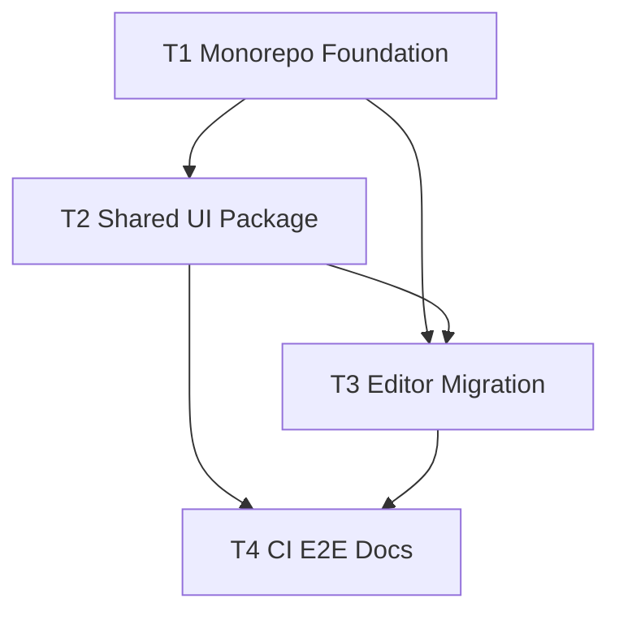

## Ticket Breakdown

Primary focus inferred from request: implement the full artstyle synchronization epic end-to-end with the smallest practical set of story-sized tickets.

## Proposed Tickets

1. [T1 - Restructure gsnake-web into a workspace monorepo](./t1-restructure-gsnake-web-monorepo.md)
1. [T2 - Build the shared gsnake-web-ui design system package](./t2-build-gsnake-web-ui-design-system.md)
1. [T3 - Migrate gsnake-editor to consume gsnake-web-ui](./t3-migrate-gsnake-editor-to-shared-ui.md)
1. [T4 - Harden CI/E2E integration and update docs](./t4-harden-ci-e2e-and-docs.md)

## Dependency Diagram

## Why This Grouping

- Grouped by implementation layer, not by individual files/functions.
- Keeps ticket count minimal while preserving meaningful ownership boundaries.
- Allows parallelization only where safe (`T2` can start after `T1`; `T4` starts after both integration tickets stabilize).
