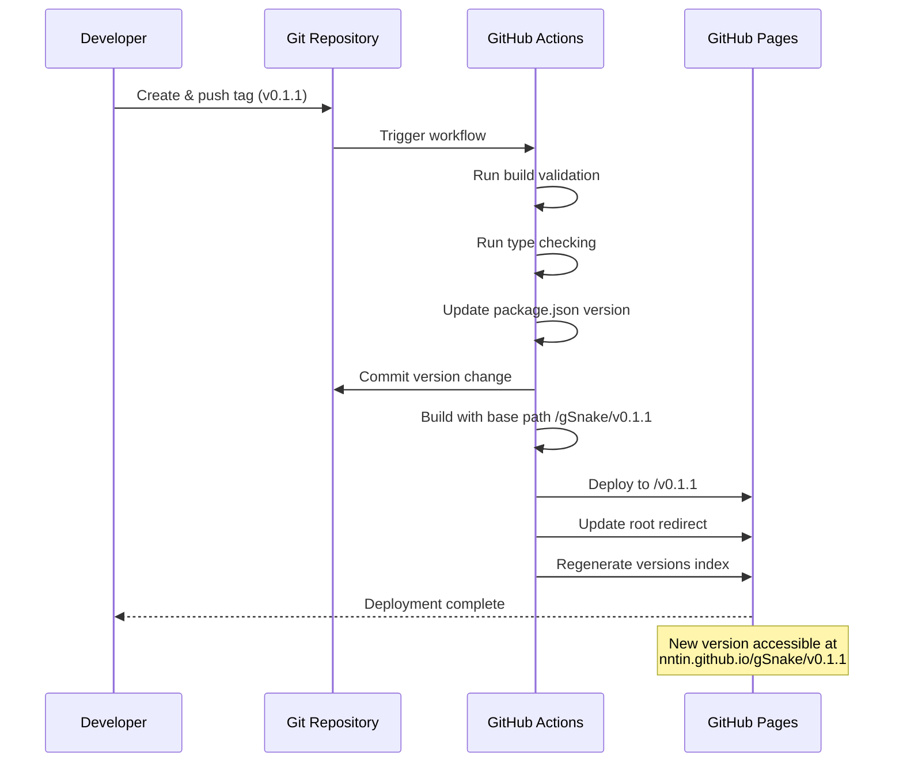

## Overview

This spec defines the user flows for accessing and deploying gSnake through GitHub Pages. The experience is intentionally minimal—no version management UI, seamless redirects, and simple version discovery through external documentation.

______________________________________________________________________

## Flow 1: Player Accessing Game via Root URL

**Description**: The most common entry point—players receive a link to the game and want to play the latest stable version.

**Trigger**: Player visits `nntin.github.io/gSnake`

**Steps**:

1. Player navigates to root URL in browser
1. JavaScript redirect executes instantly (no loading screen or delay)
1. Browser URL changes to latest version (e.g., `nntin.github.io/gSnake/v0.1.1`)
1. Game loads and player can start playing
1. No visual indication of version in game UI—version only visible in URL bar

**Exit**: Player plays the game or closes the browser

______________________________________________________________________

## Flow 2: Player Accessing Specific Version

**Description**: Player has a direct link to a specific version (from bookmark, shared link, or versions page).

**Trigger**: Player visits versioned URL (e.g., `nntin.github.io/gSnake/v0.1.1`)

**Steps**:

1. Player navigates to versioned URL in browser
1. Game loads directly at that version
1. No redirect occurs—URL remains unchanged
1. Player plays the game at that specific version
1. No visual distinction between versions—gameplay experience identical

**Exit**: Player plays the game or closes the browser

______________________________________________________________________

## Flow 3: Player Accessing Non-Existent Version

**Description**: Player attempts to access a version that doesn't exist or has been mistyped.

**Trigger**: Player visits invalid versioned URL (e.g., `nntin.github.io/gSnake/v99.99.99`)

**Steps**:

1. Player navigates to non-existent version URL in browser
1. GitHub Pages serves default 404 page
1. Player realizes the version doesn't exist
1. Player can navigate back or try a different URL

**Exit**: Player leaves the 404 page

**Note**: No custom 404 handling is implemented. GitHub Pages' default 404 page is used for simplicity.

______________________________________________________________________

## Flow 4: Player Exploring Version History

**Description**: Player wants to see all available versions and choose which one to play.

**Trigger**: Player visits `nntin.github.io/gSnake/versions` (discovered through external documentation)

**Steps**:

1. Player navigates to versions index page
1. Page displays list of all tagged versions with release dates
1. Versions shown in reverse chronological order (newest first)
1. Each version is a clickable link
1. Player clicks on desired version
1. Browser navigates to that version's URL
1. Game loads at selected version

**Exit**: Player is now in Flow 2 (playing specific version)

```wireframe
<!DOCTYPE html>
<html>
<head>
<style>
  body {
    font-family: -apple-system, BlinkMacSystemFont, 'Segoe UI', sans-serif;
    max-width: 800px;
    margin: 40px auto;
    padding: 20px;
    background: #f5f5f5;
  }
  h1 {
    color: #333;
    margin-bottom: 10px;
  }
  .subtitle {
    color: #666;
    margin-bottom: 30px;
  }
  .version-list {
    background: white;
    border-radius: 8px;
    padding: 20px;
    box-shadow: 0 2px 4px rgba(0,0,0,0.1);
  }
  .version-item {
    padding: 15px;
    border-bottom: 1px solid #eee;
    display: flex;
    justify-content: space-between;
    align-items: center;
  }
  .version-item:last-child {
    border-bottom: none;
  }
  .version-item:hover {
    background: #f9f9f9;
  }
  .version-number {
    font-size: 18px;
    font-weight: 600;
    color: #0066cc;
    text-decoration: none;
  }
  .version-number:hover {
    text-decoration: underline;
  }
  .version-date {
    color: #666;
    font-size: 14px;
  }
  .latest-badge {
    background: #4CAF50;
    color: white;
    padding: 4px 8px;
    border-radius: 4px;
    font-size: 12px;
    margin-left: 10px;
  }
</style>
</head>
<body>
  <h1>gSnake Versions</h1>
  <p class="subtitle">All released versions of gSnake</p>
  
  <div class="version-list">
    <div class="version-item" data-element-id="version-item-latest">
      <div>
        <a href="/gSnake/v0.2.0" class="version-number" data-element-id="version-link-v0.2.0">
          v0.2.0
          <span class="latest-badge">Latest</span>
        </a>
      </div>
      <div class="version-date">January 13, 2026</div>
    </div>
    
    <div class="version-item" data-element-id="version-item-2">
      <div>
        <a href="/gSnake/v0.1.1" class="version-number" data-element-id="version-link-v0.1.1">v0.1.1</a>
      </div>
      <div class="version-date">January 10, 2026</div>
    </div>
    
    <div class="version-item" data-element-id="version-item-3">
      <div>
        <a href="/gSnake/v0.1.0" class="version-number" data-element-id="version-link-v0.1.0">v0.1.0</a>
      </div>
      <div class="version-date">January 5, 2026</div>
    </div>
  </div>
</body>
</html>
```

______________________________________________________________________

## Flow 5: Developer Testing Main Branch

**Description**: Developer needs to test the latest development build on any device without local setup.

**Trigger**: Developer visits `nntin.github.io/gSnake/main`

**Steps**:

1. Developer navigates to main branch URL
1. Game loads with latest code from main branch
1. No visual distinction from versioned releases—identical appearance
1. Developer tests new features or changes
1. Can test on any device with browser access

**Exit**: Developer finishes testing or closes browser

______________________________________________________________________

## Flow 6: Developer Deploying New Version

**Description**: Developer releases a new version of the game, making it publicly accessible.

**Trigger**: Developer creates and pushes a Git tag (e.g., `v0.1.1`)

**Steps**:

1. Developer creates Git tag locally with semantic version format
1. Developer pushes tag to GitHub repository
1. GitHub Actions workflow automatically triggers
1. Workflow runs build validation and type checking
1. Workflow updates `package.json` version to match tag
1. Workflow commits version change back to the branch where the tag was created
1. Workflow builds the game with correct base path
1. Workflow deploys to GitHub Pages at `/v{version}` path
1. Workflow updates root redirect to point to new version
1. Workflow regenerates versions index page with new entry
1. New version is now accessible at its versioned URL
1. Root URL now redirects to this new version

**Exit**: Version is deployed and accessible to all user **Exit**: Version is deployed and accessible to all users

**Exit**: Version is deployed and accessible to all user**Deployment Feedback**: Developer checks GitHub Actions UI to verify deployment success or investigate failures. No custom notifications are provided beyond GitHub's standard workflow notifications.



______________________________________________________________________

## Flow 7: Developer Deploying Main Branch

**Description**: Developer pushes changes to main branch, updating the development build.

**Trigger**: Developer pushes commits to main branch

**Steps**:

1. Developer pushes commits to main branch
1. GitHub Actions workflow automatically triggers
1. Workflow runs build validation and type checking
1. Workflow builds the game with base path `/gSnake/main`
1. Workflow deploys to GitHub Pages at `/main` path
1. Main branch build is updated and accessible
1. No changes to versioned releases or root redirect

**Exit**: Main branch deployment updated, accessible for testin **Exit**: Main branch deployment updated, accessible for testing

**Exit**: Main branch deployment updated, accessible for testin**Deployment Feedback**: Developer checks GitHub Actions UI to verify deployment success or investigate failures. No custom notifications are provided beyond GitHub's standard workflow notifications.

______________________________________________________________________

## Key Design Decisions

**Minimal UI**: No version indicators, navigation, or development badges in the game UI. Version information exists only in URLs.

**Seamless Redirects**: Root URL redirect is instant with no loading screens or intermediate pages.

**External Discovery**: Versions page is not linked from game UI—discovery happens through external documentation.

**Identical Experiences**: Main branch and versioned releases look identical—no visual distinction.

**Automatic Version Management**: Workflow handles all version updates, redirects, and index generation automatically.
