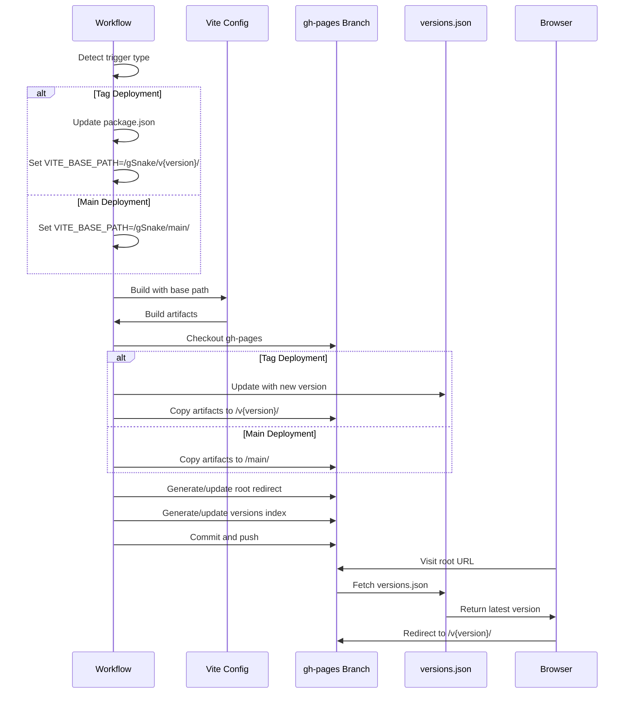

## Architectural Approach

### Core Design Pattern

**Single Workflow with Conditional Execution**: A unified GitHub Actions workflow handles both main branch and tag deployments through conditional logic. This provides a single source of truth while maintaining clear separation between deployment modes.

**GitHub Pages Action for Deployment**: Uses the `peaceiris/actions-gh-pages` action to manage gh-pages branch deployment, providing robust handling of edge cases (branch creation, force push, etc.) while maintaining simplicity.

**Environment-Driven Configuration**: Vite base path configuration is injected via environment variables at build time, avoiding source file modifications and enabling dynamic path configuration per deployment.

### Key Architectural Decisions

**1. Workflow Trigger Strategy**

The workflow responds to two distinct triggers:

- `push` events on the `main` branch → development deployment to `/main`
- `push` events with tag pattern `v*.*.*` → versioned deployment to `/v{version}`

Conditional steps execute based on the trigger type, with shared validation logic and divergent deployment paths.

**Trade-off**: Single workflow increases complexity with conditionals but reduces maintenance burden and ensures consistency across deployment modes.

**2. Version Registry Pattern**

A JSON file (`versions.json`) in the gh-pages branch serves as the authoritative version registry. This file contains:

- List of all deployed versions with timestamps
- Explicit `latestVersion` field for root redirect target

The workflow updates this registry atomically during each versioned deployment, automatically setting the new version as latest.

**Trade-off**: JSON file approach is simple and self-contained but requires validation on each deployment to prevent corruption.

**Error Handling**: Workflow validates versions.json structure before updating. If invalid or corrupted, deployment fails with clear error message requiring manual fix.

**3. Deployment Atomicity and Concurrency Control**

The workflow uses GitHub Actions concurrency groups to serialize deployments, preventing conflicts from simultaneous runs:

```yaml
concurrency:
  group: github-pages-deployment
  cancel-in-progress: false
```

Each deployment is atomic—either fully succeeds or fully fails. The GitHub Pages action handles the deployment process:

1. Prepares deployment directory with build artifacts
2. Updates metadata files (versions.json for tag deployments)
3. Generates static pages (root redirect, versions index)
4. Commits and pushes to gh-pages branch atomically

If any step fails, the entire deployment is rolled back, preventing partial deployment states.

**4. Base Path Injection**

Vite's base path is configured via the `VITE_BASE_PATH` environment variable, read by file:vite.config.ts:

```typescript
base: process.env.VITE_BASE_PATH || '/'
```

The workflow sets this variable before building:

- Main branch: `VITE_BASE_PATH=/gSnake/main/`
- Tagged version: `VITE_BASE_PATH=/gSnake/v{version}/`

**Trade-off**: Environment variable approach is clean but requires vite.config.ts modification. Alternative command-line flag (`--base`) would avoid config changes but is less explicit.

**5. Package Version Synchronization**

For tagged deployments, the workflow updates file:package.json version field to match the Git tag before building. This ensures:

- Build artifacts contain correct version metadata
- Repository state reflects deployed version
- Version consistency across Git tags and package.json

The update happens via a dedicated commit pushed back to the source branch before deployment.

**Trade-off**: Committing before build ensures version is part of artifacts but creates an additional commit in the source branch.

**Error Handling**: If the commit-back fails (due to permissions, conflicts, or network issues), the entire deployment fails immediately. This prevents inconsistency between Git tags and package.json versions.

### Technical Constraints

**GitHub Pages Limitations**:

- Static hosting only (no server-side logic)
- Subpath deployment requires base path configuration
- Branch-based deployment (gh-pages branch)

**GitHub Actions Constraints**:

- Workflow requires write permissions to repository (both source and gh-pages branches)
- Concurrency groups serialize deployments to prevent conflicts
- Package.json commit-back requires push permissions to source branch

**Vite Build Constraints**:

- Base path must be known at build time
- Assets are referenced relative to base path
- Each deployment requires separate build with different base path

### Deployment Flow Overview

**Concurrency Control**: All deployments run through a single concurrency group, ensuring only one deployment executes at a time.

**Fail-Fast Strategy**: Validation failures, build errors, or commit-back failures immediately halt the workflow, preventing partial deployments.

```mermaid
flowchart TD
    A[Trigger: Push to main or tag] --> B{Trigger Type?}
    B -->|Main Branch| C[Set base path: /gSnake/main/]
    B -->|Tag| D[Extract version from tag]
    D --> E[Update package.json version]
    E --> F[Commit version change]
    F --> G[Set base path: /gSnake/v{version}/]
    C --> H[Run validation & type check]
    G --> H
    H --> I[Build with Vite]
    I --> J[Checkout gh-pages branch]
    J --> K{Deployment Type?}
    K -->|Main| L[Copy build to /main/]
    K -->|Tag| M[Validate versions.json]
    M --> N[Update versions.json]
    N --> O[Copy build to /v{version}/]
    O --> P[Generate root redirect]
    P --> Q[Generate versions index]
    L --> R[Deploy via GitHub Pages action]
    Q --> R
    Q --> R[Deployment Complete]
```

---

## Data Model

### Version Registry Schema

The version registry is stored as `versions.json` at the root of the gh-pages branch:

```json
{
  "latestVersion": "v0.1.1",
  "versions": [
    {
      "version": "v0.1.1",
      "date": "2026-01-13T10:30:00Z"
    },
    {
      "version": "v0.1.0",
      "date": "2026-01-05T14:20:00Z"
    }
  ]
}
```

**Fields**:

- `latestVersion` (string): Version identifier for root redirect target. Automatically updated on each new versioned deployment.
- `versions` (array): Chronologically ordered list of all deployed versions (newest first).
  - `version` (string): Semantic version with 'v' prefix (e.g., "v0.1.1")
  - `date` (string): ISO 8601 timestamp of deployment

**Operations**:

- **Read**: Root redirect page and versions index page read this file at runtime
- **Write**: Workflow updates during versioned deployments only
- **Validation**: Workflow validates JSON structure before each update; fails deployment if corrupted
- **Initialization**: Created on first versioned deployment with single entry

**Error Recovery**: If versions.json becomes corrupted, deployment fails with error message. Manual fix required by editing the file in gh-pages branch or deleting it to reinitialize.

### Package Metadata

The file:package.json version field is synchronized with Git tags during versioned deployments:

```json
{
  "version": "0.1.1"
}
```

Note: Package.json uses semantic version without 'v' prefix, while Git tags use 'v' prefix. Workflow strips prefix during update.

### GitHub Pages Directory Structure

The gh-pages branch maintains the following structure:

```
/ (root)
├── index.html              # Root redirect page
├── versions.json           # Version registry
├── versions/
│   └── index.html          # Versions index page
├── main/
│   ├── index.html          # Main branch build
│   ├── assets/
│   └── ...
├── v0.1.0/
│   ├── index.html          # Version 0.1.0 build
│   ├── assets/
│   └── ...
└── v0.1.1/
    ├── index.html          # Version 0.1.1 build
    ├── assets/
    └── ...
```

**Persistence**: All version directories persist indefinitely. If a version is redeployed (same tag pushed again), the existing directory is overwritten. Main branch directory is overwritten on each main deployment.

---

## Component Architecture

### 1. GitHub Actions Workflow

**Location**: .github/workflows/deploy.yml

**Responsibilities**:

- Detect trigger type (main push vs tag push)
- Execute validation and type checking
- Update package.json for tagged deployments
- Configure Vite base path via environment variable
- Build application with correct base path
- Manage gh-pages branch deployment
- Update version registry
- Generate redirect and index pages

**Key Jobs**:

- **validate**: Runs `npm run build` and `npm run check` to ensure code quality
- **deploy**: Handles git operations, build, and deployment logic

**Conditional Logic**:

- Version update: Only for tag triggers
- Base path: Different values for main vs tag
- Registry update: Only for tag triggers (with validation)
- Page generation: Root redirect and versions index only regenerated for tag deployments
- Deployment path: `/main/` vs `/v{version}/`

**Concurrency Configuration**:

```yaml
concurrency:
  group: github-pages-deployment
  cancel-in-progress: false
```

This ensures deployments run serially, preventing conflicts when pushing to gh-pages.

### 2. Vite Configuration

**Location**: file:vite.config.ts

**Modification Required**: Add base path configuration reading from environment variable:

```typescript
export default defineConfig({
  plugins: [svelte()],
  base: process.env.VITE_BASE_PATH || '/',
})
```

**Responsibilities**:

- Read base path from environment variable
- Configure asset paths for subpath deployment
- Default to root path for local development

### 3. Root Redirect Page

**Location**: `index.html` in gh-pages branch root

**Responsibilities**:

- Fetch `versions.json` from same origin
- Read `latestVersion` field
- Perform instant JavaScript redirect to latest version path
- Handle error case if versions.json doesn't exist

**Implementation Pattern**:

```html
<script>
  fetch('/gSnake/versions.json')
    .then(res => res.json())
    .then(data => {
      window.location.href = `/gSnake/${data.latestVersion}/`;
    })
    .catch(err => {
      // Fallback: redirect to /main if versions.json unavailable
      window.location.href = '/gSnake/main/';
    });
</script>
```

**Error Handling**: If versions.json is missing, malformed, or fetch fails, redirects to `/main` as fallback. This ensures the site remains accessible even if version metadata is unavailable.

### 4. Versions Index Page

**Location**: `versions/index.html` in gh-pages branch

**Responsibilities**:

- Fetch `versions.json` from parent directory
- Render list of all versions with dates
- Display "Latest" badge on current latest version
- Provide clickable links to each version

**Data Flow**: Reads versions.json → Generates HTML list → Displays in browser

### 5. Build Artifacts

**Location**: Subdirectories in gh-pages branch (`/main/`, `/v{version}/`)

**Characteristics**:

- Standard Vite build output (index.html, assets/, etc.)
- Assets referenced with correct base path
- Self-contained (no cross-version dependencies)
- Immutable once deployed (versions never change)

### Component Interaction Flow



### Integration Points

**Workflow ↔ Vite Config**: Environment variable `VITE_BASE_PATH` passed from workflow to Vite build process.

**Workflow ↔ gh-pages Branch**: GitHub Pages action manages deployment state, handling branch creation, commits, and pushes automatically.

**Workflow ↔ versions.json**: Workflow reads existing registry, appends new version, updates latestVersion field, writes back.

**Root Redirect ↔ versions.json**: Client-side JavaScript fetch reads registry to determine redirect target.

**Versions Index ↔ versions.json**: Client-side JavaScript fetch reads registry to generate version list.

### Error Handling Strategy

**First Deployment**: GitHub Pages action automatically creates gh-pages branch if it doesn't exist. No special handling required.

**Package.json Commit-Back Failure**: Deployment fails immediately if commit-back fails. Error message indicates permission or conflict issue. Prevents inconsistency between Git tags and package.json.

**versions.json Validation**: Before updating versions.json, workflow validates JSON structure. If invalid or corrupted, deployment fails with clear error message. Manual fix required by editing or deleting the file in gh-pages branch.

**Missing versions.json (Runtime)**: Root redirect page falls back to `/main` if versions.json fetch fails. Versions index page shows error message if unable to load version list.

**Concurrent Deployments**: Concurrency groups serialize deployments. If a deployment is running, subsequent triggers wait in queue. No conflicts possible.

**Build Failures**: Workflow fails fast on validation errors (`npm run check`) or build errors (`npm run build`). No deployment occurs if build fails.

**Duplicate Version Deployment**: If the same version tag is pushed again, the existing version directory is overwritten. No validation prevents redeployment—useful for fixing broken deployments.