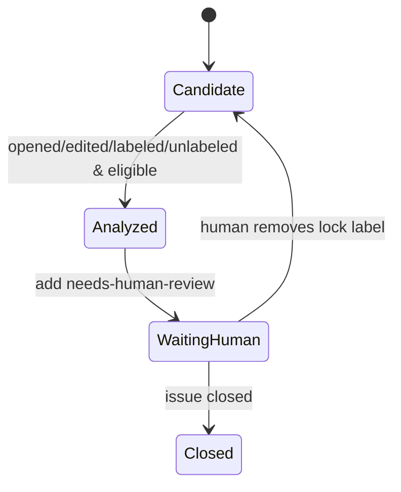

## Overview

This document defines webhook-driven execution flows for the hybrid model (n8n orchestration + external LLM analyzer).

## Flow Option A (Recommended): Single Workflow, Conditional Router

```mermaid
flowchart TD
    A[GitHub issue webhook] --> B{action}
    B -->|opened| C[Normalize payload]
    B -->|edited| C
    B -->|labeled| C
    B -->|unlabeled| C
    B -->|other| Z[Ignore]

    C --> D{title starts with [n8n]?}
    D -->|no| Z
    D -->|yes| E{has label llm-analyzed OR needs-human-review?}
    E -->|yes| Z2[Ignore until human intervention]
    E -->|no| F[Build analysis request]

    F --> G[Call analyzer service]
    G --> H{valid structured response?}
    H -->|no| I[Post fallback failure comment]
    H -->|yes| J[Post analysis comment]

    J --> K[Add labels llm-analyzed + needs-human-review]
    I --> K
    K --> L[Done]
```

### Pros

- Small operational footprint
- Easy to reason about idempotency and label gates
- Single deployment unit

### Cons

- One workflow file grows as logic expands

______________________________________________________________________

## Flow Option B: Parent Router + Child Analyzer Workflow

```mermaid
flowchart LR
    A[Webhook Router Workflow] --> B{Eligible [n8n] issue?}
    B -->|no| Z[Exit]
    B -->|yes| C{Locked by labels?}
    C -->|yes| Z
    C -->|no| D[Execute child workflow: issue-analyzer]
    D --> E[Post comment + apply lock labels]
    E --> F[Exit]
```

### Pros

- Better separation of concerns
- Analyzer can be tested independently
- Cleaner long-term maintenance

### Cons

- More workflow coordination and versioning

______________________________________________________________________

## Flow Option C: Two-Phase Analysis + Human Ack Cycle



### Pros

- Very explicit human control
- Prevents noisy repeated LLM responses

### Cons

- Requires human discipline to remove lock labels for re-analysis

______________________________________________________________________

## Event Handling Contract

Supported actions:

- `opened`
- `edited`
- `labeled`
- `unlabeled` (required for re-entry)

Ignored actions: all others.

## Eligibility Contract

An issue is eligible only when all are true:

1. `title` begins with `[n8n]`
1. Action is in supported set
1. Labels do **not** contain `llm-analyzed`
1. Labels do **not** contain `needs-human-review`

## Human Intervention Contract

Automation resumes only after human unlock:

1. Human removes lock label(s)
1. Any supported event occurs (most commonly `unlabeled` or `edited`)
1. Workflow evaluates again

## Recommended Initial Choice

Start with **Option B** (router + child analyzer), because it maps well to current n8n workflow composition patterns and will age better as prompt versions, retry logic, and enrichment steps increase.
