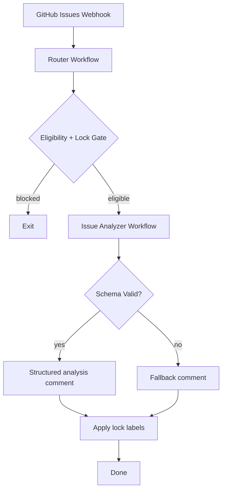

## Architecture Plan

### Chosen Model

Hybrid model:

- n8n handles triggers, routing, idempotency, label gating, and GitHub writes.
- Analyzer component handles LLM prompt orchestration and structured result generation.

## Proposed Components

1. **Webhook Router Workflow** (`tools/n8n-flows/github-n8n-issue-router.json`)

   - Trigger: GitHub webhook
   - Filters actions/title/labels
   - Executes child analyzer workflow

1. **Issue Analyzer Workflow** (`tools/n8n-flows/github-n8n-issue-analyzer.json`)

   - Enriches issue context
   - Calls analyzer service/script
   - Validates response schema
   - Returns normalized payload

1. **Analyzer Interface** (repo-managed)

   - Input: issue metadata + body + comments (optional)
   - Output schema:
     - `summary`
     - `root_causes[]`
     - `next_actions[]`
     - `confidence` (0..1)
     - `risk_level` (`low|medium|high`)

1. **Comment/Label Applier** (n8n node group)

   - Posts markdown comment
   - Applies `llm-analyzed` + `needs-human-review` (MVP policy)

## Mermaid: Component Interaction

## Data and Idempotency Rules

1. Compute content hash from:
   - issue title
   - issue body
   - latest label set
1. Store hash in comment marker (hidden HTML tag) or workflow data store.
1. If hash already processed, skip duplicate comment.

## Error Handling

- Analyzer timeout/error:
  - post minimal failure comment
  - apply `needs-human-review`
- GitHub API failure:
  - retry with backoff in workflow
  - if persistent, log and alert (Discord optional)

## Rollout Plan

### Phase 0: Spec + Dry Run

- Finalize this spec set
- Create stub workflows with no external LLM call
- Validate event parsing and gate behavior

### Phase 1: MVP in Controlled Mode

- Enable on `[n8n]` issues only
- Apply current lock policy (`llm-analyzed` OR `needs-human-review` blocks)
- Observe for one week

### Phase 2: Simplify Label Semantics

- Transition to single lock label (`needs-human-review`)
- Keep `llm-analyzed` as optional analytics label only

### Phase 3: Quality Improvements

- Add richer context ingestion (linked PRs, CI status)
- Add confidence threshold branches
- Add periodic reports on analyzer accuracy

## Test Plan

1. **Opened event** for `[n8n]` issue without lock labels -> analysis comment + labels applied.
1. **Edited event** with lock labels present -> ignored.
1. **Unlabeled event** after human removes lock -> re-analysis allowed.
1. Non-`[n8n]` issue -> ignored.
1. Analyzer failure -> fallback comment + lock label.

## Security Plan

- Verify GitHub webhook signature (`X-Hub-Signature-256`)
- Keep credentials in n8n credential store / env, never in git
- Restrict analyzer endpoint tokens to least privilege

## Deliverables

- Specs:
  - [gsnake-specs/n8n-issue-analysis-loop/brief.md](brief.md)
  - [gsnake-specs/n8n-issue-analysis-loop/flow.md](flow.md)
  - [gsnake-specs/n8n-issue-analysis-loop/plan.md](plan.md)
- n8n SOP drafts in [gsnake-n8n/workflows](../../gsnake-n8n/workflows)
- n8n workflow JSON implementations in [gsnake-n8n/tools/n8n-flows](../../gsnake-n8n/tools/n8n-flows)
