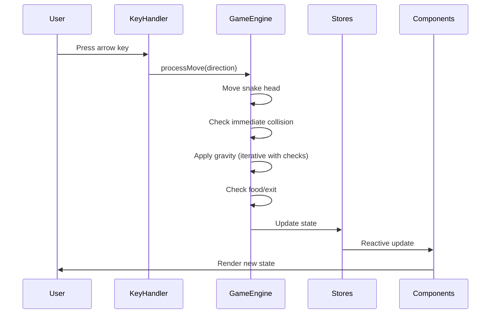

## Overview

This document defines the technical architecture for Gravity Snake, a turn-based puzzle game built with Svelte, TypeScript, and Vite. The architecture emphasizes clean separation between game logic and UI, leveraging Svelte's reactivity for efficient rendering.

______________________________________________________________________

## Architectural Approach

### Core Architectural Decisions

**1. DOM-Based Rendering with Svelte Components**

We'll render the game grid using native DOM elements (divs) styled with CSS Grid, rather than Canvas-based rendering.

**Rationale:**

- Leverages Svelte's reactive rendering system automatically
- Simpler implementation for MVP with instant state changes (no animations)
- CSS Grid provides clean, responsive layout
- Easier to debug and inspect game state in browser DevTools
- No manual render loop needed

**Trade-offs:**

- Less performant than Canvas for large grids or animations (not a concern for 15x15 static grid)
- More DOM nodes (225 cells) but negligible for modern browsers
- Future animation additions would require CSS transitions or migration to Canvas

**2. Separated Game Engine Architecture**

Game logic will be isolated in a pure TypeScript module, completely independent of UI concerns.

**Rationale:**

- Testable without UI dependencies
- Reusable logic if we add features (undo, replay, level editor)
- Clear boundaries between business logic and presentation
- Easier to reason about game state transitions

**Structure:**

```
GameEngine (pure logic)
    ↓ updates
Svelte Stores (reactive state)
    ↓ consumed by
Svelte Components (UI)
```

**3. Svelte Writable Stores for State Management**

Centralized game state managed through Svelte's writable stores.

**Rationale:**

- Built-in reactivity triggers UI updates automatically
- Single source of truth for game state
- Easy to subscribe/unsubscribe from any component
- No external state management library needed

**Stores:**

- `gameState`: Current game status, level number, moves, score
- `snake`: Snake position and segments
- `level`: Current level data (obstacles, food, exit)

**4. Event-Driven Input Handling**

No traditional game loop (requestAnimationFrame). Instead, respond to discrete keyboard events.

**Rationale:**

- Turn-based gameplay doesn't need continuous updates
- Simpler architecture without loop management
- Lower CPU usage (only processes on user input)
- Natural fit for Svelte's event handling

**5. TypeScript for Type Safety**

Full TypeScript implementation with strict type checking.

**Rationale:**

- Catches errors at compile time (especially important for grid coordinates)
- Better IDE autocomplete and refactoring support
- Self-documenting code through type definitions
- Easier to maintain as complexity grows

**6. Vite + Svelte Build Tooling**

Modern build setup with Vite as the bundler.

**Rationale:**

- Fast HMR (Hot Module Replacement) for development
- Minimal configuration required
- Native ES modules support
- Optimized production builds
- Official Svelte template available

### Technical Constraints

- **Browser Support:** Modern browsers only (ES2020+, CSS Grid support)
- **No Backend:** Pure client-side SPA, no server communication
- **No Persistence:** Game state resets on page refresh (acceptable for MVP)
- **Fixed Grid Size:** 15x15 grid hardcoded (can be parameterized later)
- **Keyboard Only:** No touch/mobile support in MVP

### Data Flow Architecture



______________________________________________________________________

## Data Model

### Core Type Definitions

```typescript
// Coordinate system: {x, y} where (0,0) is top-left
interface Position {
  x: number;
  y: number;
}

// Cardinal directions for movement
enum Direction {
  North = 'NORTH',
  South = 'SOUTH',
  East = 'EAST',
  West = 'WEST'
}

// Cell types in the grid
enum CellType {
  Empty = 'EMPTY',
  SnakeHead = 'SNAKE_HEAD',
  SnakeBody = 'SNAKE_BODY',
  Food = 'FOOD',
  Obstacle = 'OBSTACLE',
  Exit = 'EXIT'
}

// Game state machine
enum GameStatus {
  Playing = 'PLAYING',
  GameOver = 'GAME_OVER',
  LevelComplete = 'LEVEL_COMPLETE',
  AllComplete = 'ALL_COMPLETE'
}
```

### Snake Data Structure

```typescript
interface Snake {
  segments: Position[];  // [0] is head, [length-1] is tail
  direction: Direction | null;  // Last move direction
}

// Helper methods (in GameEngine):
// - getHead(): Position
// - getTail(): Position
// - contains(pos: Position): boolean
// - move(direction: Direction): void
// - grow(): void
```

**Design Notes:**

- Array maintains segment order naturally
- Head at index 0 for easy access
- Tail operations (pop/push) are O(1) amortized
- Collision detection: iterate array to check if position exists

### Level Data Structure

```typescript
interface Level {
  id: number;
  name: string;
  gridSize: { width: number; height: number };
  snake: Position[];  // Initial snake segments [0] = head
  obstacles: Position[];
  food: Position[];  // Can be empty array, one item, or multiple items
  exit: Position;
}

// Example level definition:
const level1: Level = {
  id: 1,
  name: "First Steps",
  gridSize: { width: 15, height: 15 },
  snake: [
    { x: 7, y: 2 },  // Head
    { x: 7, y: 1 },  // Body segment 1
    { x: 7, y: 0 }   // Body segment 2 (tail)
  ],
  obstacles: [
    { x: 5, y: 10 },
    { x: 6, y: 10 },
    // ...
  ],
  food: [
    { x: 8, y: 5 },
    { x: 10, y: 8 }
  ],
  exit: { x: 7, y: 14 }
};
```

**Level Storage:**

- JSON file containing array of Level objects
- Imported at build time: `import levels from './levels.json'`
- Validated against Level interface at compile time
- No runtime validation - level designers are responsible for valid data

**Level Design Notes:**

- Snake segments array defines initial position and length
- Food array can be empty (no food required), single item, or multiple items
- All food items must be collected before exit is accessible
- Level designer must ensure valid positions (no overlaps, within bounds)

### Game State Structure

```typescript
interface GameState {
  status: GameStatus;
  currentLevel: number;  // 1-indexed for display
  moves: number;
  foodCollected: number;  // Count of food items collected
  totalFood: number;      // Total food items in current level
}

// Svelte store:
const gameState = writable<GameState>({
  status: GameStatus.Playing,
  currentLevel: 1,
  moves: 0,
  foodCollected: 0,
  totalFood: 0
});
```

### Grid Representation

```typescript
// Grid type for rendering
type Grid = CellType[][];  // grid[y][x]

// Grid computation strategy:
// - Computed on-demand in UI components from stores
// - No caching needed for 15×15 grid (225 cells)
// - Components derive cell types from snake and level stores
// - Svelte's reactivity handles efficient re-rendering
```

**Coordinate System:**

- Origin (0, 0) at top-left
- X increases rightward (columns)
- Y increases downward (rows)
- Grid bounds: [0, width-1] × [0, height-1]

______________________________________________________________________

## Component Architecture

### Component Hierarchy

```
App.svelte (root)
├── GameContainer.svelte
│   ├── Header.svelte
│   │   ├── ScoreDisplay.svelte
│   │   └── RestartButton.svelte
│   ├── GameGrid.svelte
│   │   └── Cell.svelte (×225)
│   └── Overlay.svelte
│       ├── GameOverModal.svelte
│       └── GameCompleteModal.svelte
```

### Component Responsibilities

**App.svelte**

- Root component
- Initializes game engine
- Sets up keyboard event listeners
- Provides game engine context to children

**GameContainer.svelte**

- Main layout container
- Subscribes to game state stores
- Passes state to child components
- No game logic

**Header.svelte**

- Displays score information
- Contains restart button
- Pure presentational component

**ScoreDisplay.svelte**

- Shows level, length, moves
- Subscribes to gameState store
- Formats display values

**RestartButton.svelte**

- Restart button UI
- Calls GameEngine.restartLevel() on click

**GameGrid.svelte**

- Renders 15×15 grid using CSS Grid
- Computes cell types from snake + level data
- Creates Cell components for each grid position
- Handles grid-level styling

**Cell.svelte**

- Individual grid cell
- Receives cellType as prop
- Applies CSS class based on type
- Pure presentational (no logic)

**Overlay.svelte**

- Modal overlay container
- Shows/hides based on game status
- Renders appropriate modal component

**GameOverModal.svelte**

- Game over UI
- "Restart Level" and "Back to Level 1" buttons
- Calls appropriate GameEngine methods

**GameCompleteModal.svelte**

- All levels complete UI
- Static message (no buttons)

### Game Engine Module

**GameEngine.ts** (pure TypeScript, event-driven architecture)

```typescript
// Event types for decoupling from UI
type GameEvent = 
  | { type: 'stateChanged'; state: GameState }
  | { type: 'snakeChanged'; snake: Snake }
  | { type: 'levelChanged'; level: Level }
  | { type: 'gridDirty' };

type GameEventListener = (event: GameEvent) => void;

class GameEngine {
  private levels: Level[];
  private currentLevelIndex: number;
  private snake: Snake;
  private level: Level;
  private gameState: GameState;
  private isProcessing: boolean;  // Input lock flag
  private listeners: GameEventListener[];
  
  // Public API:
  init(levels: Level[]): void
  processMove(direction: Direction): void
  restartLevel(): void
  loadLevel(levelNumber: number): void
  addEventListener(listener: GameEventListener): void
  removeEventListener(listener: GameEventListener): void
  canProcessInput(): boolean  // Check isProcessing flag
  
  // Private methods:
  private emit(event: GameEvent): void
  private moveSnake(direction: Direction): void
  private applyGravity(): void
  private checkCollision(pos: Position): boolean
  private checkFoodAtPosition(pos: Position): boolean
  private canSnakeFall(): boolean  // Check if any segment would collide when falling
  private checkExit(pos: Position): boolean
  private isValidPosition(pos: Position): boolean
  private isOppositeDirection(direction: Direction): boolean  // Prevent 180-degree turns
}
```

**Responsibilities:**

- All game logic (movement, gravity, collision)
- Level management and progression
- State transitions (playing → game over → level complete)
- Emits events for state changes (decoupled from UI)
- Manages input processing lock
- Prevents opposite direction moves (180-degree turns)

**Key Methods:**

`processMove(direction: Direction)`:

1. Check isProcessing flag → return early if locked
1. Set isProcessing = true
1. Calculate new head position based on direction
1. Check if food at new head position
1. If food collected:

- Unshift new head (grow snake)
- Increment foodCollected counter
- Do NOT pop tail

6. If no food:

- Unshift new head
- Pop tail (maintain length)

7. Check collision (Game Over check):

- If head collides with obstacle, bounds, or self → trigger game over
- If Game Over, skip gravity/exit checks

8. If not Game Over, Apply gravity:

- Loop while snake can fall:
  - Move all segments down
  - Check collision again (for hazards/traps) → trigger game over and break if collision

9. If still Playing, Check exit (if snake head at exit) → trigger level complete
1. Increment moves counter
1. Emit state change events
1. Set isProcessing = false

`applyGravity()`:

```typescript
// Entire snake falls together as a unit
// Falls until ANY segment hits an obstacle or floor
while (this.canSnakeFall()) {
  // Move all segments down simultaneously
  for (let i = 0; i < snake.segments.length; i++) {
    snake.segments[i].y += 1;
  }
  
  // Check collision after each fall step (e.g. falling into hazards)
  if (this.checkCollision(this.snake.segments[0])) {
      this.gameState.status = GameStatus.GameOver;
      break;
  }
}
```

**Gravity Collision Rules:**

- Check all snake segments (head, body, tail)
- If ANY segment would hit obstacle/floor/boundary, stop falling
- If snake is already resting on obstacle, no movement occurs

**Snake Movement Algorithm:**

```typescript
// Calculate new head position
const newHead = calculateNewHeadPosition(direction);

// Check if food at new position
const foodCollected = checkFoodAtPosition(newHead);

if (foodCollected) {
  // Growing move: add head, keep tail (snake grows by 1)
  snake.segments.unshift(newHead);
  // Don't pop tail - snake length increases
} else {
  // Non-growing move: add head, remove tail (snake length stays same)
  snake.segments.unshift(newHead);
  snake.segments.pop();
}
```

**Movement Order is Critical:**

1. Check for opposite direction (prevent 180-degree turns)
1. Calculate new head position
1. Check for food BEFORE modifying snake
1. Add new head
1. Conditionally remove tail based on food collection
1. Check for immediate collision
1. Then apply gravity (iterative with collision checks)

**Opposite Direction Prevention:**

```typescript
// Prevent 180-degree turns to avoid instant self-collision
if (currentDirection === North && newDirection === South) return;
if (currentDirection === South && newDirection === North) return;
if (currentDirection === East && newDirection === West) return;
if (currentDirection === West && newDirection === East) return;
```

### Store Definitions

**stores.ts**

```typescript
import { writable } from 'svelte/store';

export const gameState = writable<GameState>({
  status: GameStatus.Playing,
  currentLevel: 1,
  moves: 0,
  foodCollected: 0,
  totalFood: 0
});

export const snake = writable<Snake>({
  segments: [],
  direction: null
});

export const level = writable<Level | null>(null);

// Adapter to connect GameEngine events to Svelte stores
export function connectGameEngineToStores(engine: GameEngine): void {
  engine.addEventListener((event) => {
    switch (event.type) {
      case 'stateChanged':
        gameState.set(event.state);
        break;
      case 'snakeChanged':
        snake.set(event.snake);
        break;
      case 'levelChanged':
        level.set(event.level);
        break;
    }
  });
}
```

### Input Handling

**KeyboardHandler.ts**

```typescript
class KeyboardHandler {
  private gameEngine: GameEngine;
  private keyMap: Map<string, Direction>;
  
  constructor(gameEngine: GameEngine) {
    this.gameEngine = gameEngine;
    this.keyMap = new Map([
      ['ArrowUp', Direction.North],
      ['ArrowDown', Direction.South],
      ['ArrowLeft', Direction.West],
      ['ArrowRight', Direction.East],
      ['w', Direction.North],
      ['s', Direction.South],
      ['a', Direction.West],
      ['d', Direction.East],
    ]);
  }
  
  handleKeyPress(event: KeyboardEvent): void {
    const direction = this.keyMap.get(event.key);
    if (direction && this.gameEngine.canProcessInput()) {
      event.preventDefault();
      this.gameEngine.processMove(direction);
    }
  }
  
  attach(): void {
    window.addEventListener('keydown', this.handleKeyPress);
  }
  
  detach(): void {
    window.removeEventListener('keydown', this.handleKeyPress);
  }
}
```

### Integration Points

**App.svelte initialization:**

```typescript
import { onMount } from 'svelte';
import { GameEngine } from './engine/GameEngine';
import { KeyboardHandler } from './engine/KeyboardHandler';
import { connectGameEngineToStores } from './stores';
import levels from './data/levels.json';

let gameEngine: GameEngine;
let keyboardHandler: KeyboardHandler;

onMount(() => {
  gameEngine = new GameEngine();
  gameEngine.init(levels);
  
  // Connect engine events to Svelte stores
  connectGameEngineToStores(gameEngine);
  
  keyboardHandler = new KeyboardHandler(gameEngine);
  keyboardHandler.attach();
  
  return () => keyboardHandler.detach();
});
```

**Component store subscriptions:**

```typescript
// In any component:
import { gameState, snake, level } from './stores';

$: currentLevel = $gameState.currentLevel;
$: snakeLength = $snake.segments.length;
$: moves = $gameState.moves;
```

### Styling Approach

- **Global styles:** Base typography, colors, resets
- **Component-scoped styles:** Each .svelte file contains its own `<style>` block
- **CSS Grid:** For game field layout
- **CSS classes:** Cell types mapped to classes (`.snake-head`, `.obstacle`, etc.)
- **No CSS framework:** Vanilla CSS sufficient for MVP

______________________________________________________________________

## Summary

This architecture provides:

- **Clean separation:** Game logic isolated from UI
- **Reactivity:** Svelte stores automatically update UI
- **Testability:** Pure GameEngine can be unit tested
- **Simplicity:** No unnecessary abstractions for MVP
- **Extensibility:** Clear boundaries for future features

The DOM-based rendering with Svelte components leverages the framework's strengths while keeping the implementation straightforward. The separated game engine ensures business logic remains testable and reusable.
