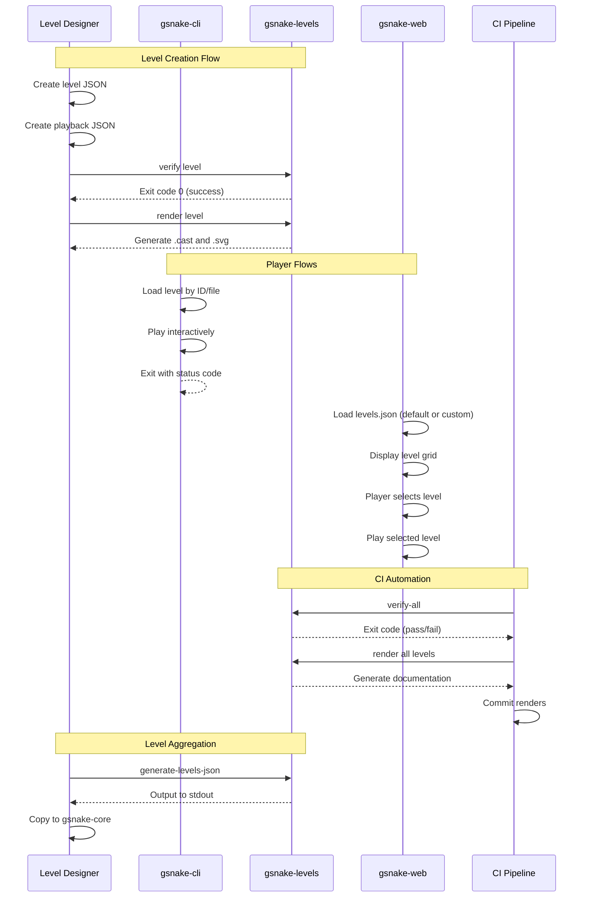

## Overview

This document describes the user flows for the level management system, covering level designers creating and verifying levels, players using the CLI and web interfaces, CI automation, and level aggregation workflows.

## Flow 1: Level Designer Creates and Verifies a Level

**Trigger**: Level designer wants to create a new level and verify it's solvable

**Steps**:

1. Designer creates a new level JSON file in the appropriate difficulty folder (e.g., `levels/easy/level_003.json`)
1. Designer plays the level interactively to find a solution: `cargo run -p gsnake-cli --level-file levels/easy/level_003.json` (no playback needed for interactive play)
1. Designer creates a playback JSON file with the solution key sequence (e.g., `playbacks/easy/level_003.json`)
1. Designer runs the verify command: `cargo run -- verify levels/easy/level_003.json`
1. System silently replays the playback against the level
1. On success: exits with code 0, updates `levels.toml` setting `solved = true`
1. On failure: exits with non-zero code, designer debugs and repeats from step 3
1. Designer adds metadata to `levels.toml` (author, difficulty, tags, description)
1. Designer runs render command to generate visual documentation

**Exit**: Level is verified, metadata is updated, ready for inclusion in levels.json

______________________________________________________________________

## Flow 2: Level Designer Records a Solution

**Trigger**: Level designer wants to record a solution for documentation

**Steps**:

1. Designer creates a playback JSON file with the solution key sequence
1. Designer runs gsnake-cli with recording: `cargo run -p gsnake-cli --level-file levels/easy/level_003.json --input-file playbacks/easy/level_003.json --record`

- Optional: specify output path with `--record-output playbacks/easy/level_003.cast`

3. System starts asciinema recording immediately
1. System replays the playback, emulating key events
1. Recording continues for 1 second after the last key event
1. System saves the .cast file:

- Default: current directory as `level_003.cast`
- With --record-output: specified path

7. Designer runs render command: `cargo run -- render levels/easy/level_003.json playbacks/easy/level_003.json`
1. System converts .cast to .svg and saves to `renders/easy/level_003.svg`

**Exit**: Visual documentation (SVG) is generated for the level

______________________________________________________________________

## Flow 3: CLI Player Plays a Specific Level

**Trigger**: Player wants to practice or replay a specific level

**Steps**:

1. Player runs gsnake-cli with level selection:

- By file: `cargo run -p gsnake-cli --level-file levels/easy/level_001.json`
- By ID: `cargo run -p gsnake-cli --level-id 1` (searches for level with JSON id=1)
- By index: `cargo run -p gsnake-cli --level-index 1` (loads first level in levels.json)

2. System loads the single specified level
1. Game starts in interactive mode
1. Player uses arrow keys to move, 'r' to reset, 'q' to quit
1. On level complete: game stays on the completed level (no auto-advance)
1. Player can reset to replay or quit
1. On quit: system exits with code 0 if level was completed, non-zero otherwise

**Exit**: Player completes or quits the level

**Note**: When no level is specified, system loads all levels from levels.json and cycles through them (backward compatible behavior)

______________________________________________________________________

## Flow 4: Web Player Uses Custom Levels

**Trigger**: Player wants to play custom levels in the web interface

**Steps**:

1. Player navigates to URL with custom levels: `https://example.com/?levelsUrl=https://cdn.example.com/custom-levels.json`
1. System loads custom levels.json from the specified URL at page load
1. Player clicks a button/icon to open the level selector
1. System displays full-screen grid overlay showing all available levels with names and difficulty
1. Player clicks on a level card to start playing
1. Grid overlay closes, game loads and starts the selected level
1. Player uses arrow keys to play
1. On level complete: game stays on the completed level, shows completion message, marks level as completed in localStorage
1. Player can reopen the level grid anytime to switch levels
1. Level completion status persists across browser sessions via localStorage

**Exit**: Player completes levels or closes the browser

**Note**: Without `?levelsUrl` parameter, system loads default embedded levels.json

______________________________________________________________________

## Flow 5: Web Player Selects Levels (Default Levels)

**Trigger**: Player wants to select a specific level from the default level set

**Steps**:

1. Player navigates to the game URL (no custom levels)
1. System loads default embedded levels.json
1. Player clicks a button/icon to open the level selector
1. System displays full-screen grid overlay showing all 12 default levels with names and difficulty
1. Player clicks on a level card (e.g., "Level 3: The Wall")
1. Grid overlay closes, game loads and starts the selected level
1. Player plays the level
1. On level complete: game stays on the completed level, marks as completed in localStorage
1. Player can reopen the level grid anytime to switch levels
1. Completion status persists across browser sessions

**Exit**: Player completes levels or closes the browser

______________________________________________________________________

## Flow 6: CI Verifies All Levels

**Trigger**: CI pipeline runs on pull request or commit

**Steps**:

1. CI runs verify-all command: `cargo run -- verify-all`
1. System iterates through all difficulty folders (easy, medium, hard)
1. For each level with a matching playback file:

- Silently verifies the level is solvable
- Updates levels.toml with verification status (solved = true/false)

4. System exits with code 0 if all levels pass, non-zero if any fail
1. CI runs render commands for each level to generate .cast and .svg files
1. CI commits updated levels.toml and renders back to the repository
1. CI pushes changes to trigger documentation updates

**Exit**: All levels are verified and documentation is updated

______________________________________________________________________

## Flow 7: Generate Aggregated levels.json

**Trigger**: Developer wants to update the master levels.json file

**Steps**:

1. Developer runs generate command with optional filters:

- All levels: `cargo run -- generate-levels-json`
- Specific difficulties: `cargo run -- generate-levels-json --filter easy,medium`
- Dry run: `cargo run -- generate-levels-json --dry-run`

2. System reads levels.toml from each difficulty folder
1. System loads level JSON files in the order specified in levels.toml
1. System aggregates levels into a single JSON array
1. System outputs the aggregated JSON to stdout
1. Developer redirects output to file: `cargo run -- generate-levels-json > output.json`
1. Developer manually copies to `gsnake-core/engine/core/data/levels.json`

**Exit**: Master levels.json is updated with selected levels

______________________________________________________________________

## Flow 8: Replay Command for Debugging

**Trigger**: Developer wants to visually debug a level solution

**Steps**:

1. Developer runs replay command: `cargo run -- replay levels/easy/level_001.json playbacks/easy/level_001.json`
1. System loads the level and playback
1. System displays visual playback in the terminal (like normal gameplay)
1. Playback runs with timing from the playback JSON
1. Developer can see exactly how the solution plays out
1. On completion or failure, system exits

**Exit**: Developer understands the solution behavior

______________________________________________________________________

## Web Interface Wireframes

### Level Grid UI

The level grid appears as an overlay or sidebar, allowing players to select levels at any time.

```wireframe
<!DOCTYPE html>
<html>
<head>
<style>
* { margin: 0; padding: 0; box-sizing: border-box; }
body { font-family: system-ui, sans-serif; background: #1a1a1a; color: #fff; padding: 20px; }
.container { max-width: 1200px; margin: 0 auto; }
.header { margin-bottom: 30px; }
.header h1 { font-size: 24px; margin-bottom: 10px; }
.header p { color: #999; font-size: 14px; }
.level-grid { display: grid; grid-template-columns: repeat(auto-fill, minmax(200px, 1fr)); gap: 16px; }
.level-card { background: #2a2a2a; border: 2px solid #3a3a3a; border-radius: 8px; padding: 16px; cursor: pointer; transition: all 0.2s; }
.level-card:hover { border-color: #4a9eff; transform: translateY(-2px); }
.level-card.completed { border-color: #4caf50; }
.level-card.current { border-color: #ff9800; background: #3a2a1a; }
.level-number { font-size: 12px; color: #999; text-transform: uppercase; letter-spacing: 1px; }
.level-name { font-size: 18px; font-weight: 600; margin: 8px 0; }
.level-difficulty { display: inline-block; padding: 4px 8px; border-radius: 4px; font-size: 11px; text-transform: uppercase; margin-top: 8px; }
.difficulty-easy { background: #4caf50; color: #fff; }
.difficulty-medium { background: #ff9800; color: #fff; }
.difficulty-hard { background: #f44336; color: #fff; }
.level-status { font-size: 12px; color: #4caf50; margin-top: 8px; }
.close-button { position: fixed; top: 20px; right: 20px; background: #2a2a2a; border: 2px solid #3a3a3a; color: #fff; padding: 8px 16px; border-radius: 4px; cursor: pointer; }
.close-button:hover { border-color: #4a9eff; }
</style>
</head>
<body>
<div class="container">
  <div class="header">
    <h1>Select Level</h1>
    <p>Choose a level to play. Click on any level card to start.</p>
  </div>
  
  <div class="level-grid">
    <div class="level-card completed" data-element-id="level-card-1">
      <div class="level-number">Level 1</div>
      <div class="level-name">First Steps</div>
      <span class="level-difficulty difficulty-easy">Easy</span>
      <div class="level-status">✓ Completed</div>
    </div>
    
    <div class="level-card completed" data-element-id="level-card-2">
      <div class="level-number">Level 2</div>
      <div class="level-name">The Drop</div>
      <span class="level-difficulty difficulty-easy">Easy</span>
      <div class="level-status">✓ Completed</div>
    </div>
    
    <div class="level-card current" data-element-id="level-card-3">
      <div class="level-number">Level 3</div>
      <div class="level-name">The Wall</div>
      <span class="level-difficulty difficulty-easy">Easy</span>
      <div class="level-status">Currently Playing</div>
    </div>
    
    <div class="level-card" data-element-id="level-card-4">
      <div class="level-number">Level 4</div>
      <div class="level-name">Zig Zag</div>
      <span class="level-difficulty difficulty-medium">Medium</span>
    </div>
    
    <div class="level-card" data-element-id="level-card-5">
      <div class="level-number">Level 5</div>
      <div class="level-name">The Tower</div>
      <span class="level-difficulty difficulty-medium">Medium</span>
    </div>
    
    <div class="level-card" data-element-id="level-card-6">
      <div class="level-number">Level 6</div>
      <div class="level-name">Floating Islands</div>
      <span class="level-difficulty difficulty-medium">Medium</span>
    </div>
    
    <div class="level-card" data-element-id="level-card-7">
      <div class="level-number">Level 7</div>
      <div class="level-name">Cascade</div>
      <span class="level-difficulty difficulty-hard">Hard</span>
    </div>
    
    <div class="level-card" data-element-id="level-card-8">
      <div class="level-number">Level 8</div>
      <div class="level-name">Push to Survive</div>
      <span class="level-difficulty difficulty-hard">Hard</span>
    </div>
  </div>
</div>

<button class="close-button" data-element-id="close-level-selector">Close</button>
</body>
</html>
```

### Level Grid - Compact Sidebar View

Alternative layout showing the level grid as a sidebar that can be toggled during gameplay.

```wireframe
<!DOCTYPE html>
<html>
<head>
<style>
* { margin: 0; padding: 0; box-sizing: border-box; }
body { font-family: system-ui, sans-serif; background: #1a1a1a; color: #fff; display: flex; height: 100vh; }
.sidebar { width: 300px; background: #2a2a2a; border-right: 2px solid #3a3a3a; padding: 20px; overflow-y: auto; }
.sidebar-header { margin-bottom: 20px; padding-bottom: 16px; border-bottom: 1px solid #3a3a3a; }
.sidebar-header h2 { font-size: 18px; margin-bottom: 4px; }
.sidebar-header p { font-size: 12px; color: #999; }
.level-list { display: flex; flex-direction: column; gap: 12px; }
.level-item { background: #1a1a1a; border: 2px solid #3a3a3a; border-radius: 6px; padding: 12px; cursor: pointer; transition: all 0.2s; }
.level-item:hover { border-color: #4a9eff; }
.level-item.completed { border-left: 4px solid #4caf50; }
.level-item.current { border-color: #ff9800; background: #3a2a1a; }
.level-item-header { display: flex; justify-content: space-between; align-items: center; margin-bottom: 4px; }
.level-item-number { font-size: 11px; color: #999; text-transform: uppercase; }
.level-item-badge { font-size: 10px; padding: 2px 6px; border-radius: 3px; }
.badge-easy { background: #4caf50; }
.badge-medium { background: #ff9800; }
.badge-hard { background: #f44336; }
.level-item-name { font-size: 14px; font-weight: 500; }
.game-area { flex: 1; display: flex; align-items: center; justify-content: center; background: #1a1a1a; }
.game-placeholder { text-align: center; color: #666; }
.game-placeholder h3 { font-size: 20px; margin-bottom: 8px; }
.toggle-sidebar { position: absolute; top: 20px; left: 320px; background: #2a2a2a; border: 2px solid #3a3a3a; color: #fff; padding: 8px 12px; border-radius: 4px; cursor: pointer; }
.toggle-sidebar:hover { border-color: #4a9eff; }
</style>
</head>
<body>
<div class="sidebar">
  <div class="sidebar-header">
    <h2>Levels</h2>
    <p>12 levels available</p>
  </div>
  
  <div class="level-list">
    <div class="level-item completed" data-element-id="sidebar-level-1">
      <div class="level-item-header">
        <span class="level-item-number">Level 1</span>
        <span class="level-item-badge badge-easy">Easy</span>
      </div>
      <div class="level-item-name">First Steps</div>
    </div>
    
    <div class="level-item completed" data-element-id="sidebar-level-2">
      <div class="level-item-header">
        <span class="level-item-number">Level 2</span>
        <span class="level-item-badge badge-easy">Easy</span>
      </div>
      <div class="level-item-name">The Drop</div>
    </div>
    
    <div class="level-item current" data-element-id="sidebar-level-3">
      <div class="level-item-header">
        <span class="level-item-number">Level 3</span>
        <span class="level-item-badge badge-easy">Easy</span>
      </div>
      <div class="level-item-name">The Wall</div>
    </div>
    
    <div class="level-item" data-element-id="sidebar-level-4">
      <div class="level-item-header">
        <span class="level-item-number">Level 4</span>
        <span class="level-item-badge badge-medium">Medium</span>
      </div>
      <div class="level-item-name">Zig Zag</div>
    </div>
    
    <div class="level-item" data-element-id="sidebar-level-5">
      <div class="level-item-header">
        <span class="level-item-number">Level 5</span>
        <span class="level-item-badge badge-medium">Medium</span>
      </div>
      <div class="level-item-name">The Tower</div>
    </div>
    
    <div class="level-item" data-element-id="sidebar-level-6">
      <div class="level-item-header">
        <span class="level-item-number">Level 6</span>
        <span class="level-item-badge badge-hard">Hard</span>
      </div>
      <div class="level-item-name">Floating Islands</div>
    </div>
  </div>
</div>

<div class="game-area">
  <div class="game-placeholder">
    <h3>Game Area</h3>
    <p>Level grid appears as sidebar</p>
  </div>
</div>

<button class="toggle-sidebar" data-element-id="toggle-sidebar-button">☰ Levels</button>
</body>
</html>
```

______________________________________________________________________

## Flow Sequence Diagram


