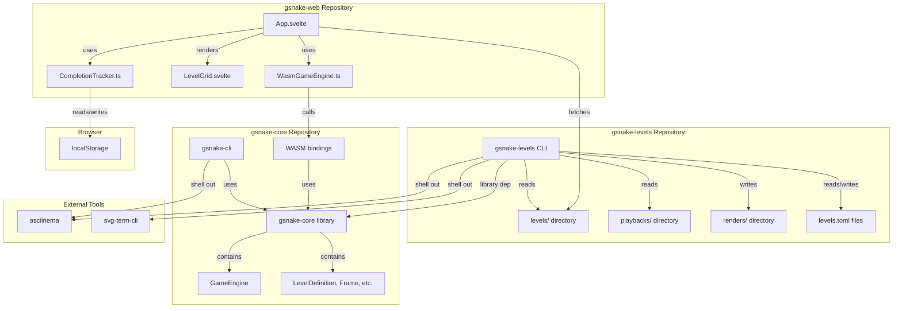

## Architectural Approach

### Repository Architecture

**Sibling Repository Pattern with Library Dependency**

The system uses a sibling repository architecture where `gsnake-levels` and `gsnake-core` are separate git repositories in the same workspace. `gsnake-levels` depends on `gsnake-core` as a Rust library dependency, enabling direct use of the `GameEngine` for level verification without code duplication.

**Trade-offs:**

- **Tight coupling**: Changes to gsnake-core may require updates to gsnake-levels
- **Code reuse**: Direct access to GameEngine eliminates need to duplicate game logic
- **Versioning**: gsnake-levels can pin to specific gsnake-core versions for stability

### External Tooling Strategy

**Leverage Mature External Tools**

The system integrates with external tools for recording and rendering rather than implementing custom solutions:

- **asciinema**: Terminal recording (requires `asciinema` command installed)
- **svg-term-cli**: .cast to .svg conversion (requires Node.js and npm package)

**Trade-offs:**

- **External dependencies**: Users must install asciinema and svg-term-cli
- **Mature solutions**: Proven tools with good output quality
- **Maintenance**: No need to maintain custom recording/rendering code

**Rationale**: The .cast format and SVG generation are complex to implement correctly. Using established tools reduces implementation risk and maintenance burden.

### Data Model Extension Strategy

**Extend Core Model with Optional Fields**

The `LevelDefinition` struct in file:gsnake-core/engine/core/src/models.rs will be extended with an optional `difficulty` field. This approach maintains backward compatibility while enabling new features.

**Trade-offs:**

- **Schema change**: Requires updating all level JSON files
- **Backward compatibility**: Optional field allows old levels to work without difficulty
- **Simplified web UI**: Difficulty available directly in level data without separate metadata file

**Rationale**: Adding difficulty to the core model simplifies the web UI implementation and keeps all level data in a single file. The optional field ensures existing levels continue to work.

### Web Architecture

**TypeScript-Side Level Loading**

Custom levels.json files are fetched in TypeScript and passed to the WASM engine, keeping the WASM layer focused on game logic.

**Trade-offs:**

- **Separation of concerns**: WASM handles game logic, TypeScript handles HTTP/CORS
- **Error handling**: TypeScript layer handles fetch errors and network issues
- **WASM simplicity**: No HTTP client needed in WASM, smaller binary size

**Client-Side Completion Tracking**

Level completion is tracked in browser localStorage as a JSON array of completed level IDs. No server-side persistence is required.

**Trade-offs:**

- **No backend needed**: Purely client-side, no server infrastructure
- **Browser-specific**: Completion doesn't sync across devices
- **Simple implementation**: Standard localStorage API, no authentication needed

### Backward Compatibility

**Preserve Existing Behavior**

All changes maintain backward compatibility with existing gsnake-web functionality:

- gsnake-cli without flags loads all levels and cycles through them (current behavior)
- WASM `getLevels()` continues to return embedded levels.json
- Contract interface extensions are additive (new fields, no breaking changes)
- Existing level JSON files work without difficulty field (optional)

______________________________________________________________________

## Data Model

### Core Model Extensions

**LevelDefinition Schema Extension**

Extend the existing `LevelDefinition` struct with an optional difficulty field:

```rust
#[derive(Debug, Clone, PartialEq, Serialize, Deserialize, TS)]
#[serde(rename_all = "camelCase")]
#[ts(rename_all = "camelCase")]
pub struct LevelDefinition {
    pub id: u32,
    pub name: String,
    #[serde(skip_serializing_if = "Option::is_none")]
    pub difficulty: Option<String>,  // NEW: "easy", "medium", "hard"
    pub grid_size: GridSize,
    // ... existing fields ...
}
```

**Impact:**

- TypeScript types auto-generated via ts-rs will include the new field
- Existing levels without difficulty field will deserialize successfully (Option)
- Web UI can display difficulty badges when available

### Level Metadata (levels.toml)

**Per-Difficulty Metadata Files**

Each difficulty folder contains a `levels.toml` file with level metadata:

```toml
# levels/easy/levels.toml
[[level]]
id = "level_001"
file = "level_001.json"
author = "designer_name"
solved = true
difficulty = "easy"
tags = ["tutorial", "basic"]
description = "Learn basic movement"
```

**Fields:**

- `id`: String identifier matching the JSON filename
- `file`: Filename of the level JSON
- `author`: Level designer name
- `solved`: Boolean indicating if level has been verified
- `difficulty`: "easy", "medium", or "hard"
- `tags`: Array of string tags for categorization
- `description`: Human-readable description

**Usage:**

- Read by `generate-levels-json` to determine level order
- Updated by `verify` command to set `solved = true/false`
- Used by CI to track verification status

### Playback Format

**Unchanged from Current Format**

Playback JSON remains as array of key-delay pairs:

```json
[
  {"key": "Right", "delay_ms": 200},
  {"key": "Down", "delay_ms": 200},
  {"key": "Right", "delay_ms": 200}
]
```

**Rationale**: Current format is simple and sufficient. No need for additional metadata.

### Completion Tracking

**localStorage JSON Array**

Completion state stored as JSON array in localStorage:

```typescript
// Key: "gsnake_completed_levels"
// Value: "[1, 2, 3, 5]"  // Array of completed level IDs
```

**Operations:**

- Read on app init to restore completion state
- Append level ID on level complete
- Query to check if level is completed

**Rationale**: Simple array structure is easy to query and update. Level IDs are unique within a level set.

______________________________________________________________________

## Component Architecture

### New Components

#### gsnake-levels CLI

**Responsibility**: Level management, verification, and documentation generation

**Commands:**

- `verify <level.json>`: Verify level is solvable with matching playback
- `replay <level.json> <playback.json>`: Visual playback for debugging
- `render <level.json> <playback.json>`: Generate .cast and .svg documentation
- `verify-all`: Verify all levels in all difficulty folders
- `generate-levels-json [--filter easy,medium] [--dry-run]`: Aggregate levels into single JSON

**Dependencies:**

- gsnake-core (library): Use GameEngine for verification (path dependency)
- asciinema (external): Shell out for recording
- svg-term-cli (external): Shell out for SVG generation

**Error Handling:**

- Check for asciinema availability before recording operations
- Check for svg-term-cli availability before render operations
- Fail with clear installation instructions if tools are missing
- Exit with non-zero code on any failure

**Integration:**

- Reads level JSON files from `levels/` directory
- Reads playback JSON files from `playbacks/` directory
- Reads/writes levels.toml metadata files
- Outputs .cast files to `playbacks/` directory
- Outputs .svg files to `renders/` directory
- Outputs aggregated JSON to stdout

**CI Considerations:**

- CI updates levels.toml and commits changes
- Merge conflicts in levels.toml are resolved manually by developers
- CI workflow should handle git operations (commit, push)

#### Level Grid UI Component

**Responsibility**: Display level selector overlay in web interface

**Features:**

- Full-screen grid overlay with level cards
- Display level name, difficulty badge, completion status
- Click to select and load level
- Close button to return to game
- Responsive grid layout

**State:**

- List of available levels (from loaded levels.json)
- Current level ID
- Completion status (from localStorage)

**Integration:**

- Receives levels from WasmGameEngine
- Emits level selection events
- Reads completion from CompletionTracker service

#### Completion Tracker Service

**Responsibility**: Manage level completion state in localStorage

**Methods:**

- `isCompleted(levelId: number): boolean`
- `markCompleted(levelId: number): void`
- `getCompletedLevels(): number[]`
- `clearCompleted(): void`

**Storage:**

- Key: `"gsnake_completed_levels"`
- Value: JSON array of level IDs

### Modified Components

#### gsnake-cli Extensions

**New Flags:**

- `--level-file <path>`: Load single level from file
- `--level-id <id>`: Load single level by numeric ID (searches JSON id field)
- `--level-index <n>`: Load single level by 1-based array index
- `--record`: Enable asciinema recording
- `--record-output <path>`: Specify .cast output path (optional)

**Behavior Changes:**

- When level is specified, load only that level (no auto-advance)
- Exit code 0 if level completed, non-zero otherwise
- Recording starts immediately, stops 1 second after playback completes

**Error Handling:**

- `--level-id`: Error if no level with matching ID found, error if duplicate IDs exist
- `--level-index`: Error if index out of bounds
- `--record`: Check for asciinema at startup, fail with installation instructions if missing

**Integration:**

- Shells out to `asciinema rec` when `--record` flag is present
- Uses existing `load_levels()` function for file loading
- Implements new `load_level_by_json_id()` function for ID-based loading
- Uses existing `load_level_by_id()` function renamed to `load_level_by_index()` for index-based loading

#### gsnake-core Model Extension

**LevelDefinition Changes:**

- Add optional `difficulty: Option<String>` field
- Update ts-rs annotations to generate TypeScript types
- Maintain backward compatibility with existing levels

**Impact:**

- WASM bindings automatically include new field
- TypeScript types regenerated with new field
- No changes to GameEngine logic required

#### WasmGameEngine (TypeScript Wrapper)

**New Functionality:**

- Accept custom levels array in `init()` method (already supported)
- Expose level metadata to UI components

**Current Implementation:**

```typescript
async init(levels: LevelDefinition[] | null = null, startLevel: number = 1)
```

**No changes needed**: Current implementation already supports custom levels.

#### App.svelte Extensions

**New Features:**

- Fetch custom levels.json from `?levelsUrl` parameter
- Render level grid UI component
- Handle level selection events
- Track completion in localStorage

**Integration Flow:**

1. Parse URL parameters for `levelsUrl`
1. If present, fetch levels.json from URL
1. On fetch failure: display error modal, fallback to default embedded levels
1. Pass custom or default levels to WasmGameEngine.init()
1. Render level grid button in UI
1. On level complete, mark in localStorage

**Error Handling:**

- Network errors: Show error modal with message, load default levels
- CORS errors: Show error modal explaining CORS requirement, load default levels
- Invalid JSON: Show error modal with parse error, load default levels
- Schema validation: Show error modal if levels don't match LevelDefinition[], load default levels
- User can dismiss error modal and continue playing with default levels

### Integration Points

#### gsnake-levels ↔ gsnake-core

**Type**: Rust library dependency

**Interface**: gsnake-levels imports and uses:

- `GameEngine::new(level: LevelDefinition)`
- `GameEngine::process_move(direction: Direction)`
- `GameEngine::generate_frame() -> Frame`
- `parse_levels_json(json: &str) -> Result<Vec<LevelDefinition>>`

**Data Flow**: gsnake-levels loads level JSON, creates GameEngine, replays playback, checks final state

#### gsnake-cli ↔ asciinema

**Type**: Shell command execution

**Interface**: `std::process::Command` to run `asciinema rec --command "..." output.cast`

**Data Flow**: CLI starts asciinema, runs playback, asciinema captures terminal output to .cast file

#### gsnake-levels ↔ svg-term-cli

**Type**: Shell command execution

**Interface**: `std::process::Command` to run `svg-term-cli < input.cast > output.svg`

**Data Flow**: gsnake-levels pipes .cast file to svg-term-cli, receives SVG output

#### Web ↔ WASM

**Type**: JavaScript/WASM boundary

**Interface**:

- `WasmGameEngine.init(levels: LevelDefinition[], startLevel: number)`
- `WasmGameEngine.processMove(direction: Direction)`
- `WasmGameEngine.onFrame(callback: (frame: Frame) => void)`

**Data Flow**: TypeScript fetches levels.json, parses, passes to WASM. WASM emits frame updates via callback.

#### Web ↔ localStorage

**Type**: Browser API

**Interface**:

- `localStorage.getItem("gsnake_completed_levels"): string | null`
- `localStorage.setItem("gsnake_completed_levels", value: string)`

**Data Flow**: Web reads completion on init, writes on level complete, queries for UI display

______________________________________________________________________

## Architecture Diagram


