# Architecture Decision Summary

## Date: 2026-02-07

## Problem Statement

The initial plan.md suggested using an internal n8n workflow to deploy other n8n workflows via n8n CLI commands. This creates a circular dependency and architectural fragility.

## Investigation Results

### ✅ What We Verified

1. **n8n CLI is accessible** in container `440742681e58b8049db5f7541c5ce24312bd348662e6a68bab55720f7d16d30e`

   - Version: 2.4.6
   - Path: `/usr/local/bin/n8n`

1. **Import/Export commands work perfectly**

   - Export: `n8n export:workflow --backup --output=/dir/` creates one JSON file per workflow
   - Import: `n8n import:workflow --separate --input=/dir/` imports all JSON files
   - Filenames are workflow IDs (e.g., `test-id-12345.json`)

1. **ID preservation works**

   - IDs from JSON are preserved on import
   - Reimporting with same ID updates workflow in place (no duplicates)
   - versionId is regenerated by n8n (expected behavior)

1. **File transfer works**

   - `docker cp` successfully moves files between host and container
   - Tested bidirectional copy

1. **Sync script created and tested**

   - Located at: `gsnake-n8n/tools/scripts/sync-workflows.sh`
   - Successfully exported all 5 current workflows
   - Commands: `import`, `export`, `sync`

### 📋 Test Results Summary

| Test | Status | Finding |
|------|--------|---------|
| ID Preservation | ✅ Pass | IDs are kept exactly as provided in JSON |
| Update in Place | ✅ Pass | Reimport with same ID updates existing workflow |
| Directory Export | ✅ Pass | --backup creates one file per workflow |
| Filename Pattern | ✅ Pass | Files named as `{workflow-id}.json` |
| Docker CP | ✅ Pass | Bidirectional file transfer works |
| Sync Script | ✅ Pass | Export command tested successfully |

See `test-findings.md` for detailed test results.

______________________________________________________________________

## Revised Architecture

### Core Principle: Deployment Happens Outside n8n

**OLD (Broken)**:

```
User → Claude → n8n-workflow "workflow-sync" → n8n CLI → n8n
                      ↑______________|
                  (circular dependency)
```

**NEW (Clean)**:

```
User → Claude → Shell Script → n8n CLI → n8n
          ↓
    Update Git
```

### Layer Separation

**Layer 1: Workflows** (Markdown Documentation)

- Location: `gsnake-n8n/workflows/`
- Format: Markdown SOPs
- Purpose: Define WHAT should be automated
- Examples:
  - `workflows/service/notify-discord.md` - Webhook endpoint spec
  - `workflows/actions/[name].md` - Custom node spec

**Layer 2: Tools** (Implementation)

- Location: `gsnake-n8n/tools/`
- Structure:
  ```
  tools/
  ├── n8n-flows/         # Generated n8n workflow JSON (git-tracked)
  │   ├── {id-1}.json
  │   ├── {id-2}.json
  │   └── {id-3}.json
  └── scripts/           # Deployment automation
      └── sync-workflows.sh
  ```

**Layer 3: Agents** (Orchestration)

- Actor: Claude
- Responsibilities:
  1. Read markdown SOPs from `workflows/`
  1. Generate n8n workflow JSON (manual or AI-assisted)
  1. Save JSON to `tools/n8n-flows/{workflow-id}.json`
  1. Call `tools/scripts/sync-workflows.sh import`
  1. Test via n8n MCP server (execute_workflow)
  1. Report results to user

### Deployment Flow

```mermaid
sequenceDiagram
    participant User
    participant Claude
    participant Script as sync-workflows.sh
    participant Docker as Docker CP
    participant CLI as n8n CLI
    participant n8n as n8n Instance

    User->>Claude: "Create workflow for X"
    Claude->>Claude: Read workflows/X.md
    Claude->>Claude: Generate JSON
    Claude->>Git: Save to tools/n8n-flows/X.json
    Claude->>Script: ./sync-workflows.sh import
    Script->>Docker: docker cp tools/n8n-flows/ → container
    Docker->>CLI: Files in /tmp/n8n-sync/
    CLI->>n8n: n8n import:workflow --separate
    n8n-->>CLI: Import success
    Claude->>MCP: execute_workflow (test)
    MCP-->>Claude: Execution results
    Claude-->>User: Report success
```



______________________________________________________________________

## Key Architectural Decisions

### Decision 1: Shell Script Instead of n8n Workflow

**Rationale**: Avoids circular dependency, simpler, more robust

**Trade-offs**:

- ✅ No bootstrap problem
- ✅ No fragility (sync mechanism can't break itself)
- ✅ Simpler (direct docker commands, no n8n workflow complexity)
- ✅ Faster (no n8n startup overhead)
- ❌ Requires shell access to host (acceptable for POC)
- ❌ Not triggerable via webhook (acceptable - we use it from Claude)

### Decision 2: docker cp for File Transfer

**Rationale**: Works with existing docker-compose setup, no modifications needed

**Alternatives Considered**:

- Volume mount `tools/n8n-flows/` - Would be faster but requires docker-compose changes
- stdin/stdout piping - More complex, no real benefit

**Trade-offs**:

- ✅ No infrastructure changes needed
- ✅ Works immediately
- ✅ Safe (explicit copy operations)
- ❌ Slower than volume mount (acceptable for POC with few workflows)

### Decision 3: Workflow ID as Filename

**Rationale**: Stable, deterministic, git-friendly

**Pattern**: `tools/n8n-flows/{workflow-id}.json`

**Benefits**:

- Filename doesn't change unless workflow ID changes
- Easy mapping between file and workflow
- No naming conflicts
- n8n export naturally produces this pattern

### Decision 4: ID Preservation Strategy

**Rationale**: Test proved IDs are preserved, so we can control them

**Approach**:

- Generate JSON with explicit ID (derived from name or use UUID)
- Import preserves the ID
- No need for post-import export just to capture IDs

**Exception**: If AI generates JSON without ID, we must export after import to get n8n-assigned ID

### Decision 5: Import is Source of Truth

**Rationale**: Git should be canonical source

**Implication**:

- After manual changes in n8n UI, export to capture them in git
- Then import to ensure consistency
- `sync` command does both: export (backup) → import (restore)

______________________________________________________________________

## Deprecated Approaches

### ❌ Docker Volume Sync Workflow

Files `workflows/actions/node-docker-volume-sync.md` and `workflows/service/docker-volume-sync.md` describe an older approach using docker volume mounting to sync workflow files.

**Why Deprecated**:

- Assumes n8n auto-loads workflows from files in data directory (unreliable)
- More complex than using n8n CLI directly
- The git commit message confirms: "spotted fundamental architectural mistake: Volume syncing might be overcomplicated"

**Status**: Keep files for historical reference but mark as deprecated in documentation

### ❌ Internal workflow-sync Workflow

Original plan.md described creating an n8n workflow that runs n8n CLI commands.

**Why Deprecated**:

- Circular dependency (workflow deploys workflows including itself)
- Fragile (if it breaks, can't fix it using itself)
- Unnecessary complexity

**Replacement**: `tools/scripts/sync-workflows.sh`

______________________________________________________________________

## Implementation Status

### ✅ Completed

- [x] Verified n8n CLI access
- [x] Tested ID preservation
- [x] Tested import/export commands
- [x] Created sync-workflows.sh script
- [x] Tested export functionality
- [x] Exported existing 5 workflows to git

### ⏳ Remaining Work

- [ ] Test import functionality with sync script
- [ ] Answer open questions (credentials, MCP tools, generation method)
- [ ] Rewrite plan.md with corrected architecture
- [ ] Rewrite flows.md to remove workflow-sync workflow
- [ ] Update brief.md if needed
- [ ] Deprecate docker-volume-sync workflows
- [ ] Create first POC workflow (e.g., notify-discord)
- [ ] Document credential management approach
- [ ] Test end-to-end workflow generation flow

______________________________________________________________________

## Open Questions

### Q1: Workflow Generation Method

**Question**: How should we generate n8n workflow JSON from markdown SOPs?

**Options**:
A. AI generation using n8n MCP skills (if they exist)
B. Manual JSON authoring
C. Export existing workflow as template, modify it
D. Build a custom generator tool

**Status**: Need to verify if n8n MCP server provides generation tools

**Next Step**: Inspect MCP server tools list

______________________________________________________________________

### Q2: Credential Management

**Question**: How are credentials referenced and managed in workflows?

**Known**:

- Workflows reference credentials by name (e.g., `$credentials.github_token`)
- Credentials are stored in n8n, not in JSON
- Manual setup required in n8n UI

**Unknown**:

1. Can we import workflow JSON with credential references before credentials exist?
1. What happens when workflow executes with missing credential?
1. Does export capture credential bindings?
1. Can we automate credential creation via CLI?

**Next Step**: Test importing workflow with credential reference

______________________________________________________________________

### Q3: n8n MCP Server Capabilities

**Question**: What tools/features does the n8n MCP server provide?

**Expected** (from plan.md):

- `search_workflows` - Find workflows
- `get_workflow_details` - Inspect workflow
- `execute_workflow` - Run workflow
- Workflow generation skills? (unverified)

**Status**: Not yet queried

**Next Step**: List MCP server tools

______________________________________________________________________

### Q4: Workflow Active State

**Question**: Should imported workflows be active or inactive by default?

**Safety Consideration**:

- Active workflows can execute automatically (webhooks, triggers)
- Inactive workflows are safe (manual execution only)

**Current Approach**: Accept whatever state is in JSON

**Recommendation**: Consider always importing as `"active": false` for safety, then manually activate after testing

______________________________________________________________________

### Q5: Project Assignment

**Question**: How do workflows get assigned to projects?

**Observed**: Exported workflows include:

```json
{
  "shared": [{
    "projectId": "dSnNZv7zF1AxLQD6",
    "project": {
      "name": "Tin Nguyen <nguyen.ngoctindaniel@gmail.com>",
      "type": "personal"
    }
  }]
}
```

**Unknown**:

- Is projectId required for import?
- Can we omit it and have n8n assign default?
- Does CLI have `--projectId` flag?

**Next Step**: Check `n8n import:workflow --help` for project options

______________________________________________________________________

## Decisions Needed from User

### Decision Point 1: Generation Method

Once we verify MCP capabilities, choose:

- Wait for/use AI generation if available
- OR start with manual JSON authoring for POC
- OR hybrid (start manual, automate later)

**Recommendation**: Start manual for POC to unblock progress

### Decision Point 2: Credential Workflow

Define the process for:

1. One-time credential creation in n8n UI
1. Referencing credentials in workflow JSON
1. Testing workflows with credentials
1. Documenting which credentials are needed

### Decision Point 3: Documentation Rewrite Scope

What should be updated:

- ✅ plan.md - definitely needs rewrite
- ✅ flows.md - remove workflow-sync bootstrap step
- ⚠️ brief.md - may need updates
- ⚠️ workflows/actions/node-docker-volume-sync.md - deprecate or delete?

______________________________________________________________________

## Recommended Next Steps

### Immediate (Do Now)

1. ✅ Clean up test workflow from n8n
1. ⏳ Answer Q3: List n8n MCP server tools
1. ⏳ Answer Q2: Test credential reference in workflow
1. ⏳ Answer Q5: Check import --help for project flags

### Short Term (This Session)

5. Rewrite plan.md with corrected architecture
1. Rewrite flows.md without workflow-sync workflow
1. Choose workflow generation method
1. Create first POC workflow (notify-discord or simple test)

### Medium Term (Next Session)

9. Test full end-to-end generation flow
1. Document credential management
1. Create workflow generation guide
1. Set up automation for post-push workflow sync

______________________________________________________________________

## Success Metrics

The revised architecture will be validated when:

1. ✅ Sync script successfully imports and exports workflows
1. ⏳ We generate a new workflow from markdown SOP
1. ⏳ Workflow deploys to n8n via sync script
1. ⏳ Workflow executes successfully via MCP
1. ⏳ Changes committed to git with canonical JSON
1. ⏳ Documentation accurately reflects working system

Currently: **1/6 complete** (sync script export tested)
