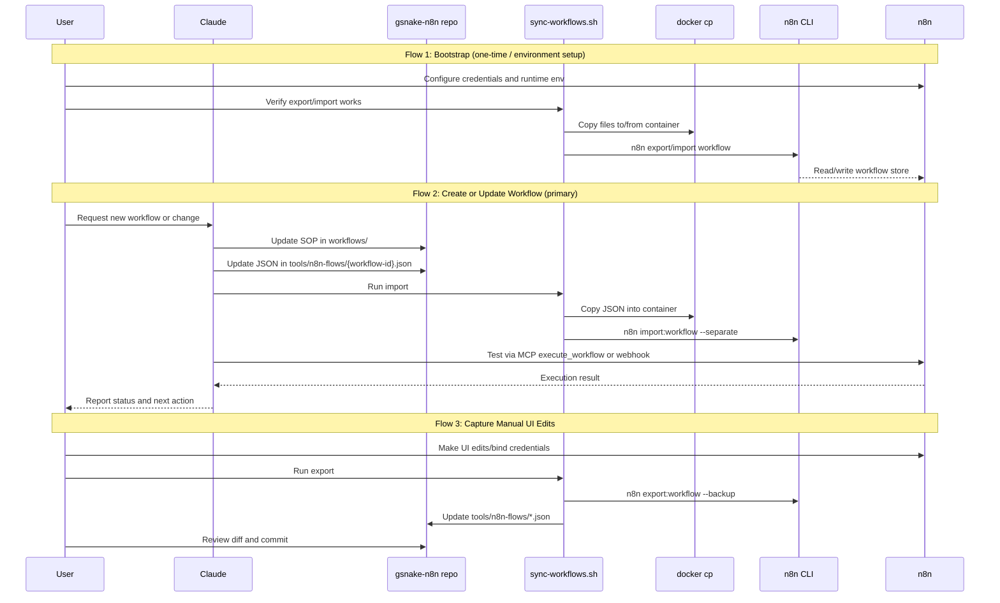

## Overview

This document defines the implemented operating flows for n8n workflow development in `gsnake-n8n/`. The outdated internal "workflow-sync" n8n workflow model is removed. Deployment and synchronization now happen through `tools/scripts/sync-workflows.sh` on the host.

______________________________________________________________________

## Flow 1: Bootstrap Environment

**Description**: Prepare the environment so workflow sync and execution are reliable.

**Trigger**: First setup or after environment drift.

**Steps**:

1. Ensure n8n container `n8n` is running and reachable.
1. Ensure required n8n runtime configuration exists (for example code-node builtins/env access when needed).
1. Create required credentials in n8n UI.
1. Run `tools/scripts/sync-workflows.sh export` to verify host\<->container transfer and CLI export.
1. Run `tools/scripts/sync-workflows.sh import` to verify deployment path.
1. Verify MCP connectivity for `search_workflows`, `get_workflow_details`, and `execute_workflow`.

**Exit**: Sync path and execution path are operational.

______________________________________________________________________

## Flow 2: Create Or Update Workflow (Primary)

**Description**: Author or modify workflow behavior from SOP to deployed n8n workflow.

**Trigger**: User requests a new workflow or behavior change.

**Steps**:

1. User requests workflow creation/update in Claude.
1. Claude clarifies requirements and updates SOP in `workflows/...`.
1. Claude creates/updates workflow JSON in `tools/n8n-flows/{workflow-id}.json` with a stable `id`.
1. Claude runs `tools/scripts/sync-workflows.sh import`.
1. n8n imports JSON files; existing IDs are updated in place.
1. Claude tests execution (MCP execution and/or real trigger).
1. If UI-side changes were made during validation, run export to recanonicalize JSON in git.
1. Commit SOP + workflow JSON together.

**Feedback points**:

- Import command output (workflow count and success/failure)
- Test execution result (success/failure, error location)
- Git diff before commit (SOP + JSON alignment)

**Exit**: Tested workflow and documentation are synchronized in git and deployed in n8n.

______________________________________________________________________

## Flow 3: Capture Manual n8n UI Changes

**Description**: Pull manual changes in n8n UI back into git.

**Trigger**: UI edits, credential binding changes, or emergency fixes performed directly in n8n.

**Steps**:

1. User/maintainer makes change in n8n UI.
1. Run `tools/scripts/sync-workflows.sh export`.
1. Review JSON diffs in `tools/n8n-flows/`.
1. Keep intended changes, discard accidental ones.
1. Commit canonical JSON updates.

**Exit**: Git reflects n8n runtime state.

______________________________________________________________________

## Flow 4: Troubleshoot Failed Workflow

**Description**: Diagnose and fix workflow failures with deterministic redeploy.

**Trigger**: Execution failure, invalid import, missing credentials, or incorrect output.

**Steps**:

1. Inspect n8n execution details and failing node.
1. Check workflow JSON and relevant SOP section.
1. Fix JSON/SOP and rerun `sync-workflows.sh import`.
1. Re-test via MCP execution or real trigger.
1. If root cause is environment/credential-related, correct n8n config and retest.
1. Export if UI adjustments were required, then commit.

**Exit**: Failure resolved and fix captured in git.

______________________________________________________________________

## Key Interaction Patterns

**Information hierarchy**:

- Primary: Claude + repo files (SOP + JSON)
- Secondary: Sync script output and n8n CLI behavior
- Tertiary: n8n UI execution logs and manual activation state

**Control rule**:

- Git is the source of truth for workflow definitions
- n8n UI is runtime/editor surface
- Export is used to capture manual/runtime metadata back into git
