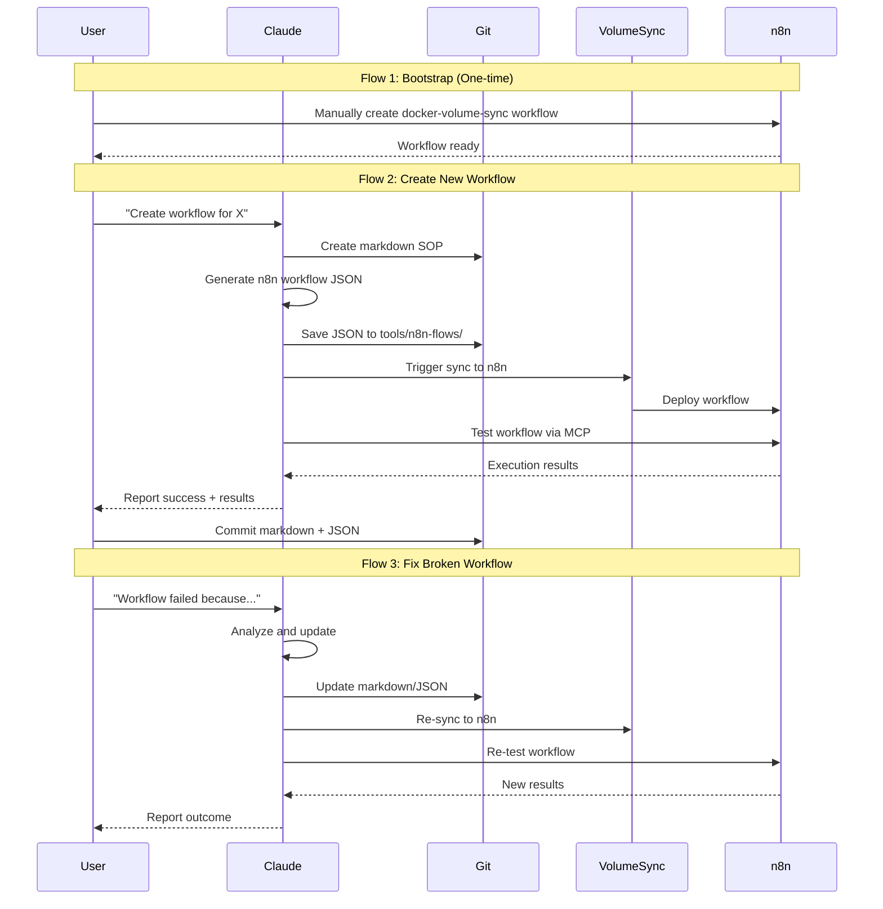

## Overview

This document defines the user flows for the WAT Framework proof of concept, where markdown SOPs are automatically translated into n8n workflows. The flows cover the complete journey from creating a workflow definition to validating it works in production.

______________________________________________________________________

## Flow 1: Bootstrap Volume Sync (One-Time Setup)

**Description**: Initial setup to enable automated workflow deployment

**Trigger**: Starting the proof of concept for the first time

**Steps**:

1. User opens the n8n UI in browser
1. User manually creates the docker-volume-sync workflow using the UI

- Add webhook trigger node with GitHub signature validation
- Add code node to execute Docker volume sync commands
- Configure environment variables and credentials

3. User tests the workflow manually to ensure it works
1. User notes the webhook URL for future use
1. System is now ready for automated workflow deployment

**Exit**: Volume sync workflow is operational and can be triggered to deploy other workflows

______________________________________________________________________

## Flow 2: Create New Workflow (Primary Flow)

**Description**: Generate and deploy a new n8n workflow from a markdown SOP

**Trigger**: User wants to create a new automation workflow

**Steps**:

1. User opens Claude Code and starts a conversation
1. User requests: "Create a workflow for [specific automation task]"
1. Claude asks clarifying questions about the workflow requirements
1. User provides details (inputs, outputs, steps, error handling)
1. Claude creates a markdown SOP document in the workflows directory
1. Claude shows the markdown content in chat for user review
1. Claude uses n8n MCP skills to generate the workflow JSON
1. Claude saves the JSON file to tools/n8n-flows/
1. Claude triggers the volume sync workflow to deploy to n8n
1. Claude uses MCP server to execute the workflow as a test
1. Claude reports the test results in chat (success/failure, execution details)
1. User reviews the results in Claude chat
1. User optionally opens n8n UI to inspect the workflow visually
1. User commits both the markdown SOP and generated JSON to git

**Feedback Points**:

- Claude confirms markdown SOP creation with file path
- Claude shows generated workflow structure summary
- Claude reports sync status (deploying to n8n)
- Claude displays test execution results
- n8n UI shows the new workflow in the workflows list

**Exit**: Working workflow deployed to n8n and committed to version control

______________________________________________________________________

## Flow 3: Validate Workflow

**Description**: Test and verify a workflow works correctly

**Trigger**: After creating a new workflow or making changes

**Steps**:

1. User asks Claude: "Test the [workflow name] workflow"
1. Claude uses MCP server to execute the workflow
1. Claude displays execution results in chat

- Execution ID
- Success/failure status
- Output data
- Any errors or warnings

4. User optionally opens n8n UI to see detailed execution logs
1. User inspects the workflow execution history and node outputs
1. User confirms the workflow behaves as expected

**Alternative Path - Manual Testing**:

1. User opens n8n UI
1. User navigates to the workflow
1. User clicks "Execute Workflow" button
1. User reviews the execution results in the UI
1. User returns to Claude to report findings

**Exit**: Workflow validated as working correctly

______________________________________________________________________

## Flow 4: Fix Broken Workflow

**Description**: Iteratively refine a workflow that isn't working correctly

**Trigger**: Workflow test fails or produces incorrect results

**Steps**:

1. User describes the problem to Claude: "The workflow failed because [error details]"
1. Claude analyzes the error and the current workflow definition
1. Claude identifies the root cause (logic error, missing config, incorrect node setup)
1. Claude proposes a fix and asks for confirmation
1. User approves the fix
1. Claude updates the markdown SOP to reflect the correction
1. Claude regenerates the workflow JSON with the fix
1. Claude saves the updated JSON
1. Claude triggers volume sync to redeploy
1. Claude re-tests the workflow via MCP server
1. Claude reports the new test results
1. If still broken, repeat from step 1
1. If working, user commits the fixes to git

**Feedback Points**:

- Claude explains what went wrong and why
- Claude shows the proposed fix before applying it
- Claude confirms redeployment status
- Claude displays new test results with comparison to previous attempt

**Exit**: Workflow fixed and working correctly, changes committed to git

______________________________________________________________________

## Flow 5: Update Existing Workflow

**Description**: Modify an existing workflow with new requirements

**Trigger**: User needs to change how an existing workflow behaves

**Steps**:

1. User tells Claude: "Update [workflow name] to [new requirement]"
1. Claude reads the current markdown SOP
1. Claude asks clarifying questions about the changes
1. User provides details
1. Claude updates the markdown SOP with the new requirements
1. Claude regenerates the workflow JSON
1. Claude shows a summary of what changed
1. Claude triggers volume sync to deploy the update
1. Claude tests the updated workflow
1. Claude reports results
1. User commits the updated markdown and JSON to git

**Exit**: Workflow updated with new behavior and committed to version control

______________________________________________________________________

## Key Interaction Patterns

**Information Hierarchy**:

- Primary: Claude chat interface (all status, results, errors)
- Secondary: n8n UI (detailed execution logs, visual workflow inspection)
- Tertiary: Git commits (version history, change tracking)

**Feedback Mechanisms**:

- Immediate: Claude chat responses during generation/deployment
- Validation: Test execution results from MCP server
- Confirmation: n8n UI showing deployed workflows and execution history

**Error Communication**:

- Claude explains errors in plain language
- Claude suggests fixes based on error analysis
- n8n UI provides detailed technical error logs
- Iterative refinement until resolution
