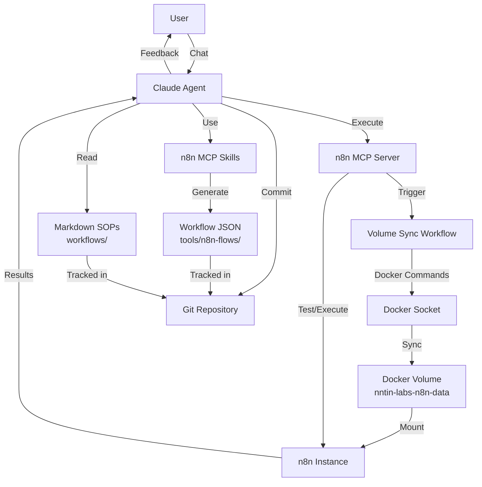

## Architectural Approach

### Core Architecture Pattern: WAT Framework

The system implements a three-layer architecture that separates concerns between probabilistic AI reasoning and deterministic execution:

**Layer 1: Workflows (Documentation as Code)**

- Markdown SOPs in file:workflows/ serve as the single source of truth
- Human-readable documentation that is also machine-executable
- Version controlled in git alongside generated artifacts

**Layer 2: Agents (AI Orchestration)**

- Claude AI reads markdown SOPs and orchestrates the generation pipeline
- Uses n8n MCP skills to generate valid n8n workflow JSON
- Handles deployment via MCP server execution
- Performs validation and iterative refinement

**Layer 3: Tools (Deterministic Execution)**

- n8n workflows execute the actual automation logic
- Docker-in-Docker for volume sync operations
- n8n MCP server for programmatic workflow control

### Key Architectural Decisions

**1. AI-Powered Workflow Generation**

- **Decision**: Use n8n MCP skills plugin for workflow generation
- **Rationale**: Leverages specialized AI knowledge of n8n's node structure, expression syntax, and workflow patterns
- **Trade-off**: Depends on AI quality, but eliminates manual JSON authoring
- **Constraint**: Generated workflows must conform to n8n's JSON schema

**2. Bidirectional Volume Sync**

- **Decision**: Implement bidirectional sync with conflict resolution between local filesystem and Docker volume
- **Rationale**: Enables both deployment (local → volume) and backup (volume → local)
- **Trade-off**: More complex than unidirectional, but provides flexibility and safety
- **Constraint**: Requires Docker socket access in n8n container

**3. Git as Source of Truth**

- **Decision**: Commit both markdown SOPs and generated JSON to version control
- **Rationale**: Full reproducibility, change tracking, and collaboration support
- **Trade-off**: Generated files in git can create noise, but provides audit trail
- **Constraint**: Requires discipline to keep markdown and JSON synchronized

**4. MCP-Based Deployment**

- **Decision**: Claude triggers volume sync via MCP `execute_workflow` tool
- **Rationale**: Programmatic control without manual intervention, integrated into generation flow
- **Trade-off**: Requires volume sync workflow to exist first (bootstrap problem)
- **Constraint**: MCP server must be accessible and authenticated

**5. In-Place Workflow Updates**

- **Decision**: Update existing workflows while preserving their IDs
- **Rationale**: Maintains workflow execution history and webhook URLs
- **Trade-off**: No automatic rollback, but simpler than versioning
- **Constraint**: Requires tracking workflow IDs between markdown and n8n

**6. Filename-Based Naming Convention**

- **Decision**: Derive workflow names from SOP filenames
- **Rationale**: Clear, predictable mapping between documentation and implementation
- **Trade-off**: Filename changes require workflow recreation
- **Constraint**: Filenames must be valid n8n workflow names

**7. n8n Credential System for Secrets**

- **Decision**: Use n8n's built-in credential management
- **Rationale**: Secure, centralized secret storage with access control
- **Trade-off**: Credentials must be manually configured in n8n UI first
- **Constraint**: Workflows reference credentials by name, not value

### Technical Constraints

**Infrastructure Constraints**:

- Self-hosted n8n instance at `https://n8n.labs.lair.nntin.xyz/`
- Docker volume `nntin-labs-n8n-data` mounted at `/home/node/.n8n`
- n8n container requires Docker socket mount for volume sync
- MCP server provides read-only access (no direct workflow creation API)

**Security Constraints**:

- GitHub webhook signature validation using `X-Hub-Signature-256`
- n8n MCP server authentication via Bearer token
- Secrets managed through n8n credentials, never in code

**Operational Constraints**:

- Bootstrap dependency: volume sync workflow must be manually created first
- No automated rollback mechanism (out of scope for POC)
- Simple linear workflows only (no complex branching/loops)

______________________________________________________________________

## Data Model

### Workflow Definition Schema

**Markdown SOP Structure** (workflows/service/*.md or workflows/actions/*.md):

```markdown
# Workflow Purpose

## Objective
What this workflow accomplishes

## Inputs
- Parameter 1: description, type, required/optional
- Parameter 2: description, type, required/optional

## Steps
1. Step description
2. Step description

## Outputs
- Output 1: description, type
- Output 2: description, type

## Error Handling
Expected failures and recovery strategies
```

**Generated n8n Workflow JSON** (tools/n8n-flows/\*.json):

```json
{
  "name": "workflow-name",
  "nodes": [...],
  "connections": {...},
  "settings": {...},
  "staticData": null,
  "tags": [],
  "triggerCount": 0,
  "updatedAt": "timestamp",
  "versionId": "uuid"
}
```

### Workflow Metadata Mapping

| Markdown SOP | n8n Workflow JSON | Derivation Rule |
| ----------------- | ------------------------------- | ------------------------------------------------ |
| Filename | `name` field | `docker-volume-sync.md` → `"docker-volume-sync"` |
| Objective section | Workflow description/notes | Copied verbatim |
| Inputs section | Webhook/trigger node parameters | Mapped to node configuration |
| Steps section | Node sequence | Translated to nodes + connections |
| Outputs section | Final node outputs | Mapped to response/action nodes |

### Workflow Identification Strategy

**Primary Key**: Workflow name (derived from filename)\
**Secondary Key**: n8n-assigned workflow ID (UUID)

**ID Preservation for Updates**:

1. When updating a workflow, Claude searches for existing workflow by name using MCP `search_workflows`
1. If found, extract the workflow ID from the search results
1. Include the ID in the updated JSON to preserve it
1. If not found, omit ID to let n8n create a new workflow

### Credential References

Workflows reference credentials by name, not value:

```javascript
// In n8n Code node
const apiKey = $credentials.github_token;
const secret = $env.N8N_WEBHOOK_SECRET;
```

**Credential Naming Convention**:

- Service-based: `github_token`, `discord_webhook`, `n8n_api_key`
- Environment-based: `production_db`, `staging_api`

### Volume Sync Data Flow

**Local → Volume (Upload)**:

- Source: tools/n8n-flows/\*.json
- Destination: Docker volume `nntin-labs-n8n-data:/home/node/.n8n/workflows/`
- Trigger: After workflow generation, Claude executes volume sync workflow

**Volume → Local (Download)**:

- Source: Docker volume `nntin-labs-n8n-data:/home/node/.n8n/workflows/`
- Destination: tools/n8n-flows/\*.json
- Trigger: Manual backup or before making changes

**Conflict Resolution Strategy**:

- Compare timestamps between local and volume files
- Newer file wins (last-write-wins strategy)
- Log conflicts for manual review
- For POC: Simple overwrite, no merge logic

______________________________________________________________________

## Component Architecture



### Component Responsibilities

**1. Claude Agent (Orchestrator)**

- **Responsibilities**:
  - Parse user requests and clarify requirements
  - Read markdown SOPs from file:workflows/
  - Invoke n8n MCP skills to generate workflow JSON
  - Save generated JSON to file:tools/n8n-flows/
  - Execute volume sync workflow via MCP server
  - Test deployed workflows via MCP server
  - Report results and errors to user
  - Commit changes to git
- **Interfaces**:
  - Input: User chat messages
  - Output: Generated workflows, test results, status updates
  - Dependencies: n8n MCP skills, n8n MCP server, filesystem, git

**2. n8n MCP Skills (Generation Engine)**

- **Responsibilities**:
  - Generate valid n8n workflow JSON from natural language descriptions
  - Ensure correct node configuration and connections
  - Apply n8n best practices and patterns
  - Validate expression syntax and code snippets
- **Interfaces**:
  - Input: Workflow requirements from Claude
  - Output: n8n workflow JSON structure
  - Skills used: `n8n-workflow-patterns`, `n8n-node-configuration`, `n8n-code-javascript`, `n8n-expression-syntax`

**3. n8n MCP Server (Execution Interface)**

- **Responsibilities**:
  - Provide programmatic access to n8n instance
  - Execute workflows on demand
  - Search for existing workflows
  - Retrieve workflow details and execution results
- **Interfaces**:
  - Endpoint: `https://n8n.labs.lair.nntin.xyz/mcp-server/http`
  - Authentication: Bearer token
  - Tools: `search_workflows`, `get_workflow_details`, `execute_workflow`

**4. Volume Sync Workflow (Deployment Mechanism)**

- **Responsibilities**:
  - Sync files between local file:tools/n8n-flows/ and Docker volume
  - Handle bidirectional sync with conflict resolution
  - Execute Docker commands via Docker-in-Docker
  - Validate sync operations and report status
- **Interfaces**:
  - Trigger: Webhook (called by Claude via MCP `execute_workflow`)
  - Input: Sync direction (upload/download/both), conflict resolution strategy
  - Output: Sync status, files transferred, conflicts detected
- **Node Structure**:
  - Webhook trigger with GitHub signature validation
  - Code node to execute Docker volume sync commands
  - Conditional logic for conflict resolution
  - Response node with sync results

**5. Docker-in-Docker (Infrastructure)**

- **Responsibilities**:
  - Provide Docker CLI access within n8n container
  - Execute volume mount and copy operations
  - Manage file permissions and ownership
- **Configuration**:
  - n8n container has Docker socket mounted: `-v /var/run/docker.sock:/var/run/docker.sock`
  - Execute Command node runs: `docker run --rm -v nntin-labs-n8n-data:/data -v /path/to/local:/backup alpine sh -c "cp -a /backup/. /data/"`

**6. Git Repository (Version Control)**

- **Responsibilities**:
  - Track markdown SOPs and generated JSON
  - Provide change history and audit trail
  - Enable collaboration and rollback
- **Structure**:
  - file:workflows/service/ - Service workflow SOPs (webhook endpoints)
  - file:workflows/actions/ - Action workflow SOPs (custom nodes)
  - file:tools/n8n-flows/ - Generated n8n workflow JSON files
  - file:CLAUDE.md - WAT Framework documentation

### Integration Points

**Claude ↔ n8n MCP Skills**:

- Claude provides workflow requirements in natural language
- Skills return structured n8n workflow JSON
- Iterative refinement if validation fails

**Claude ↔ n8n MCP Server**:

- Claude calls `execute_workflow` to trigger volume sync
- Claude calls `execute_workflow` to test generated workflows
- Claude calls `search_workflows` to find existing workflows for updates
- Claude calls `get_workflow_details` to inspect workflow configuration

**Volume Sync ↔ Docker**:

- Volume sync workflow executes Docker commands via Execute Command node
- Docker mounts both the n8n data volume and local filesystem
- Alpine container performs file copy operations

**n8n ↔ Docker Volume**:

- n8n reads workflows from `/home/node/.n8n/workflows/` (mounted from volume)
- Changes to volume are immediately reflected in n8n UI
- n8n auto-reloads workflows when files change

**Claude ↔ Git**:

- Claude commits both markdown SOPs and generated JSON
- Commit messages reference the workflow name and change type
- Git provides version history for troubleshooting

### Failure Modes and Recovery

**Workflow Generation Failure**:

- Cause: Invalid SOP, unclear requirements, AI hallucination
- Detection: JSON validation fails, n8n rejects workflow
- Recovery: Claude analyzes error, refines SOP, regenerates

**Volume Sync Failure**:

- Cause: Docker socket unavailable, permission issues, volume not mounted
- Detection: Execute Command node returns error
- Recovery: Manual intervention required (check Docker configuration)

**Deployment Failure**:

- Cause: n8n can't parse JSON, missing credentials, invalid node configuration
- Detection: Workflow doesn't appear in n8n UI or shows errors
- Recovery: Claude inspects workflow details, fixes JSON, re-syncs

**Test Execution Failure**:

- Cause: Workflow logic error, missing inputs, credential issues
- Detection: MCP `execute_workflow` returns error or unexpected output
- Recovery: Claude analyzes execution logs, updates workflow, re-deploys

### Bootstrap Sequence

**Initial Setup** (One-time, manual):

1. User manually creates volume sync workflow in n8n UI
1. User configures Docker socket mount in n8n container
1. User sets up n8n credentials for required services
1. User configures MCP server authentication

**First Workflow Generation** (Automated):

1. User requests workflow creation via Claude chat
1. Claude reads markdown SOP
1. Claude generates workflow JSON using MCP skills
1. Claude saves JSON to file:tools/n8n-flows/
1. Claude executes volume sync workflow via MCP
1. Volume sync uploads JSON to Docker volume
1. n8n detects new workflow and loads it
1. Claude tests workflow via MCP
1. Claude reports results to user
1. User commits markdown + JSON to git
