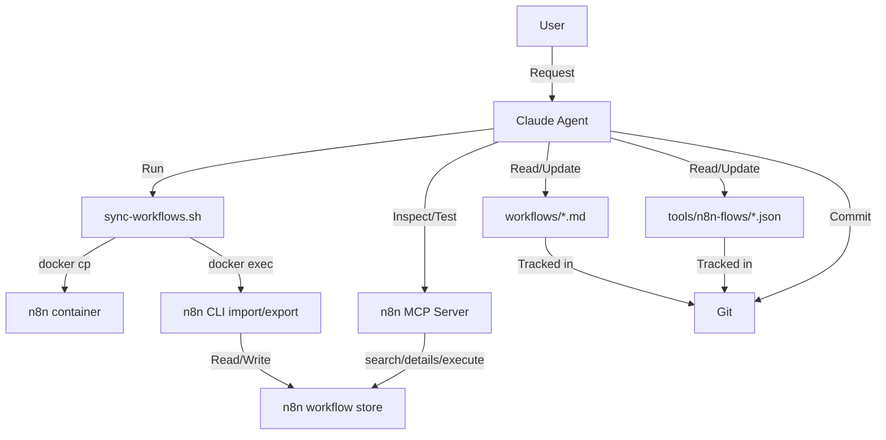

## Architectural Approach

### Core Architecture Pattern: WAT with External Deployment

The implemented architecture keeps WAT layering but moves deployment mechanics outside n8n workflows.

**Layer 1: Workflows (documentation)**

- Markdown SOPs in `gsnake-n8n/workflows/`
- Current taxonomy includes:
  - `workflows/infra/` for operational scripts/processes
  - `workflows/n8n-webhook/` for webhook-driven automations
- SOPs define intent, inputs, steps, outputs, and operational notes

**Layer 2: Agents (orchestration)**

- Claude reads/updates SOPs and workflow JSON files
- Claude runs deployment scripts from the host environment
- Claude validates behavior via MCP execution and/or real triggers

**Layer 3: Tools (deterministic execution)**

- n8n executes workflow logic
- n8n CLI (`import:workflow`, `export:workflow`) is the authoritative write/read interface
- `tools/scripts/sync-workflows.sh` orchestrates file transfer and CLI calls

### Implemented Architectural Decisions

**1. Deployment happens outside n8n**

- Implemented with `gsnake-n8n/tools/scripts/sync-workflows.sh`
- Avoids circular dependency (no workflow that deploys workflows)
- Keeps deployment concerns in infra tooling, not business workflows

**2. n8n CLI is the authoritative sync boundary**

- Import: `n8n import:workflow --separate --input=<dir>`
- Export: `n8n export:workflow --backup --output=<dir>`
- Script uses `docker cp` + `docker exec` against container `n8n`

**3. Workflow ID is stable primary identity**

- JSON `id` is preserved during import
- Re-import with same `id` updates in place (no duplicates)
- File convention: `tools/n8n-flows/{workflow-id}.json`

**4. Git-first operating model**

- Git is canonical source for workflow definitions
- UI/manual changes are captured with `export`
- Deployments are applied with `import`
- `sync` performs export then import to reconcile state

**5. MCP scope is execution and inspection, not deployment writes**

- MCP server is used for:
  - `search_workflows`
  - `get_workflow_details`
  - `execute_workflow`
- Deployment writes are done through script + CLI path

**6. Activation and safety model**

- Imported workflows are treated as inactive until validated and explicitly activated
- Runtime verification happens before enabling trigger-based production behavior

**7. Credentials and secrets stay out of git**

- Credential values are stored in n8n/environment configuration
- Workflow JSON references credential bindings/keys, not raw secret values

### Deprecated Design

The old internal "workflow-sync" n8n workflow design is deprecated and removed from the primary architecture because it introduced bootstrap and reliability risks.

### Technical Constraints

- n8n instance: `https://n8n.labs.lair.nntin.xyz/`
- Runtime container name: `n8n`
- Host must have Docker access for `docker exec` and `docker cp`
- n8n CLI must be available inside container
- MCP access requires configured bearer-token auth

______________________________________________________________________

## Data Model

### Repository-Level Data Objects

| Object | Path | Purpose | Source of truth |
| --- | --- | --- | --- |
| SOP markdown | `gsnake-n8n/workflows/**/*.md` | Functional/operational spec | Git |
| Workflow JSON | `gsnake-n8n/tools/n8n-flows/*.json` | Deployable n8n definitions | Git |
| Sync script | `gsnake-n8n/tools/scripts/sync-workflows.sh` | Deployment/export orchestration | Git |
| Runtime workflow records | n8n backing store | Executable runtime state | n8n (reconciled from git) |

### SOP Structure

SOPs are markdown-first and implementation-aware. Typical metadata fields include:

- `implementation_status`
- `tool_type`
- `tool_location`
- `workflow_id`
- `last_updated`
- `dependencies`
- `tags`

Core body sections capture objective, prerequisites, implementation, usage, error handling, and tests.

### Workflow JSON Canonical Shape

```json
{
  "id": "github-discord-notify",
  "name": "GitHub to Discord Notification",
  "active": false,
  "nodes": [],
  "connections": {},
  "settings": {},
  "versionId": "<n8n-generated>",
  "shared": []
}
```

### Identity And Naming Rules

1. Workflow `id` is the primary key.
1. JSON filename equals workflow `id` (`{id}.json`).
1. `name` is human-readable and can change without changing identity.
1. `versionId` is regenerated by n8n and expected to change over time.

### Sync Operation Data Contracts

**Import (`git -> n8n`)**

- Input: all `*.json` files in `tools/n8n-flows/`
- Transfer: host -> container via `docker cp`
- Apply: `n8n import:workflow --separate`
- Result: create/update workflows by stable `id`

**Export (`n8n -> git`)**

- Extract: `n8n export:workflow --backup`
- Transfer: container -> host via `docker cp`
- Result: canonicalized JSON files in `tools/n8n-flows/`

**Sync (`export` then `import`)**

- Captures runtime/manual edits first
- Reapplies git-controlled state second

### Conflict Resolution Rules

- Canonical intent is maintained in git.
- If UI/runtime edits are intended, export and commit them.
- If UI/runtime edits are accidental, discard export diff and re-import git state.

### Credential And Environment Model

- Secrets are not committed in workflow JSON.
- n8n credentials and environment variables provide secret material at runtime.
- Workflows depending on code-node crypto/env access require corresponding n8n runtime configuration.

______________________________________________________________________

## Component Architecture



### Component Responsibilities

**1. Claude Agent**

- Maintain SOP + JSON alignment
- Execute sync script for deploy/export
- Run validations and summarize outcomes

**2. Git Repository (`gsnake-n8n/`)**

- Version control for SOPs, workflows, and scripts
- Audit trail for workflow behavior changes

**3. Sync Script (`tools/scripts/sync-workflows.sh`)**

- Validate container availability
- Perform `import`, `export`, or `sync`
- Handle temporary container paths and cleanup

**4. Docker + n8n CLI**

- Provide deterministic transfer and apply/export operations
- Ensure update-in-place behavior by workflow `id`

**5. n8n Runtime**

- Execute workflows
- Hold active/inactive runtime state and credentials

**6. MCP Server**

- Query workflow inventory/details
- Execute workflows for verification
- Does not serve as primary deployment writer

### Primary End-To-End Flow

1. Update SOP in `workflows/...`.
1. Generate or edit workflow JSON in `tools/n8n-flows/{id}.json`.
1. Run `./tools/scripts/sync-workflows.sh import`.
1. Test behavior via MCP execution and/or real trigger.
1. If UI edits were introduced, run export and review diffs.
1. Commit SOP + JSON together.

### Failure Modes And Recovery

**Import/export failure**

- Cause: container unavailable, CLI error, file transfer failure
- Recovery: fix container/CLI path, rerun script, verify with command output

**Workflow execution failure**

- Cause: node logic bug, missing env/credentials, invalid assumptions
- Recovery: inspect execution in n8n, update JSON/SOP, re-import and retest

**Credential binding/runtime configuration issues**

- Cause: missing credential or runtime env capability
- Recovery: configure n8n credentials/env, then rerun validation

**Drift between n8n UI and git**

- Cause: manual UI edits without export
- Recovery: run export, review diff, commit intended changes or discard and re-import

### Current Implementation Evidence

- `gsnake-n8n/tools/scripts/sync-workflows.sh` exists and is operational.
- `gsnake-n8n/tools/n8n-flows/` contains deployed workflow JSON files.
- `gsnake-n8n/workflows/infra/n8n-sync.md` documents the sync process.
- `gsnake-n8n/workflows/n8n-webhook/notify-discord.md` is implemented and tracked.
