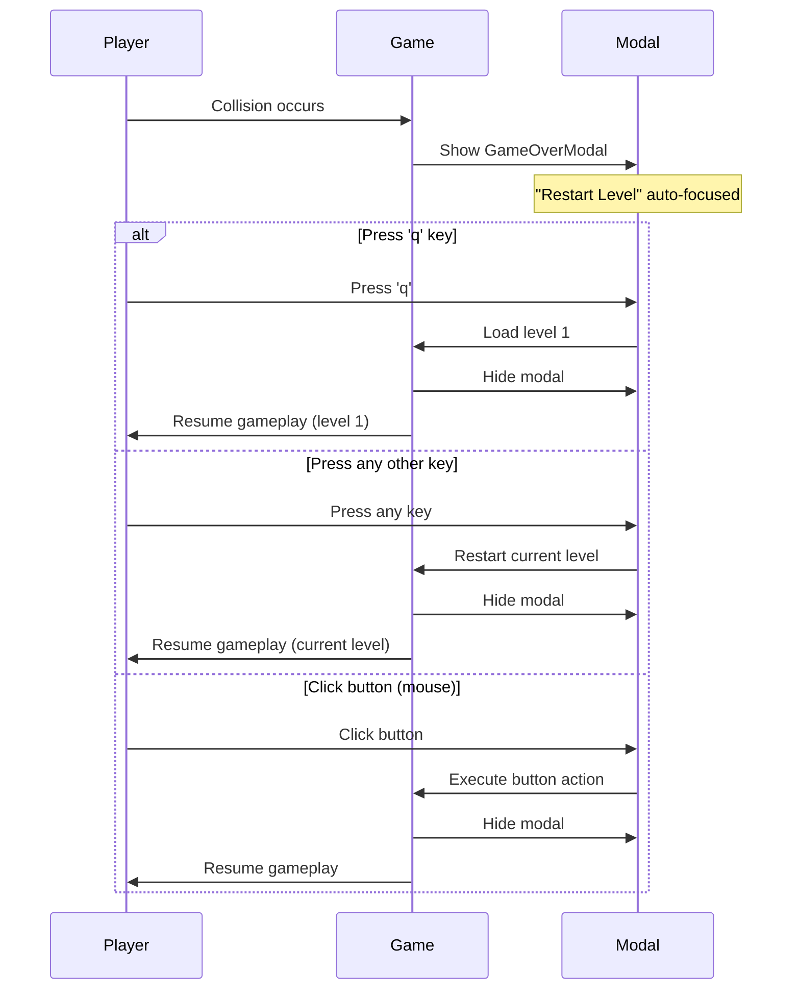

## Overview

This document defines the user interaction flows for keyboard navigation and shortcuts in gSnake. The design prioritizes instant, frictionless actions that maintain player flow state during the play-retry-play cycle.

**Key Design Notes:**

- Only plain keys are handled (modifier combinations like Ctrl+R, Alt+Q are ignored to preserve browser shortcuts)
- Escape key provides quick "go to level 1" action across all game states

## Flow 1: Gameplay Shortcuts

**Description:** Quick restart and level navigation during active gameplay

**Trigger:** Player is actively playing a level (game status is "Playing")

**Flow:**

1. Player presses 'r' key
  - Level restarts instantly
  - Snake returns to starting position
  - Move counter resets to 0
  - Food respawns in original positions
  - No visual feedback or confirmation
2. Player presses 'q' key
  - Game loads level 1 instantly
  - All level state resets
  - No visual feedback or confirmation
3. Player presses Escape key
  - No action taken
  - Gameplay continues normally
4. Player continues using WASD/Arrow keys for directional movement
  - Existing movement behavior unchanged
  - 'r', 'q', and Escape do not interfere with gameplay controls
5. Player presses modifier key combinations (Ctrl+R, Alt+Q, etc.)
  - Ignored by game - browser handles these normally
  - Allows Ctrl+R to refresh page, etc.

**Exit:** Player continues gameplay with the restarted/reloaded level

---

## Flow 2: GameOver Modal Interaction

**Description:** Keyboard-driven restart options when player fails a level

**Trigger:** Player collides with obstacle, boundary, or self → GameOverModal appears

**Initial State:**

- Modal displays with "Game Over" heading
- Two buttons visible: "Restart Level" (primary/green) and "Back to Level 1" (secondary/gray)
- "Restart Level" button is automatically focused (though focus state is not visually indicated)

**Flow:**

1. **Any key restart** (most common path)
  - Player presses any key: WASD, Arrow keys, Space, Enter, Tab, letters, numbers, etc.
  - **Exceptions:** 'q' and Escape keys have special behavior (see step 2)
  - Level restarts instantly
  - Modal disappears
  - Gameplay resumes from level start
2. **Return to Level 1**
  - Player presses 'q' key OR Escape key
  - Game loads level 1 instantly
  - Modal disappears
  - Gameplay begins at level 1
3. **Mouse interaction** (alternative path)
  - Player can still click buttons with mouse
  - "Restart Level" button → restarts current level
  - "Back to Level 1" button → loads level 1
4. **Modifier key combinations ignored**
  - Player presses Ctrl+R, Alt+Q, Shift+Space, etc.
  - Game ignores these - browser handles them normally
  - Allows browser shortcuts to work (Ctrl+R refreshes page)

**Key Behaviors:**

- No visual feedback before action executes
- No confirmation dialogs
- Directional keys (WASD/Arrows) trigger restart, not button navigation
- Tab/Enter/Space trigger restart, not button focus/activation
- Escape key goes to level 1 (same as 'q')
- Modifier key combinations (Ctrl/Alt/Shift/Meta) are ignored
- Buttons remain clickable for mouse users

**Exit:** Player returns to active gameplay (either current level or level 1)

---

## Flow 3: GameComplete Modal Interaction

**Description:** Keyboard shortcuts to restart after completing all levels

**Trigger:** Player completes the final level → GameCompleteModal appears

**Initial State:**

- Modal displays "All Levels Complete!" heading
- Congratulations message shown
- Text says "Refresh the page to play again"
- No buttons present

**Flow:**

1. Player presses 'r' key
  - Game loads level 1 instantly
  - Modal disappears
  - Gameplay begins at level 1
2. Player presses 'q' key
  - Game loads level 1 instantly (same as 'r')
  - Modal disappears
  - Gameplay begins at level 1
3. Player presses Escape key
  - Game loads level 1 instantly (same as 'r' and 'q')
  - Modal disappears
  - Gameplay begins at level 1
4. Player presses any other key
  - No action taken
  - Modal remains visible
  - Only 'r', 'q', and Escape are active shortcuts
5. Player presses modifier key combinations (Ctrl+R, Alt+Q, etc.)
  - Ignored by game - browser handles these normally

**Key Behaviors:**

- 'r', 'q', and Escape all perform identical action (restart from level 1)
- No visual feedback before action executes
- Other keys are ignored (no "any key" behavior here)
- Modifier key combinations (Ctrl/Alt/Shift/Meta) are ignored
- Player can still refresh page manually if preferred

**Exit:** Player returns to active gameplay at level 1

---

## Interaction Summary Table

| Context           | Key                 | Action                    | Visual Feedback |
| ----------------- | ------------------- | ------------------------- | --------------- |
| Active Gameplay   | 'r'                 | Restart current level     | None (instant)  |
| Active Gameplay   | 'q'                 | Go to level 1             | None (instant)  |
| Active Gameplay   | Escape              | No action                 | None            |
| Active Gameplay   | WASD/Arrows         | Directional movement      | Snake moves     |
| Active Gameplay   | Ctrl/Alt/Shift+Key  | Ignored (browser handles) | None            |
| GameOverModal     | 'q' or Escape       | Go to level 1             | None (instant)  |
| GameOverModal     | Any other key       | Restart current level     | None (instant)  |
| GameOverModal     | Ctrl/Alt/Shift+Key  | Ignored (browser handles) | None            |
| GameOverModal     | Mouse click         | Execute button action     | None (instant)  |
| GameCompleteModal | 'r', 'q', or Escape | Go to level 1             | None (instant)  |
| GameCompleteModal | Ctrl/Alt/Shift+Key  | Ignored (browser handles) | None            |
| GameCompleteModal | Other keys          | No action                 | None            |

---

## Design Principles

1. **Zero Friction:** All keyboard shortcuts execute instantly without confirmation or visual feedback
2. **Flow Preservation:** Players never need to switch from keyboard to mouse during gameplay sessions
3. **Consistent Shortcuts:** 'r' and 'q' work the same way across all game states
4. **Any-Key Optimization:** GameOverModal prioritizes the fastest possible restart (any key)
5. **Mouse Compatibility:** Buttons remain functional for players who prefer mouse interaction

