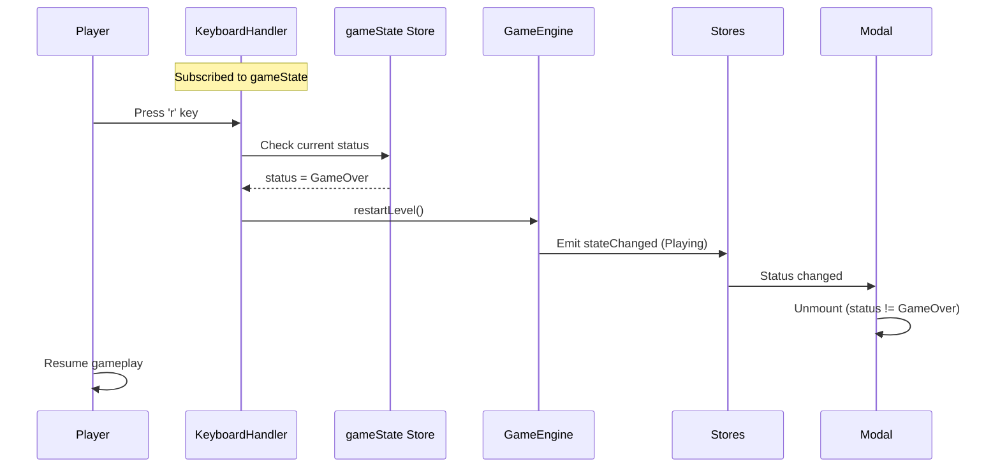
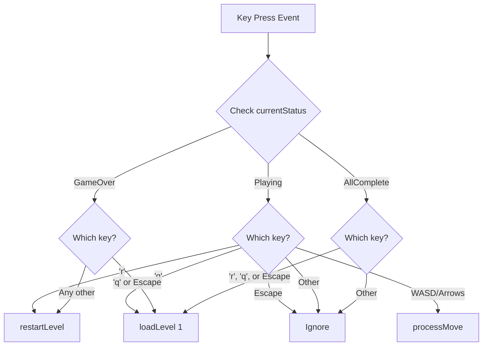
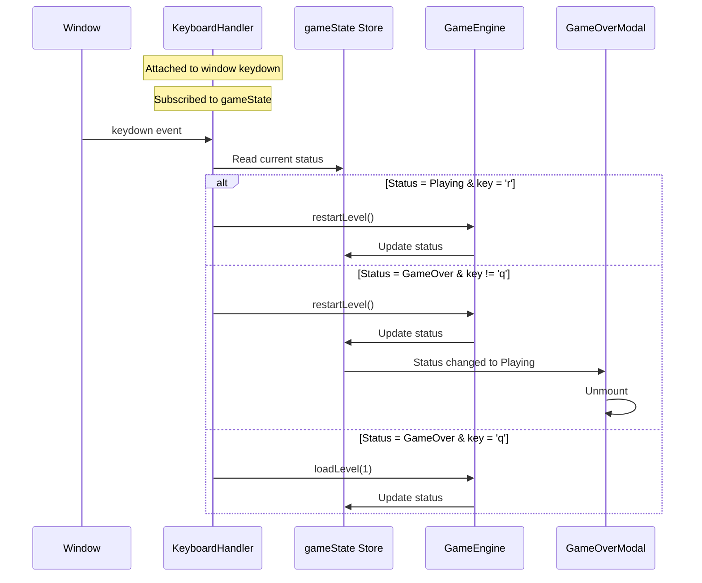

## Architectural Approach

### Pattern: Centralized State-Aware Keyboard Handling

Extend the existing file:engine/KeyboardHandler.ts to handle all keyboard input (directional movement + shortcuts) with state-aware routing logic. This maintains a single source of truth for keyboard behavior while adapting to different game states.

**Key Architectural Decisions:**

1. **Centralized Keyboard Logic**
  - All keyboard input flows through KeyboardHandler
  - State-aware routing: Different key behaviors based on GameStatus (Playing, GameOver, AllComplete)
  - Modifier key filtering: Ignore Ctrl/Alt/Shift/Meta combinations (only handle plain keys)
  - Trade-off: Couples keyboard logic to game state, but provides single point of control
  - Rationale: Prevents listener conflicts, easier to test, matches existing pattern
2. **Reactive State Access via Store Subscription**
  - KeyboardHandler subscribes to file:stores/stores.ts gameState store
  - Maintains local reference to current GameStatus
  - Trade-off: Couples KeyboardHandler to Svelte stores
  - Rationale: Follows existing reactive pattern, automatic updates on state changes
3. **Selective Event Prevention**
  - Prevent default browser behavior for specific keys:
    - Always: Space, Tab, Arrows (prevent scrolling/focus changes)
    - Conditionally: 'r' and 'q' only when no modifier keys pressed (allow Ctrl+R refresh, etc.)
  - Other keys (letters, numbers) allow default behavior
  - Trade-off: More permissive, but avoids unwanted scrolling/focus changes
  - Rationale: Balances UX smoothness with browser compatibility, preserves browser shortcuts
4. **Component-Local Auto-Focus**
  - GameOverModal handles button auto-focus using Svelte's `onMount` lifecycle
  - Simple, standard Svelte pattern with `bind:this` reference
  - Trade-off: Component-specific code, not reusable
  - Rationale: Single use case, no need for abstraction

**Constraints:**

- Must maintain existing directional movement behavior (WASD/Arrows during gameplay)
- Must not break existing GameEngine API (`restartLevel()`, `loadLevel()`)
- Must work with existing event system (GameEngine → Stores → Components)
- No changes to visual design or modal layout

**Request Flow Example:**



---

## Data Model

**No new data models or schema changes required.**

The existing type system in file:types/index.ts provides all necessary structures:

- `GameStatus` enum: Already includes Playing, GameOver, AllComplete states
- `GameState` interface: Already tracks status, currentLevel, moves, etc.
- `GameEvent` type: Already supports stateChanged events

**Existing Types (No Changes):**

```typescript
enum GameStatus {
  Playing = 'PLAYING',
  GameOver = 'GAME_OVER',
  LevelComplete = 'LEVEL_COMPLETE',
  AllComplete = 'ALL_COMPLETE'
}

interface GameState {
  status: GameStatus;
  currentLevel: number;
  moves: number;
  foodCollected: number;
  totalFood: number;
}
```

**Integration with Existing Schema:**

- KeyboardHandler will read `GameState.status` to determine key routing
- No modifications to GameEngine's internal state management
- No changes to event emission or store updates

---

## Component Architecture

### Modified Components

#### 1. KeyboardHandler (file:engine/KeyboardHandler.ts)

**Current Responsibility:**

- Handle directional input (WASD/Arrows)
- Call GameEngine.processMove() when status is Playing

**New Responsibilities:**

- Subscribe to gameState store for current GameStatus
- Route keyboard events based on game state:
  - **Playing**: Handle 'r' (restart), 'q' (level 1), Escape (no action), directional keys (movement)
  - **GameOver**: Handle 'q' (level 1), Escape (level 1), any other key (restart)
  - **AllComplete**: Handle 'r' (level 1), 'q' (level 1), Escape (level 1)
- Filter out modifier key combinations (Ctrl/Alt/Shift/Meta) - only handle plain keys
- Prevent default browser behavior:
  - Always: Space, Tab, Arrows
  - Conditionally: 'r', 'q', Escape (only when no modifiers pressed)

**Key Interfaces:**

```typescript
// Constructor receives GameEngine (existing)
constructor(gameEngine: GameEngine)

// Subscribe to gameState store (new)
private currentStatus: GameStatus

// Enhanced key routing (modified)
handleKeyPress(event: KeyboardEvent): void
```

**Integration Points:**

- Subscribes to `gameState` store from file:stores/stores.ts
- Calls `gameEngine.restartLevel()` for restart actions
- Calls `gameEngine.loadLevel(1)` for level 1 actions
- Calls `gameEngine.processMove(direction)` for directional input

**State-Aware Routing Logic:**



---

#### 2. GameOverModal (file:components/GameOverModal.svelte)

**Current Responsibility:**

- Display "Game Over" message and two buttons
- Handle button clicks (restart level, back to level 1)

**New Responsibilities:**

- Auto-focus "Restart Level" button on mount
- Maintain existing button click handlers for mouse users

**Key Changes:**

- Add `onMount` lifecycle hook
- Add `bind:this` reference to primary button
- Call `.focus()` on button element when component mounts

**Integration Points:**

- No changes to GameEngine interaction (existing click handlers remain)
- No keyboard event listeners (handled by KeyboardHandler)

---

#### 3. GameCompleteModal (file:components/GameCompleteModal.svelte)

**Current Responsibility:**

- Display "All Levels Complete!" message
- Show text: "Refresh the page to play again"

**New Responsibilities:**

- None (keyboard shortcuts handled by KeyboardHandler)

**Key Changes:**

- No changes required

**Integration Points:**

- KeyboardHandler handles 'r' and 'q' shortcuts when this modal is visible

---

### Unchanged Components

#### GameEngine (file:engine/GameEngine.ts)

- No changes required
- Existing `restartLevel()` and `loadLevel()` methods are sufficient
- Existing event emission system remains unchanged

#### Overlay (file:components/Overlay.svelte)

- No changes required
- Continues to show/hide modals based on gameState.status

#### Stores (file:stores/stores.ts)

- No changes required
- Existing gameState store provides necessary reactive state

---

## Component Interaction Flow



---

## Implementation Considerations

### Lifecycle Management

- KeyboardHandler is attached once at app initialization
- Persists for entire app lifetime (never detached in normal operation)
- Store subscription cleanup not required - KeyboardHandler lifecycle matches app lifecycle
- Note: If architecture changes to support KeyboardHandler detachment, store unsubscribe must be implemented

### Race Condition Prevention

- GameEngine's existing `isProcessing` flag prevents concurrent actions
- Store updates are synchronous within Svelte's reactivity system
- Modal mount timing race condition is acceptable - preventDefault and isProcessing flag provide sufficient protection
- No additional debouncing or delays needed

### Browser Compatibility

- `event.preventDefault()` is widely supported
- Button `.focus()` method is standard DOM API
- Svelte store subscriptions work in all modern browsers

### Testing Strategy

- Unit test KeyboardHandler with mocked gameState values
- Test each state transition (Playing → GameOver → Playing)
- Test key routing logic for all GameStatus values
- Test modifier key filtering (Ctrl+R, Alt+Q should be ignored)
- Test Escape key behavior in each game state
- Test preventDefault logic for different key types
- Integration test: Full keyboard flow from gameplay to modal to restart

