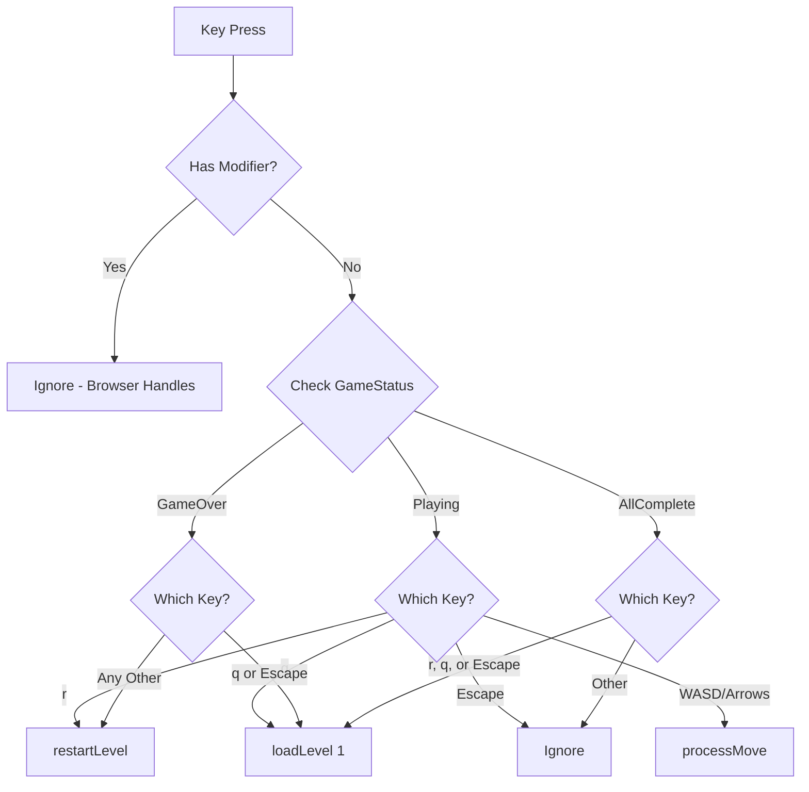

## Overview

Extend file:engine/KeyboardHandler.ts to handle keyboard shortcuts ('r', 'q', Escape) with state-aware routing based on current game status (Playing, GameOver, AllComplete). This enables players to restart levels and navigate without using the mouse.

## Scope

**In Scope:**

- Subscribe to gameState store to track current GameStatus
- Implement state-aware key routing:
  - **Playing**: 'r' restarts level, 'q' goes to level 1, Escape ignored
  - **GameOver**: 'q' or Escape go to level 1, any other key restarts level
  - **AllComplete**: 'r', 'q', or Escape all go to level 1
- Filter out modifier key combinations (Ctrl/Alt/Shift/Meta) - only handle plain keys
- Implement selective preventDefault:
  - Always prevent: Space, Tab, Arrows
  - Conditionally prevent: 'r', 'q', Escape (only when no modifiers)
- Maintain existing directional key behavior (WASD/Arrows for movement)

**Out of Scope:**

- Changes to GameEngine (use existing `restartLevel()` and `loadLevel()` methods)
- Changes to modal components (keyboard handling is centralized)
- Visual feedback or UI changes
- Documentation

## Technical Approach

**Store Subscription:**

```typescript
// Subscribe to gameState store in constructor
private currentStatus: GameStatus;
// Store subscription lives for app lifetime (no cleanup needed)
```

**State-Aware Routing:**



**preventDefault Strategy:**

- Check for modifier keys first (Ctrl/Alt/Shift/Meta)
- If modifiers present, don't prevent default (allow browser shortcuts)
- If no modifiers, prevent default for Space, Tab, Arrows, 'r', 'q', Escape

## Acceptance Criteria

- [ ] KeyboardHandler subscribes to gameState store and tracks current GameStatus
- [ ] During gameplay (Playing): 'r' restarts level, 'q' goes to level 1, Escape does nothing
- [ ] In GameOverModal (GameOver): 'q' or Escape go to level 1, any other key restarts level
- [ ] In GameCompleteModal (AllComplete): 'r', 'q', or Escape all go to level 1
- [ ] Modifier key combinations (Ctrl+R, Alt+Q, etc.) are ignored by game
- [ ] Browser shortcuts (Ctrl+R refresh, etc.) continue to work
- [ ] Existing directional controls (WASD/Arrows) work normally during gameplay
- [ ] Space, Tab, Arrows don't cause scrolling or focus changes
- [ ] No race conditions or double-actions (GameEngine.isProcessing flag prevents this)

## References

- **Epic Brief**: spec:epics/navigation/epic-brief.md
- **Core Flows**: spec:epics/navigation/core-flows.md
- **Tech Plan**: spec:epics/navigation/tech-plan.md (Component Architecture → KeyboardHandler section)

## Files to Modify

- file:engine/KeyboardHandler.ts - Main implementation
- file:stores/stores.ts - Import gameState store (no changes needed, just import)
- file:types/index.ts - Import GameStatus enum (no changes needed, just import)

## Testing Notes

- Test each GameStatus state with all key combinations
- Test modifier key filtering (Ctrl+R, Alt+Q should be ignored)
- Test Escape key in all states
- Test preventDefault logic for different key types
- Verify existing directional movement still works
