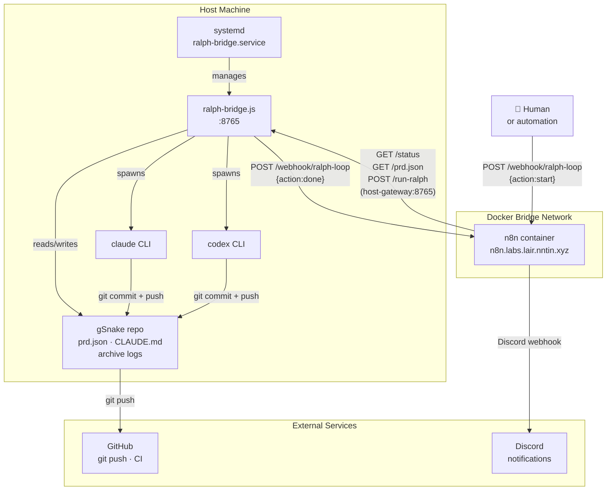
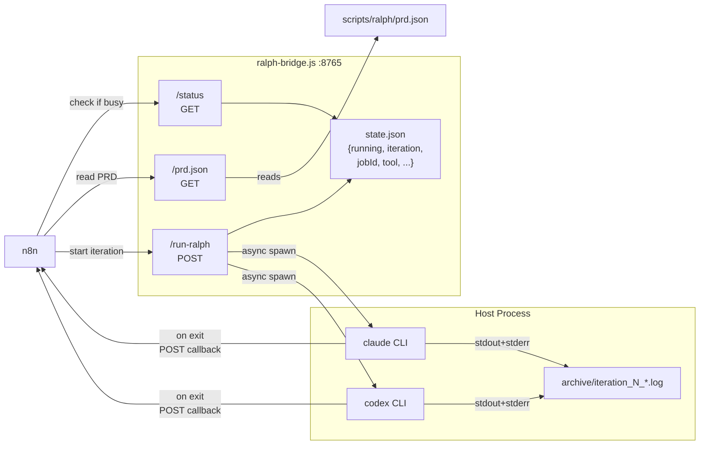
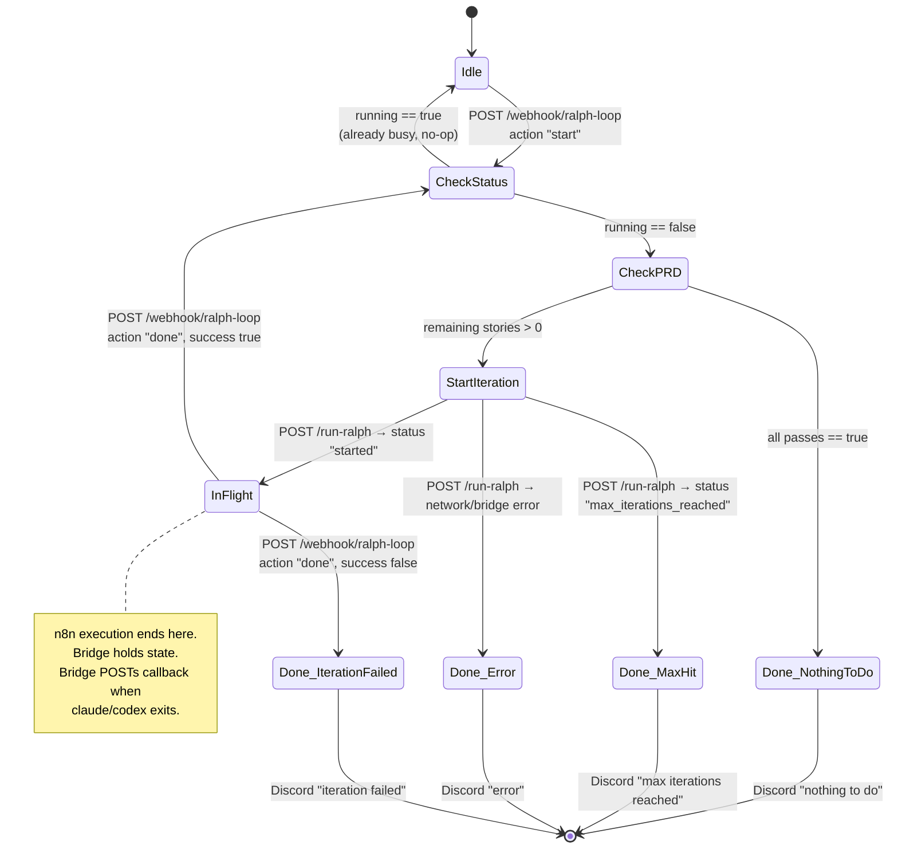
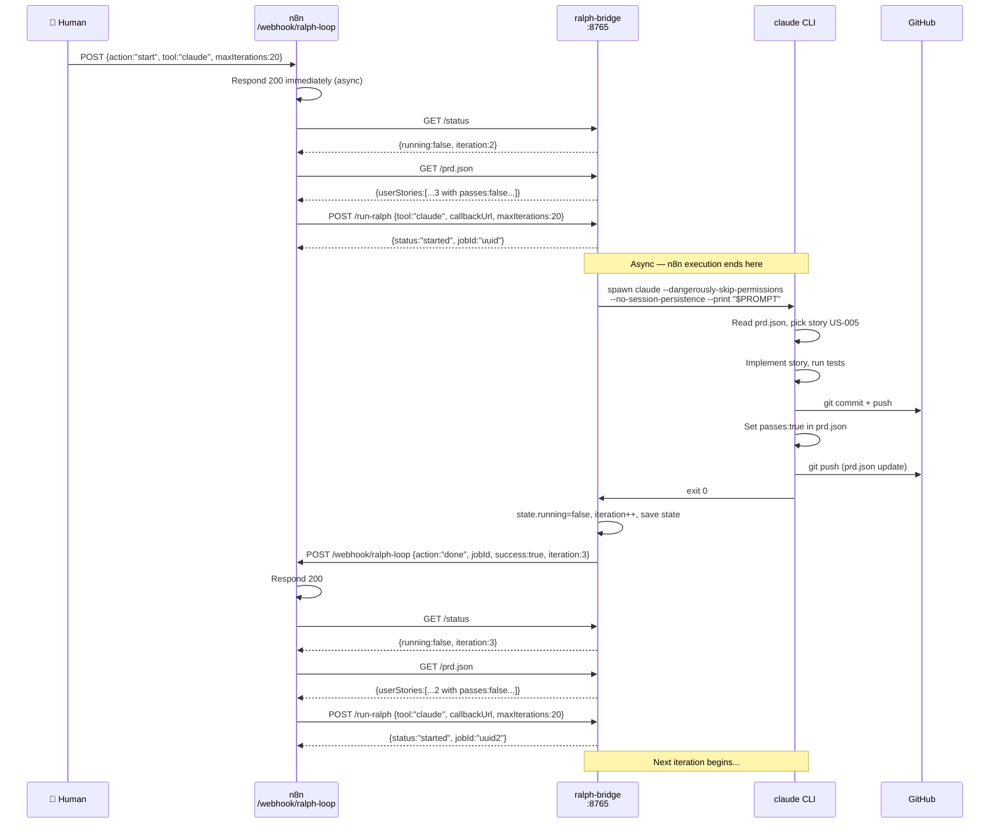
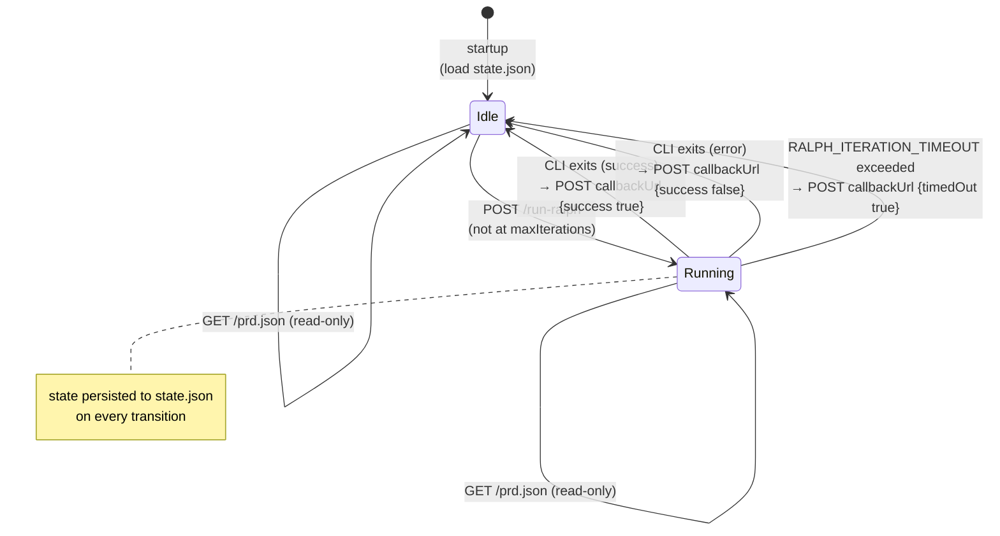
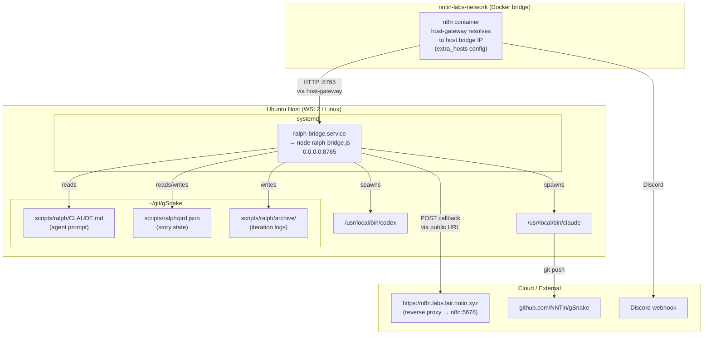

# Ralph Loop Architecture

Visual specification for the ralph-loop n8n implementation.
See `gsnake-n8n/workflows/n8n-workflow/ralph-loop.md` for the full SOP.

______________________________________________________________________

## 1. System Overview

High-level view of all components and their relationships.

______________________________________________________________________

## 2. Bridge HTTP API

The bridge service acts as a thin execution proxy between n8n and the host CLIs.

______________________________________________________________________

## 3. n8n Webhook State Machine

The n8n workflow is driven entirely by webhook callbacks. There is no polling or sleep.

______________________________________________________________________

## 4. Iteration Sequence

One complete iteration from n8n's perspective, showing all HTTP hops.

______________________________________________________________________

## 5. Bridge State Machine

Internal state transitions inside `ralph-bridge.js`.

______________________________________________________________________

## 6. Deployment View

Physical deployment topology and network paths.

