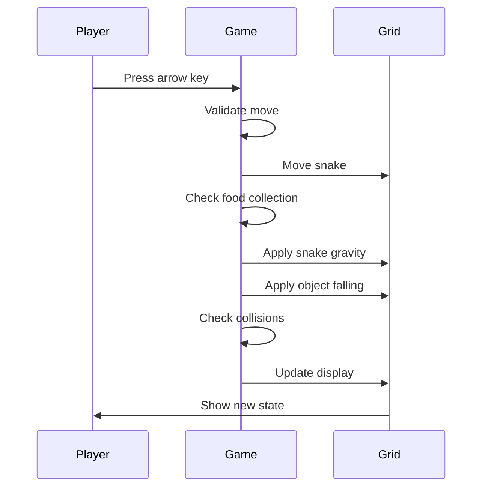

## Overview

This spec defines the gameplay flows and interactions for the extended game object system. Players discover object behaviors through experimentation, with visual feedback provided through distinct colors and animations.

## Visual Design Language

| Object Type | Color | Visual Pattern | Platform Behavior |
| ----------------- | ----------- | ---------------- | -------------------------- |
| Floating Food | Orange | Solid fill | Acts as platform |
| Falling Food | Yellow | Solid fill | Platform only when settled |
| Stone | Brown | Solid fill | Acts as platform |
| Spike | Red | Solid fill | No platform (deadly) |
| Solid Exit | Green | Filled pattern | Acts as platform |
| Fall-Through Exit | Light Green | Hole/gap pattern | No platform |
| Obstacle | Dark Gray | Solid fill | Acts as platform |
| Regular Food | Red/Orange | Solid fill | Acts as platform |

## Flow 1: Core Gameplay Loop

**Description:** The fundamental game loop with new object interactions

**Entry Point:** Player presses arrow key to move snake

**Flow:**

1. Player presses arrow key (North/South/East/West)
1. Game validates move (not opposite direction, not blocked push)
1. Snake moves one cell in the chosen direction
1. Game checks if snake ate food (any type - regular, floating, or falling):

- If yes: snake grows, food disappears, food counter increments
- If no: snake tail shrinks (maintains length)

5. Snake falls due to gravity until hitting solid object
1. All falling objects (stones, falling food) fall until hitting solid objects

- Falling food that was resting on snake now falls (snake moved away)
- Stones fall if support was removed

7. Game checks collisions (in priority order):

- **Death checks (highest priority):**
  - Spike contact → Game Over
  - Obstacle/wall contact → Game Over
  - Self-collision → Game Over
- **Success checks:**
  - Exit reached AND food counter >= totalFood → Level Complete

8. Grid updates with new positions
1. Player sees updated game state
1. Loop continues until game over or level complete

**Key Behaviors:**

- Falling happens sequentially: snake first, then all other falling objects
- All falling completes before next player input is accepted
- Visual updates are instant (no smooth animations)



## Flow 2: Collecting Floating Food

**Description:** Player collects floating food that stays in place

**Entry Point:** Snake moves into cell containing floating food

**Flow:**

1. Snake head enters cell with floating food (orange)
1. Food disappears from grid
1. Snake grows by one segment
1. Food counter increments (counts toward level's `totalFood` requirement)
1. Floating food does not fall or move (remains in original position until collected)

**Visual Feedback:**

- Orange cell indicates floating food
- Food disappears when collected
- Snake visibly grows

**Key Behavior:**

- Floating food counts toward the `totalFood` requirement for exiting the level
- Acts as permanent platform for other objects until collected

## Flow 3: Collecting Falling Food

**Description:** Player collects falling food that reacts to support removal

**Entry Point:** Snake moves into cell containing falling food, or support below falling food is removed

**Flow:**

1. **Initial State:** Falling food (yellow) sits on a solid object (settled state)
1. **Scenario A - Direct Collection:**

- Snake head enters cell with falling food
- Food disappears, snake grows
- Food counter increments (counts toward level's `totalFood` requirement)

3. **Scenario B - Support Removed:**

- Object below falling food is removed (snake eats it, stone pushed away)
- Falling food becomes unsettled and falls until hitting next solid object
- If snake is below, food stops above snake (snake acts as platform)
- Player can then collect it by moving into it

4. **Scenario C - Resting on Snake:**

- Falling food rests on any snake segment (head or body)
- Food is in settled state (acts as platform for objects above it)
- When snake moves away, space below food becomes empty
- Food becomes unsettled and falls during step 6 of Flow 1
- Food continues falling until hitting next solid object

**Visual Feedback:**

- Yellow cell indicates falling food
- Instant position update when falling (no animation)
- Food stops visibly above solid objects

**Key Behaviors:**

- **Settled state:** Not currently falling; acts as platform for objects above
- **Unsettled state:** Currently falling; does not act as platform
- Falling food counts toward the `totalFood` requirement for exiting the level
- Falls during the "all falling objects fall" phase (step 6 of Flow 1)

## Flow 4: Pushing Stones (Single)

**Description:** Player pushes a single stone horizontally

**Entry Point:** Snake moves horizontally (East/West) into cell containing stone

**Flow:**

1. Snake moves toward stone (brown cell)
1. Game checks if space beyond stone is available:

- **If available:** Stone moves one cell in push direction, snake enters stone's previous cell
- **If blocked:** Stone wiggles/shakes briefly, snake doesn't move, move is rejected

3. After successful push, stone falls due to gravity until hitting solid object
1. Snake also falls due to gravity
1. Grid updates with new positions

**Visual Feedback:**

- Brown cell indicates stone
- Blocked push: stone shakes/wiggles in place
- Successful push: stone and snake positions update instantly
- Stone falls to rest position

**Blocked Conditions:**

- Wall/grid boundary beyond stone
- Obstacle beyond stone
- Another stone beyond stone

**Special Case - Stone Pushed onto Spike:**

- If space beyond stone contains a spike, push succeeds
- Stone moves onto spike and is immediately destroyed
- Stone disappears from grid
- Snake enters stone's previous cell
- This can be used strategically to remove stones from the level

## Flow 5: Pushing Multiple Stones (Horizontal Row)

**Description:** Player pushes a horizontal row of connected stones (Sokoban-style)

**Entry Point:** Snake moves horizontally into cell containing stone that's part of a horizontal row

**Flow:**

1. Snake moves toward first stone in a row
1. Game checks entire row of stones in push direction
1. Game checks if space beyond last stone is available:

- **If available:** All stones in row move one cell in push direction, snake enters first stone's cell
- **If blocked:** First stone wiggles/shakes, snake doesn't move, move is rejected

4. After successful push, all stones fall due to gravity independently
1. Snake falls due to gravity
1. Grid updates with new positions

**Visual Feedback:**

- Multiple brown cells in a row
- Blocked push: first stone shakes/wiggles
- Successful push: entire row shifts one cell
- Each stone falls independently to its rest position

**Example:**

```
Before: [Snake][Stone][Stone][Stone][Empty]
After:  [Empty][Snake][Stone][Stone][Stone]
Then:   (All stones fall independently)
```

**Important Constraint:**

- Only horizontal rows of stones can be pushed together
- Vertical stacks cannot be pushed as a group (see Flow 6)
- When pushing horizontally into a stone that's part of a vertical stack, only the stone at snake's level moves

## Flow 6: Vertical Stone Movement and Stacks

**Description:** Stones cannot be pushed vertically, and vertical stacks have special behavior

**Entry Point:** Snake moves into cell containing stone (vertically or horizontally into a stack)

**Flow:**

**Scenario A - Vertical Push Attempt:**

1. Snake attempts to move vertically (North/South) into stone
1. Move is rejected (treated as blocked)
1. Stone does not wiggle (no push attempt feedback)
1. Snake doesn't move
1. Grid remains unchanged

**Scenario B - Horizontal Push into Vertical Stack:**

1. Snake moves horizontally (East/West) into stone that's part of a vertical stack
1. Only the stone at snake's level is pushed
1. Stones above/below in the vertical stack remain in place
1. After push, the moved stone falls independently
1. Stones above may fall if they lost support

**Key Behaviors:**

- Stones only respond to horizontal pushes
- Vertical movement into stone is treated like moving into obstacle
- Stones fall naturally due to gravity but cannot be pushed down/up
- Vertical stacks do not move as a unit - only individual stones at snake's level can be pushed

## Flow 7: Encountering Spikes

**Description:** Player dies on any contact with spikes; stones are destroyed when pushed onto spikes

**Entry Point:** Snake moves into spike, falls onto spike, or stone is pushed onto spike

**Flow:**

1. **Scenario A - Horizontal Contact:**

- Snake moves horizontally into spike (red cell)
- Game Over immediately

2. **Scenario B - Falling Onto Spike:**

- Snake falls due to gravity
- Snake lands on spike
- Game Over immediately

3. **Scenario C - Moving Up Through Spike:**

- Snake moves upward into spike
- Game Over immediately

4. Game Over modal appears
1. Player can restart level or return to level 1

**Visual Feedback:**

- Red cell indicates spike
- Game Over modal with restart options (for snake death)
- Stone disappears when pushed onto spike
- No platform behavior for snake (snake doesn't stop above spike)

**Key Behaviors:**

- Spikes are deadly to snake on any contact
- Spikes destroy stones pushed onto them
- Spikes act as floor for falling objects (stones, falling food) - objects stop above spikes
- Snake cannot stand on spikes (falls through and dies)

## Flow 8: Using Solid Exit

**Description:** Player completes level using solid exit

**Entry Point:** Snake moves onto solid exit after collecting all food

**Flow:**

1. Snake moves toward solid exit (green, filled pattern)
1. **If food counter < totalFood:**

- Exit acts as platform (snake stands on it)
- Level doesn't complete
- Snake can move away from exit

3. **If food counter >= totalFood:**

- Snake enters exit cell
- Level Complete status triggered
- Level Complete modal appears

4. Player proceeds to next level or returns to menu

**Visual Feedback:**

- Green filled cell indicates solid exit
- Exit acts as platform (snake doesn't fall through)
- Level Complete modal on success

## Flow 9: Using Fall-Through Exit

**Description:** Player completes level using fall-through exit

**Entry Point:** Snake moves onto fall-through exit after collecting all food

**Flow:**

1. Snake moves toward fall-through exit (light green, hole/gap pattern)
1. **If food counter < totalFood:**

- Snake falls through exit (no platform behavior)
- Snake continues falling until hitting solid object below
- Level doesn't complete

3. **If food counter >= totalFood:**

- Snake enters exit cell
- Level Complete status triggered immediately
- Level Complete modal appears

4. Player proceeds to next level or returns to menu

**Visual Feedback:**

- Light green with hole/gap pattern indicates fall-through exit
- Snake falls through (no platform behavior)
- Level Complete modal on success

**Key Difference from Solid Exit:**

- Snake cannot stand on fall-through exit
- Useful for levels where exit is mid-air or requires falling through

## Flow 10: Object Falling Interactions

**Description:** How falling objects interact with snake and each other

**Entry Point:** Object loses support and begins falling

**Flow:**

1. Object (stone or falling food) loses support
1. Object falls one cell at a time until hitting solid object
1. **Collision with Snake:**

- Falling object stops above any snake segment (head or body)
- Object rests on snake in settled state
- Snake can move away, causing object to become unsettled and fall further

4. **Collision with Other Objects:**

- Falling object stops above solid objects (obstacles, stones, floating food, settled falling food)
- Multiple objects can stack vertically

5. **Collision with Spike:**

- Falling object stops above spike (spike acts as floor for objects, not snake)

6. Grid updates with final positions

**Visual Feedback:**

- Instant position updates (no smooth animation)
- Objects visibly rest on platforms
- Stacking is visible in grid

## Flow 11: Level Design Flow

**Description:** How level designers create levels with new objects

**Entry Point:** Designer edits level JSON file

**Flow:**

1. Designer opens level JSON file
1. Designer adds new object arrays:

- `floatingFood`: Array of positions for floating food
- `fallingFood`: Array of positions for falling food
- `stones`: Array of positions for stones
- `spikes`: Array of positions for spikes

3. Designer sets exit property:

- `exitIsSolid`: `true` for solid exit (default), `false` for fall-through

4. Designer saves level file
1. Game loads level with new objects
1. Objects appear in grid with correct colors and behaviors

**Level JSON Structure:**

```json
{
  "id": 6,
  "name": "New Puzzle",
  "gridSize": {"width": 15, "height": 15},
  "snake": [{"x": 2, "y": 13}],
  "obstacles": [{"x": 0, "y": 14}],
  "food": [{"x": 5, "y": 10}],
  "floatingFood": [{"x": 7, "y": 8}],
  "fallingFood": [{"x": 9, "y": 5}],
  "stones": [{"x": 6, "y": 12}],
  "spikes": [{"x": 10, "y": 14}],
  "exit": {"x": 13, "y": 13},
  "exitIsSolid": true,
  "totalFood": 3,
  "snakeDirection": "East"
}
```

**Field Descriptions:**

- `totalFood`: Number of food items (any type) required to exit the level
  - Can be 0 (no food required), partial (some food), or total (all food)
  - Counts regular food + floating food + falling food
  - Level designer controls this per level for puzzle variety

**Backward Compatibility:**

- Existing levels without new fields work unchanged
- Missing fields default to empty arrays
- `exitIsSolid` defaults to `true` (solid exit)
- `totalFood` defaults to count of all food items in level (maintains current behavior)

## Discovery & Learning

**Philosophy:** Pure discovery through gameplay

Players learn object behaviors by:

1. **Visual cues:** Distinct colors indicate different object types
1. **Experimentation:** Trying to interact with objects reveals their behavior
1. **Trial and error:** Game Over teaches what's deadly, success teaches what works
1. **Pattern recognition:** Similar colors/patterns suggest similar behaviors

**No explicit tutorials or instructions** - the game teaches through play.

## Edge Cases & Special Scenarios

### Multiple Stones Falling

- Each stone falls independently after being pushed
- Stones can land on different levels based on obstacles below
- Stacking is possible (stone on stone on stone)

### Falling Food Chain Reaction

- Eating floating food can cause falling food above it to drop
- Pushing stone away can cause falling food to drop
- Multiple falling food items can cascade

### Snake as Platform

- Any snake segment (head or body) acts as platform for falling objects
- Objects rest on snake in settled state until snake moves
- When snake moves away, objects become unsettled and fall
- Snake can "carry" objects by staying still

### Stone Destruction on Spikes

- Stones pushed onto spikes are destroyed immediately
- Can be used strategically to remove blocking stones
- Useful for puzzle designs requiring stone removal

### Vertical Stack Pushing

- Only horizontal rows of stones can be pushed together
- Pushing into a vertical stack only moves the stone at snake's level
- Stones above may fall if they lose support after push

### Exit Placement Strategy

- Solid exits useful for platform-based puzzles
- Fall-through exits useful for vertical drop puzzles
- Exit property enables new level design patterns
