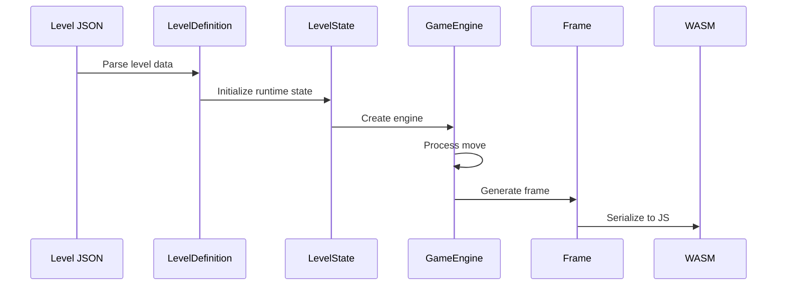
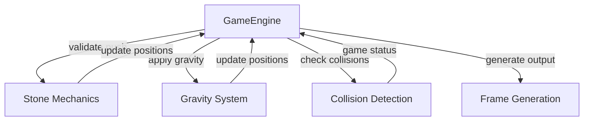

## Architectural Approach

### Core Architectural Decisions

**1. Modular Game Mechanics**

Extract complex object-specific logic into dedicated modules rather than inline in the game engine. This improves maintainability and testability.

- **Stone mechanics** → New `stone_mechanics.rs` module
  - Handles stone push validation, multi-stone detection, push execution
  - Keeps `GameEngine::process_move()` focused on orchestration
  - Enables isolated testing of stone push logic

**Trade-off:** Adds one more module to the codebase, but significantly improves code organization as stone pushing is complex (multi-stone rows, blocked conditions, destruction on spikes).

**2. General Gravity System**

Replace object-specific gravity functions with a unified gravity system that works for any falling object.

- Current: `apply_gravity()` only handles snake
- New: General gravity system handles snake, stones, and falling food
- Enables future falling objects without engine changes
- Falling food uses reactive gravity (falls when support removed)
- Stones use dynamic gravity (fall after every move)

**Trade-off:** Slightly more abstract than object-specific functions, but provides flexibility for future object types and reduces code duplication.

**3. Computed State for Falling Food**

Falling food "settled" state is computed dynamically rather than stored explicitly.

- Check if solid object exists directly below falling food
- If yes → settled (acts as platform)
- If no → unsettled (currently falling, doesn't act as platform)
- Stateless approach keeps data model simple

**Trade-off:** Requires checking support on every frame, but avoids state synchronization complexity and keeps `LevelState` simpler.

**4. Enhanced Error Context**

Extend `ContractError` to include rejection reasons for better UI feedback.

- Add optional `rejectionReason` field to error context
- Engine provides: `{reason: "stonePushBlocked", position: {x, y}}`
- Enables web layer to show stone wiggle animation
- Minimal contract extension (optional field in existing structure)

**Trade-off:** Slightly extends contract interface, but provides necessary information for polished UX without breaking existing error handling.

**5. Automated Type Generation**

Integrate TypeScript type generation into the build process.

- Add build script that runs `ts-rs` type generation before web build
- Ensures Rust and TypeScript types stay synchronized
- Reduces manual steps and potential for type mismatches

**Trade-off:** Slightly more complex build process, but eliminates manual type regeneration and prevents type drift.

### Architectural Constraints

**Constraint 1: Core-Web Separation**

- All game logic remains in `gsnake-core`
- Web layer only handles rendering and input
- WASM bridge remains thin (no logic)

**Constraint 2: Backward Compatibility**

- Existing levels must work without modification
- New fields in `LevelDefinition` have sensible defaults
- `CellType` enum is extended, not restructured

**Constraint 3: Frame-Based Rendering**

- Web renders based on `Frame` objects from core
- No shared mutable state across WASM boundary
- Reactive updates via callback system

**Constraint 4: Minimal Contract Changes**

- Prefer additive changes over restructuring
- New `CellType` variants (additive)
- New `LevelDefinition` fields (additive)
- Enhanced error context (optional field)

## Data Model

### Core Data Model Extensions

**1. CellType Enum Extension**

Add four new variants to the existing `CellType` enum in file:gsnake-core/engine/core/src/models.rs:

```rust
#[derive(Debug, Clone, Copy, PartialEq, Eq, Serialize, Deserialize, TS)]
pub enum CellType {
    Empty,
    SnakeHead,
    SnakeBody,
    Food,              // Existing: regular food
    Obstacle,
    Exit,
    FloatingFood,      // New: stays in place, acts as platform
    FallingFood,       // New: falls when support removed
    Stone,             // New: pushable, falls with gravity
    Spike,             // New: deadly, no platform behavior
}
```

**2. LevelDefinition Extension**

Extend `LevelDefinition` struct with new object arrays and properties:

```rust
#[derive(Debug, Clone, PartialEq, Serialize, Deserialize, TS)]
#[serde(rename_all = "camelCase")]
#[ts(rename_all = "camelCase")]
pub struct LevelDefinition {
    pub id: u32,
    pub name: String,
    pub grid_size: GridSize,
    pub snake: Vec<Position>,
    pub obstacles: Vec<Position>,
    pub food: Vec<Position>,
    pub exit: Position,
    pub snake_direction: Direction,
    
    // New fields with defaults for backward compatibility
    #[serde(default)]
    pub floating_food: Vec<Position>,
    
    #[serde(default)]
    pub falling_food: Vec<Position>,
    
    #[serde(default)]
    pub stones: Vec<Position>,
    
    #[serde(default)]
    pub spikes: Vec<Position>,
    
    #[serde(default = "default_exit_is_solid")]
    pub exit_is_solid: bool,
    
    #[serde(default = "default_total_food")]
    pub total_food: u32,
}

fn default_exit_is_solid() -> bool { true }
fn default_total_food() -> u32 { 0 } // Computed from food arrays if 0
```

**3. LevelState Extension**

Extend `LevelState` struct to track runtime state of new objects:

```rust
#[derive(Debug, Clone, PartialEq, Eq)]
pub struct LevelState {
    pub grid_size: GridSize,
    pub snake: Snake,
    pub obstacles: Vec<Position>,
    pub food: Vec<Position>,
    pub exit: Position,
    
    // New runtime state
    pub floating_food: Vec<Position>,
    pub falling_food: Vec<Position>,
    pub stones: Vec<Position>,
    pub spikes: Vec<Position>,
    pub exit_is_solid: bool,
}
```

**4. ContractError Context Extension**

Enhance `ContractError` to include rejection reasons:

```rust
#[derive(Debug, Clone, PartialEq, Eq, Serialize, Deserialize, TS)]
#[serde(rename_all = "camelCase")]
#[ts(rename_all = "camelCase")]
pub struct ContractError {
    pub kind: ContractErrorKind,
    pub message: String,
    
    #[serde(skip_serializing_if = "Option::is_none")]
    pub context: Option<std::collections::BTreeMap<String, String>>,
    
    // New: structured rejection reason
    #[serde(skip_serializing_if = "Option::is_none")]
    pub rejection_reason: Option<RejectionReason>,
}

#[derive(Debug, Clone, PartialEq, Eq, Serialize, Deserialize, TS)]
#[serde(rename_all = "camelCase")]
#[ts(rename_all = "camelCase")]
pub struct RejectionReason {
    pub reason: String,  // e.g., "stonePushBlocked"
    pub position: Option<Position>,
}
```

### Data Flow



## Component Architecture

### New Components

**1. Stone Mechanics Module** (gsnake-core/engine/core/src/stone_mechanics.rs)

Handles all stone-related game logic:

**Responsibilities:**

- Validate stone push attempts (horizontal only, check blocked conditions)
- Detect multi-stone rows (find connected stones in push direction)
- Execute stone pushes (move stones, handle destruction on spikes)
- Check if stone can be pushed (space available, not blocked)

**Key Functions:**

- `try_push_stone(position, direction, level_state) -> PushResult`
- `find_stone_row(position, direction, stones) -> Vec<Position>`
- `can_push_stones(stones, direction, level_state) -> bool`
- `execute_stone_push(stones, direction, level_state)`

**Integration:** Called by `GameEngine::process_move()` when snake moves into stone.

**2. Gravity System Module** (gsnake-core/engine/core/src/gravity.rs)

General gravity system for any falling object:

**Responsibilities:**

- Apply gravity to snake (existing behavior)
- Apply gravity to stones (dynamic falling after each move)
- Apply gravity to falling food (reactive falling when support removed)
- Check if object can fall (no solid object below)
- Determine what constitutes "solid" for each object type

**Key Functions:**

- `apply_gravity_to_snake(snake, level_state)`
- `apply_gravity_to_stones(stones, level_state)`
- `apply_gravity_to_falling_food(falling_food, level_state)`
- `can_object_fall(position, level_state) -> bool`
- `is_solid_below(position, level_state, object_type) -> bool`

**Integration:** Called by `GameEngine::process_move()` after snake moves and stone pushes.

**3. Collision Detection Extensions** (in file:gsnake-core/engine/core/src/engine.rs)

Extend existing collision detection to handle new objects:

**New Collision Checks:**

- Spike collision (any contact = death, highest priority)
- Stone collision (vertical = blocked, horizontal = push attempt)
- Falling food platform check (settled = platform, unsettled = no platform)
- Exit platform check (solid = platform, fall-through = no platform)

**Collision Priority Order:**

1. Spike contact → Game Over
1. Obstacle/wall contact → Game Over
1. Self-collision → Game Over
1. Exit + food requirement met → Level Complete

### Component Integration



### Modified Components

**1. GameEngine** (file:gsnake-core/engine/core/src/engine.rs)

**Changes:**

- Import and use `stone_mechanics` module
- Import and use `gravity` module
- Extend `process_move()` to handle stone push attempts
- Update collision detection to include spikes
- Update `generate_frame()` to render new cell types
- Enhance error creation to include rejection reasons

**New Logic Flow in `process_move()`:**

1. Validate move (existing + stone push validation)
1. Execute move (existing + stone push execution)
1. Check food collection (existing + new food types)
1. Apply snake gravity (via gravity module)
1. Apply stone gravity (via gravity module)
1. Apply falling food gravity (via gravity module)
1. Check collisions (extended with spikes, priority order)
1. Update game state

**2. Frame Generation** (file:gsnake-core/engine/core/src/engine.rs)

**Changes:**

- Render floating food as `CellType::FloatingFood`
- Render falling food as `CellType::FallingFood`
- Render stones as `CellType::Stone`
- Render spikes as `CellType::Spike`
- Render exit based on `exit_is_solid` (still `CellType::Exit`, visual pattern in CSS)

**3. Cell Component** (file:gsnake-web/components/Cell.svelte)

**Changes:**

- Add CSS classes for new cell types:
  - `.floating-food` → orange background
  - `.falling-food` → yellow background
  - `.stone` → brown background
  - `.spike` → red background
- Add CSS pattern for fall-through exit:
  - `.exit.fall-through` → light green with stripe/dot pattern

**Example CSS:**

```css
.cell.floating-food { background: #FF9800; }
.cell.falling-food { background: #FFEB3B; }
.cell.stone { background: #795548; }
.cell.spike { background: #F44336; }
.cell.exit.fall-through {
  background: repeating-linear-gradient(
    45deg,
    #81C784,
    #81C784 5px,
    #A5D6A7 5px,
    #A5D6A7 10px
  );
}
```

**4. WasmGameEngine** (file:gsnake-web/engine/WasmGameEngine.ts)

**Changes:**

- Handle enhanced `ContractError` with `rejectionReason`
- Trigger stone wiggle animation when `reason === "stonePushBlocked"`
- Pass rejection position to animation system

### Build Process Integration

**TypeScript Type Generation:**

Add build script (scripts/generate_types.sh):

```bash
#!/bin/bash
cd gsnake-core/engine/core
cargo test --features ts-rs
cp target/debug/bindings/*.ts ../../../gsnake-web/types/
```

Integrate into web build process (file:gsnake-web/package.json):

```json
{
  "scripts": {
    "prebuild": "bash ../scripts/generate_types.sh",
    "build": "vite build"
  }
}
```

### Integration Points

**Core → WASM Bridge:**

- No changes needed to WASM bridge (file:gsnake-core/engine/bindings/wasm/src/lib.rs)
- Existing serialization handles new `CellType` variants automatically
- Enhanced `ContractError` serializes with new fields

**WASM → Web:**

- TypeScript types auto-generated from Rust
- `Frame` interface includes new cell types
- `ContractError` interface includes `rejectionReason`
- Event system unchanged (frame updates trigger re-renders)

**Web UI:**

- Cell component maps new cell types to CSS classes
- Animation system listens for rejection reasons
- No changes to game grid, modals, or other components

### Testing Strategy

**Unit Tests:**

- Stone mechanics: push validation, multi-stone detection, destruction
- Gravity system: falling logic for each object type
- Collision detection: spike priority, platform behavior

**Integration Tests:**

- End-to-end move processing with new objects
- Level loading with new fields
- Frame generation with new cell types

**Contract Tests:**

- TypeScript type compatibility
- Error serialization with rejection reasons
- Backward compatibility with old level format
