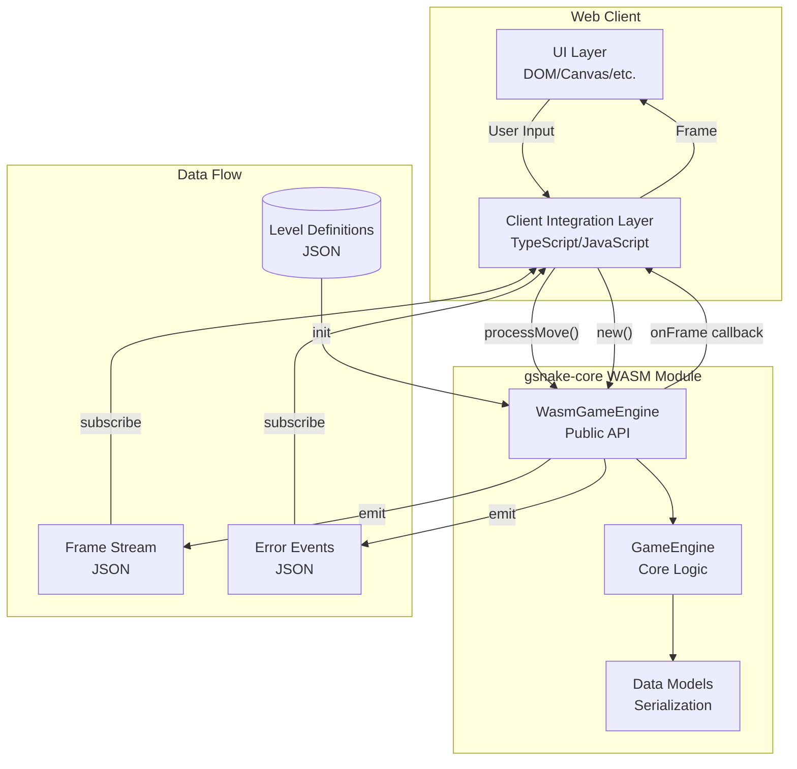
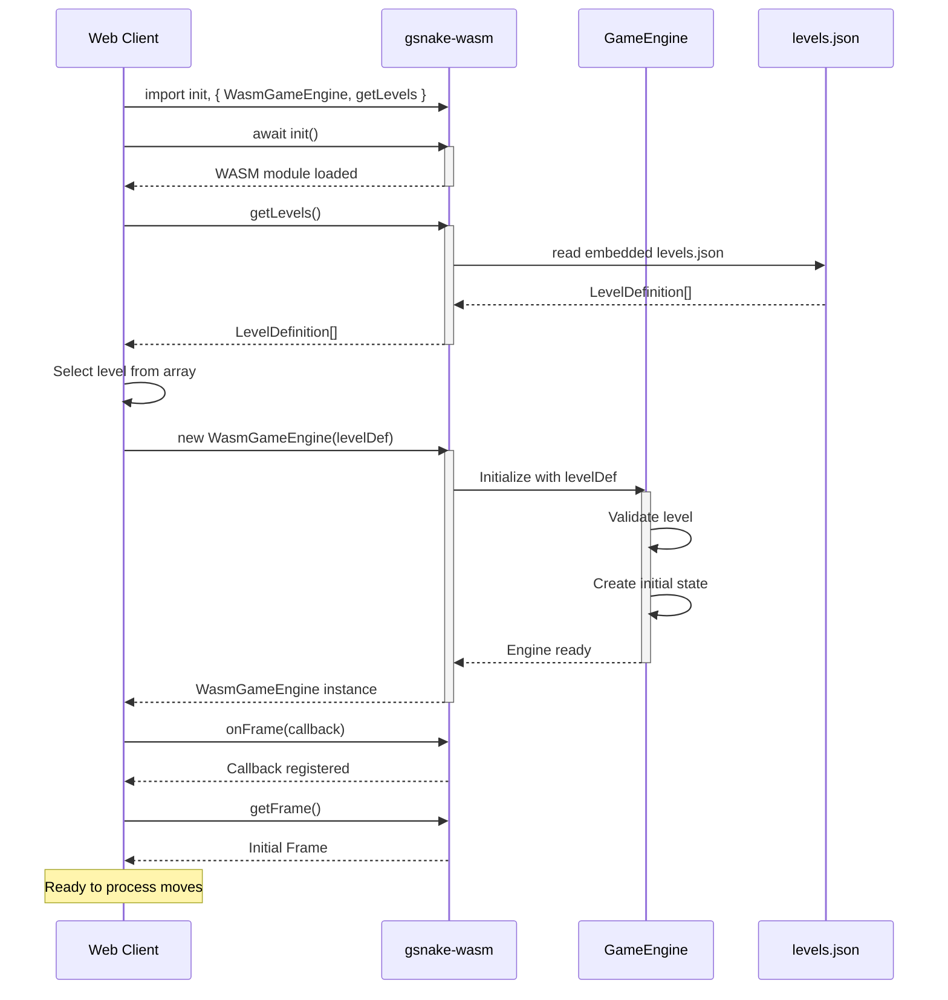
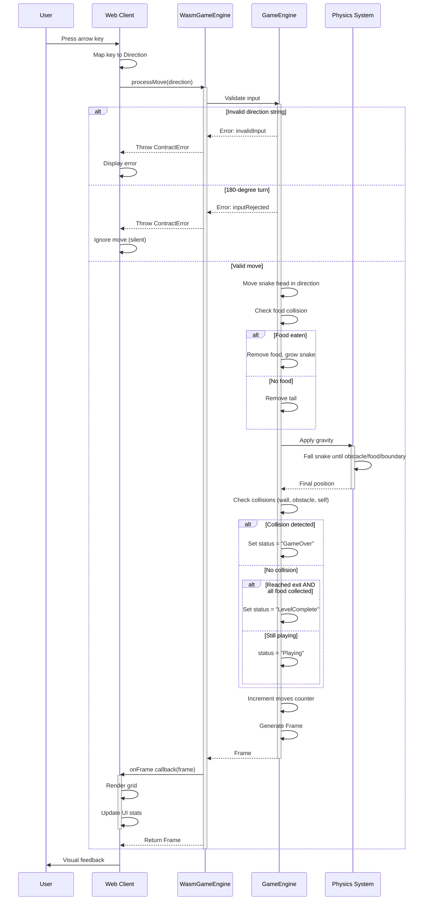

# gSnake Core Contract Specification

**Version:** 1.0
**Date:** 2026-01-18
**Status:** Reference Specification

## Table of Contents

1. [Introduction](#1-introduction)
2. [Architecture Overview](#2-architecture-overview)
3. [WASM Module Interface](#3-wasm-module-interface)
4. [Data Types & Serialization](#4-data-types--serialization)
5. [Initialization Flow](#5-initialization-flow)
6. [Game Loop & Move Processing](#6-game-loop--move-processing)
7. [Error Handling](#7-error-handling)
8. [Level Definition Format](#8-level-definition-format)
9. [Integration Requirements](#9-integration-requirements)
10. [Testing Recommendations](#10-testing-recommendations)

---

## 1. Introduction

### 1.1 Purpose

This document defines the **contract** between `gsnake-core` (a WebAssembly module) and web clients that consume it. It is a standalone reference for developers implementing new web clients without requiring knowledge of the internal implementation of gsnake-core or the reference implementation (gsnake-web).

### 1.2 Scope

This specification covers:

- WASM module initialization and configuration
- Public API methods and their signatures
- Data type structures and serialization formats (JSON)
- Game state management and update flows
- Error handling contracts
- Level definition format
- Integration patterns and best practices

### 1.3 Target Audience

- Web client developers creating new frontends for gSnake
- Testing engineers validating contract compliance
- Contributors to the gSnake ecosystem

### 1.4 Terminology

- **WASM**: WebAssembly compiled module from Rust source
- **Frame**: Complete game state snapshot (grid + metadata)
- **Direction**: Cardinal direction enum (North, South, East, West)
- **CellType**: Enum representing grid cell contents
- **Contract**: The interface boundary between WASM and JavaScript

---

## 2. Architecture Overview

### 2.1 Component Diagram



### 2.2 Technology Stack

| Component | Technology |
|-----------|-----------|
| **Core Language** | Rust 2021 |
| **WASM FFI** | wasm-bindgen |
| **Serialization** | serde, serde_json |
| **Type Generation** | ts-rs (Rust → TypeScript) |
| **Client Language** | TypeScript / JavaScript |

### 2.3 Design Principles

1. **Immutability**: Level definitions are immutable; game state changes through new Frame emissions
2. **Push-based Updates**: Frame changes are pushed via callbacks, not polled
3. **Strict Serialization**: All types have canonical JSON representations
4. **Error Safety**: All errors are typed and serializable
5. **Stateless API**: Each WasmGameEngine instance encapsulates level state

---

## 3. WASM Module Interface

### 3.1 Module Initialization

Before using the WASM module, it must be initialized:

```javascript
import init, { WasmGameEngine, getLevels } from 'gsnake-wasm';

// Initialize WASM module (loads .wasm binary)
await init();

// Module is now ready for use
```

**Requirements:**
- `init()` must be called exactly once before any other WASM functions
- `init()` is asynchronous and returns a Promise
- Subsequent calls to `init()` are safe but redundant

### 3.2 WasmGameEngine Class

The primary interface for game interaction.

#### 3.2.1 Constructor

```typescript
constructor(level_json: LevelDefinition): WasmGameEngine
```

**Parameters:**
- `level_json`: A JavaScript object matching the `LevelDefinition` schema (see §8)

**Behavior:**
- Parses and validates the level definition
- Initializes internal game state
- Sets game status to `"Playing"`
- Does NOT emit an initial frame (call `getFrame()` or wait for `onFrame` after first move)

**Throws:**
- `ContractError` with `kind: "initializationFailed"` if level JSON is invalid

**Example:**
```javascript
const level = {
  id: 1,
  name: "Test Level",
  gridSize: { width: 10, height: 10 },
  snake: [{ x: 5, y: 5 }, { x: 4, y: 5 }],
  obstacles: [{ x: 0, y: 0 }],
  food: [{ x: 7, y: 7 }],
  exit: { x: 9, y: 9 },
  snakeDirection: "East"
};

const engine = new WasmGameEngine(level);
```

#### 3.2.2 onFrame Method

```typescript
onFrame(callback: (frame: Frame) => void): void
```

**Parameters:**
- `callback`: JavaScript function invoked with a `Frame` object on every state change

**Behavior:**
- Registers a callback for frame updates
- Callback is invoked after:
  - Successful `processMove()` call
  - Level initialization (if implemented by engine)
- Only one callback is active at a time (subsequent calls replace the previous callback)
- Callback receives a `Frame` object (see §4.3.7)

**Example:**
```javascript
engine.onFrame((frame) => {
  console.log('New frame:', frame);
  // Update UI with frame.grid and frame.state
});
```

#### 3.2.3 processMove Method

```typescript
processMove(direction: Direction): Frame
```

**Parameters:**
- `direction`: One of `"North"`, `"South"`, `"East"`, `"West"` (case-sensitive)

**Returns:**
- `Frame` object representing the new game state

**Behavior:**
1. Validates input direction
2. Rejects 180-degree turns (opposite of current direction)
3. Moves snake in the specified direction
4. Applies gravity physics (snake falls until hitting obstacle/food/boundary)
5. Checks for collisions (walls, obstacles, self)
6. Updates game status if needed (`GameOver`, `LevelComplete`)
7. Invokes `onFrame` callback with new frame
8. Returns the frame

**Throws:**
- `ContractError` with:
  - `kind: "invalidInput"` if direction is not a valid Direction string
  - `kind: "inputRejected"` if direction causes a 180-degree turn or game is not in `"Playing"` status

**Example:**
```javascript
try {
  const frame = engine.processMove("North");
  // frame.state.moves has incremented
} catch (error) {
  // error is a ContractError object
  console.error(error.kind, error.message);
}
```

#### 3.2.4 getFrame Method

```typescript
getFrame(): Frame
```

**Returns:**
- Current `Frame` snapshot

**Behavior:**
- Returns the current game state without modifying it
- Does NOT invoke `onFrame` callback
- Useful for initial render or debugging

**Throws:**
- `ContractError` with `kind: "serializationFailed"` if frame cannot be serialized

**Example:**
```javascript
const currentFrame = engine.getFrame();
console.log(currentFrame.state.status); // e.g., "Playing"
```

#### 3.2.5 getGameState Method

```typescript
getGameState(): GameState
```

**Returns:**
- Current `GameState` object (without grid)

**Behavior:**
- Returns only the metadata portion of the frame
- Lighter-weight alternative to `getFrame()`

**Example:**
```javascript
const state = engine.getGameState();
console.log(`Moves: ${state.moves}, Food: ${state.foodCollected}/${state.totalFood}`);
```

#### 3.2.6 getLevel Method

```typescript
getLevel(): LevelDefinition
```

**Returns:**
- The immutable `LevelDefinition` used to initialize this engine instance

**Behavior:**
- Returns a copy of the original level configuration
- Useful for debugging or displaying level metadata

**Example:**
```javascript
const level = engine.getLevel();
console.log(`Level: ${level.name} (${level.gridSize.width}x${level.gridSize.height})`);
```

### 3.3 Global Functions

These functions are exported at the module level, not on the `WasmGameEngine` class.

#### 3.3.1 getLevels Function

```typescript
getLevels(): LevelDefinition[]
```

**Returns:**
- Array of all embedded level definitions

**Behavior:**
- Reads from the embedded `levels.json` compiled into the WASM binary
- Returns the complete level pack

**Throws:**
- `ContractError` with `kind: "serializationFailed"` if levels.json is corrupted

**Example:**
```javascript
const levels = getLevels();
console.log(`${levels.length} levels available`);
const firstLevel = levels[0];
const engine = new WasmGameEngine(firstLevel);
```

#### 3.3.2 log Function

```typescript
log(message: string): void
```

**Parameters:**
- `message`: String to log to browser console

**Behavior:**
- Utility function for debugging from Rust code
- Clients typically don't need to call this directly

#### 3.3.3 init_panic_hook Function

```typescript
init_panic_hook(): void
```

**Behavior:**
- Configures better panic messages in development
- Should be called once after `init()` in development builds
- Safe to call in production (no-op or minimal overhead)

**Example:**
```javascript
await init();
init_panic_hook(); // Better error messages in dev
```

---

## 4. Data Types & Serialization

All types serialize to JSON using strict conventions. These are enforced by contract tests.

### 4.1 Enums

Enums serialize as **PascalCase string literals** (except `ContractErrorKind`, see §4.3.11).

#### 4.1.1 Direction

```typescript
type Direction = "North" | "South" | "East" | "West";
```

**JSON Examples:**
```json
"North"
"South"
"East"
"West"
```

**Usage:**
- Input to `processMove()`
- Part of `LevelDefinition.snakeDirection`

**Contract Test Reference:** `gsnake-core/engine/core/tests/contract_tests.rs:14-31`

#### 4.1.2 CellType

```typescript
type CellType = "Empty" | "SnakeHead" | "SnakeBody" | "Food" | "Obstacle" | "Exit";
```

**JSON Examples:**
```json
"Empty"
"SnakeHead"
"SnakeBody"
"Food"
"Obstacle"
"Exit"
```

**Usage:**
- Elements of `Frame.grid[][]`
- Determines cell rendering in UI

**Rendering Mapping:**
| CellType | Recommended CSS Class | Visual Representation |
|----------|----------------------|----------------------|
| `Empty` | (none) | Blank/white space |
| `SnakeHead` | `snake-head` | Blue (#2196F3) |
| `SnakeBody` | `snake-body` | Light blue (#64B5F6) |
| `Food` | `food` | Orange-red (#FF5722) |
| `Obstacle` | `obstacle` | Dark grey (#424242) |
| `Exit` | `exit` | Green (#4CAF50) |

**Contract Test Reference:** `gsnake-core/engine/core/tests/contract_tests.rs:34-59`

#### 4.1.3 GameStatus

```typescript
type GameStatus = "Playing" | "GameOver" | "LevelComplete" | "AllComplete";
```

**JSON Examples:**
```json
"Playing"
"GameOver"
"LevelComplete"
"AllComplete"
```

**Semantics:**
- `"Playing"`: Game in progress, accepts moves
- `"GameOver"`: Snake collided, no further moves accepted
- `"LevelComplete"`: All food collected and exit reached, ready for next level
- `"AllComplete"`: All levels in the pack completed (not typically used in single-level mode)

**Usage:**
- Part of `GameState.status`
- Client should disable input when status is not `"Playing"`

**Contract Test Reference:** `gsnake-core/engine/core/tests/contract_tests.rs:62-79`

### 4.2 Structs

Structs serialize as **JSON objects**. Field naming follows **camelCase** convention.

#### 4.2.1 Position

```typescript
interface Position {
  x: number;
  y: number;
}
```

**JSON Example:**
```json
{ "x": 5, "y": 10 }
```

**Semantics:**
- `x`: Column index (0-based, increases rightward)
- `y`: Row index (0-based, increases downward)
- Coordinate system: origin (0,0) is top-left

**Usage:**
- Snake segments in `LevelDefinition.snake[]`
- Obstacle positions
- Food positions
- Exit position

#### 4.2.2 GridSize

```typescript
interface GridSize {
  width: number;
  height: number;
}
```

**JSON Example:**
```json
{ "width": 15, "height": 15 }
```

**Semantics:**
- `width`: Number of columns
- `height`: Number of rows
- Both must be positive integers

**Usage:**
- `LevelDefinition.gridSize`

#### 4.2.3 GameState

```typescript
interface GameState {
  status: GameStatus;
  currentLevel: number;
  moves: number;
  foodCollected: number;
  totalFood: number;
}
```

**Field Naming:** Uses **camelCase** (NOT snake_case)

**JSON Example:**
```json
{
  "status": "Playing",
  "currentLevel": 1,
  "moves": 42,
  "foodCollected": 3,
  "totalFood": 5
}
```

**Field Descriptions:**

| Field | Type | Description |
|-------|------|-------------|
| `status` | `GameStatus` | Current game status |
| `currentLevel` | `number` | Level ID (matches `LevelDefinition.id`) |
| `moves` | `number` | Total moves made (increments on each `processMove`) |
| `foodCollected` | `number` | Food eaten so far |
| `totalFood` | `number` | Total food in level (constant) |

**Invariants:**
- `0 <= foodCollected <= totalFood`
- `moves >= 0`
- `currentLevel >= 0`

**Contract Test Reference:** `gsnake-core/engine/core/tests/contract_tests.rs:132-160`

#### 4.2.4 Frame

```typescript
interface Frame {
  grid: CellType[][];
  state: GameState;
}
```

**JSON Example:**
```json
{
  "grid": [
    ["Obstacle", "Empty", "Empty"],
    ["Empty", "SnakeHead", "Empty"],
    ["Empty", "SnakeBody", "Food"],
    ["Empty", "Empty", "Exit"]
  ],
  "state": {
    "status": "Playing",
    "currentLevel": 1,
    "moves": 5,
    "foodCollected": 2,
    "totalFood": 3
  }
}
```

**Grid Structure:**
- `grid` is a 2D array: `grid[y][x]` (row-major order)
- Dimensions match `LevelDefinition.gridSize`: `grid.length === height`, `grid[0].length === width`
- Each cell contains exactly one `CellType`

**Invariants:**
- Exactly one `"SnakeHead"` in the grid
- At least one `"SnakeBody"` (snake length >= 2)
- All `CellType` values are valid enum members
- Grid dimensions are consistent across all rows

**Usage:**
- Primary output of `processMove()` and `getFrame()`
- Payload in `onFrame` callback

**Contract Test Reference:**
- Rust: `gsnake-core/engine/core/tests/contract_tests.rs:110-129`
- E2E: `e2e/contract.spec.ts:35-53`

#### 4.2.5 LevelDefinition

```typescript
interface LevelDefinition {
  id: number;
  name: string;
  gridSize: GridSize;
  snake: Position[];
  obstacles: Position[];
  food: Position[];
  exit: Position;
  snakeDirection: Direction;
}
```

**Field Naming:** Uses **camelCase** (NOT snake_case)

**JSON Example:**
```json
{
  "id": 1,
  "name": "First Steps",
  "gridSize": { "width": 15, "height": 15 },
  "snake": [
    { "x": 2, "y": 13 },
    { "x": 1, "y": 13 },
    { "x": 0, "y": 13 }
  ],
  "obstacles": [
    { "x": 0, "y": 14 },
    { "x": 1, "y": 14 }
  ],
  "food": [
    { "x": 4, "y": 2 }
  ],
  "exit": { "x": 14, "y": 0 },
  "snakeDirection": "East"
}
```

**Field Descriptions:**

| Field | Type | Description |
|-------|------|-------------|
| `id` | `number` | Unique level identifier |
| `name` | `string` | Human-readable level name |
| `gridSize` | `GridSize` | Grid dimensions |
| `snake` | `Position[]` | Initial snake segments (head at index 0) |
| `obstacles` | `Position[]` | Immovable obstacle positions |
| `food` | `Position[]` | Food positions |
| `exit` | `Position` | Exit position |
| `snakeDirection` | `Direction` | Initial snake direction |

**Invariants:**
- `snake.length >= 2` (head + at least one body segment)
- `snake[0]` is the head position
- All positions must be within `gridSize` bounds: `0 <= x < width`, `0 <= y < height`
- No position overlap between snake, obstacles, food, and exit (except adjacent snake segments)
- `food.length >= 1` (at least one food item)

**Contract Test Reference:** `gsnake-core/engine/core/tests/contract_tests.rs:163-183`

### 4.3 Error Types

#### 4.3.1 ContractErrorKind

```typescript
type ContractErrorKind =
  | "invalidInput"
  | "inputRejected"
  | "serializationFailed"
  | "initializationFailed"
  | "internalError";
```

**Special Note:** Uses **camelCase** (exception to PascalCase enum rule)

**JSON Examples:**
```json
"invalidInput"
"inputRejected"
"serializationFailed"
"initializationFailed"
"internalError"
```

**Semantics:**

| Kind | Meaning | Example Scenarios |
|------|---------|-------------------|
| `invalidInput` | Malformed input data | Invalid Direction string, malformed JSON |
| `inputRejected` | Valid input rejected by game logic | 180-degree turn, move when game is over |
| `serializationFailed` | JSON serialization error | Corrupted WASM state (rare) |
| `initializationFailed` | Engine initialization failed | Invalid LevelDefinition |
| `internalError` | Unexpected error | Rust panic, logic bug |

**Contract Test Reference:** `gsnake-core/engine/core/tests/contract_tests.rs:82-103`

#### 4.3.2 ContractError

```typescript
interface ContractError {
  kind: ContractErrorKind;
  message: string;
  context?: Record<string, string>;
}
```

**JSON Examples:**

Without context:
```json
{
  "kind": "inputRejected",
  "message": "Cannot reverse direction: attempted South while moving North"
}
```

With context:
```json
{
  "kind": "invalidInput",
  "message": "Invalid direction provided",
  "context": {
    "input": "InvalidDirection",
    "expected": "North|South|East|West"
  }
}
```

**Field Descriptions:**

| Field | Type | Required | Description |
|-------|------|----------|-------------|
| `kind` | `ContractErrorKind` | Yes | Error category |
| `message` | `string` | Yes | Human-readable error description |
| `context` | `Record<string, string>` | No | Optional key-value debugging context |

**Contract Test Reference:**
- Rust: `gsnake-core/engine/core/tests/contract_tests.rs:186-223`
- E2E: `e2e/contract.spec.ts:55-93`

---

## 5. Initialization Flow

### 5.1 Sequence Diagram



### 5.2 Step-by-Step Initialization

1. **Import WASM Module**
   ```javascript
   import init, { WasmGameEngine, getLevels } from 'gsnake-wasm';
   ```

2. **Initialize WASM**
   ```javascript
   await init(); // Must await before any WASM calls
   ```

3. **Load Level Definitions**
   ```javascript
   const levels = getLevels();
   console.log(`Loaded ${levels.length} levels`);
   ```

4. **Select Level** (client-specific logic)
   ```javascript
   const levelToPlay = levels[0]; // Or from URL params, user selection, etc.
   ```

5. **Create Engine Instance**
   ```javascript
   const engine = new WasmGameEngine(levelToPlay);
   ```

6. **Register Frame Callback**
   ```javascript
   engine.onFrame((frame) => {
     // Update UI with frame
     renderGrid(frame.grid);
     updateStats(frame.state);
   });
   ```

7. **Get Initial Frame** (optional, for initial render)
   ```javascript
   const initialFrame = engine.getFrame();
   renderGrid(initialFrame.grid);
   ```

8. **Ready for User Input**
   - Attach keyboard/touch handlers
   - Call `engine.processMove(direction)` on user input

### 5.3 Error Scenarios

| Error | When | How to Handle |
|-------|------|---------------|
| `init()` fails | WASM binary not found or corrupted | Show error, reload page |
| `getLevels()` throws `serializationFailed` | Embedded levels.json is invalid | Fatal error, report bug |
| `new WasmGameEngine()` throws `initializationFailed` | Invalid level definition | Validate level JSON, show error |

---

## 6. Game Loop & Move Processing

### 6.1 Sequence Diagram



### 6.2 Move Processing Rules

#### 6.2.1 Input Validation

1. **Direction must be valid string:**
   - Accepted: `"North"`, `"South"`, `"East"`, `"West"`
   - Rejected: anything else → throws `invalidInput`

2. **Game must be in `"Playing"` status:**
   - If status is `"GameOver"` or `"LevelComplete"` → throws `inputRejected`

3. **No 180-degree turns:**
   - If moving North, cannot move South
   - If moving East, cannot move West
   - Violation → throws `inputRejected`

#### 6.2.2 Snake Movement

1. Calculate new head position:
   - North: `y - 1`
   - South: `y + 1`
   - East: `x + 1`
   - West: `x - 1`

2. Insert new head at `segments[0]`

3. Check for food at new head position:
   - **Food found:** Remove food, increment `foodCollected`, snake grows (tail stays)
   - **No food:** Remove tail via `pop()` (snake length constant)

#### 6.2.3 Gravity Physics

After horizontal/vertical movement, apply gravity:

1. **Falling logic:**
   - Move snake down (`y + 1`) until:
     - Hitting bottom boundary, OR
     - Hitting an obstacle, OR
     - Hitting food (food acts as platform)

2. **Per-segment fall:**
   - Each segment falls independently until supported
   - Collision checks happen after each fall iteration

#### 6.2.4 Collision Detection

Check new head position for collisions:

1. **Wall collision:**
   - `x < 0 || x >= width || y < 0 || y >= height`
   - Result: `status = "GameOver"`

2. **Obstacle collision:**
   - New head position matches any `obstacles[]` position
   - Result: `status = "GameOver"`

3. **Self collision:**
   - New head position matches any snake body segment (excluding head itself)
   - Result: `status = "GameOver"`

#### 6.2.5 Win Condition

After movement and collision checks:

- If `snake head position == exit position` AND `foodCollected == totalFood`:
  - Result: `status = "LevelComplete"`

#### 6.2.6 State Updates

After all game logic:

1. Increment `moves` counter
2. Update `status` if needed
3. Generate new `Frame` from current state
4. Invoke `onFrame` callback with new frame
5. Return frame from `processMove()`

### 6.3 Example Move Sequence

Initial state:
```json
{
  "grid": [
    ["Empty", "Empty", "Food"],
    ["Empty", "SnakeHead", "Empty"],
    ["SnakeBody", "Empty", "Exit"]
  ],
  "state": {
    "status": "Playing",
    "moves": 0,
    "foodCollected": 0,
    "totalFood": 1
  }
}
```

Call `processMove("East")`:

1. New head position: `(2, 1)` (was `(1, 1)`)
2. Food at `(2, 0)` - not at new head, no food eaten
3. Snake does NOT grow, tail removed
4. Apply gravity: snake falls to `(2, 2)` (hits exit)
5. Check: `head == exit` AND `foodCollected (0) == totalFood (1)`? **No**
6. Status remains `"Playing"` (exit requires all food)
7. Increment moves: `moves = 1`

Resulting state:
```json
{
  "grid": [
    ["Empty", "Empty", "Food"],
    ["Empty", "Empty", "SnakeBody"],
    ["Empty", "Empty", "SnakeHead"]
  ],
  "state": {
    "status": "Playing",
    "moves": 1,
    "foodCollected": 0,
    "totalFood": 1
  }
}
```

**E2E Test Reference:** `e2e/contract.spec.ts:35-53` (validates move increments state)

---

## 7. Error Handling

### 7.1 Error Handling Strategy

All WASM API methods throw `ContractError` objects (not plain JavaScript errors).

**Client responsibilities:**
1. Wrap WASM calls in try-catch blocks
2. Handle `ContractError` objects based on `kind`
3. Display appropriate user feedback
4. Log errors for debugging

### 7.2 Error Handling Patterns

#### 7.2.1 Initialization Errors

```javascript
try {
  const engine = new WasmGameEngine(levelDef);
} catch (error) {
  if (error.kind === 'initializationFailed') {
    console.error('Invalid level:', error.message);
    alert('Failed to load level. Please try another.');
  } else {
    console.error('Unexpected error:', error);
  }
}
```

#### 7.2.2 Move Processing Errors

```javascript
function handleUserInput(direction) {
  try {
    const frame = engine.processMove(direction);
    // Success - frame callback already invoked
  } catch (error) {
    switch (error.kind) {
      case 'invalidInput':
        // Should not happen with proper UI (log for debugging)
        console.error('Invalid direction:', direction, error);
        break;

      case 'inputRejected':
        // Expected for 180-degree turns or game-over state
        // Silently ignore or show subtle feedback
        console.log('Move rejected:', error.message);
        break;

      case 'internalError':
        // Unexpected - report bug
        console.error('Game engine error:', error);
        alert('An unexpected error occurred. Please refresh.');
        break;

      default:
        console.error('Unknown error:', error);
    }
  }
}
```

#### 7.2.3 Serialization Errors

```javascript
try {
  const frame = engine.getFrame();
} catch (error) {
  if (error.kind === 'serializationFailed') {
    console.error('Failed to serialize frame:', error);
    // This indicates a bug in the WASM module
    alert('Game state corrupted. Please restart.');
  }
}
```

### 7.3 Error Kind Reference

| Kind | Severity | Expected? | Recommended Action |
|------|----------|-----------|-------------------|
| `invalidInput` | Medium | No (indicates client bug) | Log error, validate input |
| `inputRejected` | Low | Yes (180° turns) | Silent ignore or subtle feedback |
| `serializationFailed` | High | No (WASM bug) | Show error, reload |
| `initializationFailed` | High | Possible (bad level) | Show error, load different level |
| `internalError` | Critical | No (WASM bug) | Show error, reload, report bug |

### 7.4 Error Context Usage

The optional `context` field provides debugging details:

```javascript
catch (error) {
  console.error(`[${error.kind}] ${error.message}`);
  if (error.context) {
    console.error('Context:', error.context);
    // Example output:
    // Context: { input: "InvalidDirection", expected: "North|South|East|West" }
  }
}
```

**E2E Test Reference:** `e2e/contract.spec.ts:95-117` (validates error structure)

---

## 8. Level Definition Format

### 8.1 Complete Schema

See §4.2.5 for the `LevelDefinition` TypeScript interface.

### 8.2 Example Level

```json
{
  "id": 1,
  "name": "First Steps",
  "gridSize": { "width": 15, "height": 15 },
  "snake": [
    { "x": 2, "y": 13 },
    { "x": 1, "y": 13 },
    { "x": 0, "y": 13 }
  ],
  "obstacles": [
    { "x": 0, "y": 14 },
    { "x": 1, "y": 14 },
    { "x": 2, "y": 14 },
    { "x": 3, "y": 14 },
    { "x": 4, "y": 14 },
    { "x": 5, "y": 14 },
    { "x": 6, "y": 14 },
    { "x": 7, "y": 14 },
    { "x": 8, "y": 14 },
    { "x": 9, "y": 14 },
    { "x": 10, "y": 14 },
    { "x": 11, "y": 14 },
    { "x": 12, "y": 14 },
    { "x": 13, "y": 14 },
    { "x": 14, "y": 14 }
  ],
  "food": [
    { "x": 4, "y": 2 }
  ],
  "exit": { "x": 14, "y": 0 },
  "snakeDirection": "East"
}
```

### 8.3 Validation Rules

#### 8.3.1 Required Fields

All fields in `LevelDefinition` are required.

#### 8.3.2 Grid Size

- `width` and `height` must be positive integers
- Recommended range: 5-30 (for playability and performance)

#### 8.3.3 Snake

- **Minimum length:** 2 segments (head + 1 body)
- **Head position:** `snake[0]` is the head
- **Segment order:** Each segment must be adjacent to the next (horizontally or vertically)
- **Bounds:** All positions must be within grid bounds

#### 8.3.4 Obstacles

- **Bounds:** All positions must be within grid bounds
- **No overlap:** Cannot overlap with snake, food, or exit
- **Optional:** Can be an empty array `[]`

#### 8.3.5 Food

- **Minimum:** At least 1 food item required
- **Bounds:** All positions must be within grid bounds
- **No overlap:** Cannot overlap with snake, obstacles, or exit

#### 8.3.6 Exit

- **Bounds:** Must be within grid bounds
- **No overlap:** Cannot overlap with snake, obstacles, or food

#### 8.3.7 Snake Direction

- Must be a valid `Direction`: `"North"`, `"South"`, `"East"`, `"West"`
- Determines initial movement direction

### 8.4 Loading Custom Levels

Clients can provide custom level definitions instead of using `getLevels()`:

```javascript
const customLevel = {
  id: 999,
  name: "Custom Level",
  gridSize: { width: 10, height: 10 },
  snake: [{ x: 5, y: 5 }, { x: 4, y: 5 }],
  obstacles: [],
  food: [{ x: 8, y: 8 }],
  exit: { x: 9, y: 9 },
  snakeDirection: "East"
};

try {
  const engine = new WasmGameEngine(customLevel);
  // Success
} catch (error) {
  // Validation failed
  console.error('Invalid custom level:', error.message);
}
```

---

## 9. Integration Requirements

### 9.1 Minimum Implementation Checklist

A compliant web client must:

- [ ] Import and initialize WASM module with `init()`
- [ ] Create `WasmGameEngine` instance with a valid `LevelDefinition`
- [ ] Register `onFrame` callback to receive state updates
- [ ] Render `Frame.grid` as a visual grid
- [ ] Display `Frame.state` metadata (moves, food progress, status)
- [ ] Capture user input (keyboard/touch) and map to `Direction`
- [ ] Call `processMove(direction)` on user input
- [ ] Handle `ContractError` exceptions gracefully
- [ ] Respect `GameStatus`:
  - Disable input when status is not `"Playing"`
  - Show game-over message when status is `"GameOver"`
  - Show level-complete message when status is `"LevelComplete"`
- [ ] Implement level restart functionality (create new engine instance)

### 9.2 Event Handling Pattern

**Recommended approach:**

```javascript
class GameClient {
  constructor() {
    this.engine = null;
    this.currentFrame = null;
  }

  async init() {
    await init();
    const levels = getLevels();
    this.loadLevel(levels[0]);
  }

  loadLevel(levelDef) {
    this.engine = new WasmGameEngine(levelDef);
    this.engine.onFrame(this.handleFrame.bind(this));
    this.currentFrame = this.engine.getFrame();
    this.render();
  }

  handleFrame(frame) {
    this.currentFrame = frame;
    this.render();

    if (frame.state.status === 'GameOver') {
      this.showGameOver();
    } else if (frame.state.status === 'LevelComplete') {
      this.showLevelComplete();
    }
  }

  handleInput(direction) {
    if (this.currentFrame?.state.status !== 'Playing') {
      return; // Ignore input when not playing
    }

    try {
      this.engine.processMove(direction);
      // Frame callback will be invoked automatically
    } catch (error) {
      if (error.kind === 'inputRejected') {
        // Silently ignore (e.g., 180-degree turn)
        return;
      }
      console.error('Move error:', error);
    }
  }

  render() {
    this.renderGrid(this.currentFrame.grid);
    this.renderStats(this.currentFrame.state);
  }

  renderGrid(grid) {
    // Convert grid to DOM elements
    // Map CellType to CSS classes (see §4.1.2)
  }

  renderStats(state) {
    // Display moves, food progress, status
  }

  showGameOver() {
    alert('Game Over! Press R to restart.');
  }

  showLevelComplete() {
    alert('Level Complete!');
  }

  restart() {
    const level = this.engine.getLevel();
    this.loadLevel(level);
  }
}
```

### 9.3 UI Rendering Guidelines

#### 9.3.1 Grid Rendering

**HTML/CSS Approach:**

```html
<div class="game-grid" style="
  display: grid;
  grid-template-columns: repeat(${width}, 1fr);
  gap: 1px;
">
  <!-- For each cell in grid.flat(): -->
  <div class="cell ${getCellClass(cellType)}"></div>
</div>
```

**Canvas Approach:**

```javascript
function renderGrid(ctx, grid) {
  const cellSize = 20; // pixels
  for (let y = 0; y < grid.length; y++) {
    for (let x = 0; x < grid[y].length; x++) {
      const cellType = grid[y][x];
      ctx.fillStyle = getCellColor(cellType);
      ctx.fillRect(x * cellSize, y * cellSize, cellSize, cellSize);
    }
  }
}
```

#### 9.3.2 Cell Type Styling

See §4.1.2 for recommended color mapping.

#### 9.3.3 Responsive Design

- Grid should scale to viewport size
- Maintain square cells (aspect ratio 1:1)
- Touch controls for mobile (directional buttons or swipe gestures)

### 9.4 Keyboard Input Mapping

**Standard mapping:**

| Key | Direction |
|-----|-----------|
| Arrow Up / W | `"North"` |
| Arrow Down / S | `"South"` |
| Arrow Right / D | `"East"` |
| Arrow Left / A | `"West"` |

**Example implementation:**

```javascript
document.addEventListener('keydown', (event) => {
  const keyMap = {
    'ArrowUp': 'North',
    'ArrowDown': 'South',
    'ArrowLeft': 'West',
    'ArrowRight': 'East',
    'w': 'North',
    's': 'South',
    'a': 'West',
    'd': 'East',
  };

  const direction = keyMap[event.key];
  if (direction) {
    event.preventDefault();
    gameClient.handleInput(direction);
  }
});
```

**E2E Test Reference:** `e2e/contract.spec.ts:35-53` (validates keyboard → processMove flow)

### 9.5 Debugging Support

For development/testing, expose game state to `window.__gsnakeContract`:

```javascript
if (isDebugMode()) {
  engine.onFrame((frame) => {
    window.__gsnakeContract = {
      frame,
      error: null, // Set when errors occur
    };
  });
}
```

This enables contract tests to validate state via:

```javascript
// Playwright test
const frame = await page.evaluate(() => window.__gsnakeContract.frame);
expect(frame.state.moves).toBe(expectedMoves);
```

**E2E Test Reference:** `e2e/contract.spec.ts:3-277` (entire test suite uses `__gsnakeContract`)

---

## 10. Testing Recommendations

### 10.1 Contract Test Categories

#### 10.1.1 Serialization Tests

Validate JSON format compliance:

```javascript
test('Frame has correct field names', () => {
  const frame = engine.getFrame();
  expect(frame).toHaveProperty('grid');
  expect(frame).toHaveProperty('state');
  expect(frame.state).toHaveProperty('currentLevel'); // camelCase
  expect(frame.state).not.toHaveProperty('current_level'); // Not snake_case
});

test('CellType uses PascalCase', () => {
  const frame = engine.getFrame();
  const cellTypes = frame.grid.flat();
  const validTypes = ['Empty', 'SnakeHead', 'SnakeBody', 'Food', 'Obstacle', 'Exit'];
  cellTypes.forEach(cell => {
    expect(validTypes).toContain(cell);
  });
});
```

**Reference:** `gsnake-core/engine/core/tests/contract_tests.rs` (Rust serialization tests)

#### 10.1.2 Behavioral Tests

Validate game logic correctness:

```javascript
test('processMove increments moves counter', async () => {
  const initialMoves = engine.getGameState().moves;
  engine.processMove('North');
  const newMoves = engine.getGameState().moves;
  expect(newMoves).toBe(initialMoves + 1);
});

test('180-degree turn throws inputRejected error', async () => {
  engine.processMove('East');

  expect(() => {
    engine.processMove('West');
  }).toThrow();

  try {
    engine.processMove('West');
  } catch (error) {
    expect(error.kind).toBe('inputRejected');
  }
});
```

**Reference:** `e2e/contract.spec.ts:35-93`

#### 10.1.3 Grid Invariant Tests

Validate grid consistency:

```javascript
test('Grid has exactly one SnakeHead', () => {
  const frame = engine.getFrame();
  const cellTypes = frame.grid.flat();
  const headCount = cellTypes.filter(c => c === 'SnakeHead').length;
  expect(headCount).toBe(1);
});

test('Grid dimensions match level definition', () => {
  const level = engine.getLevel();
  const frame = engine.getFrame();

  expect(frame.grid.length).toBe(level.gridSize.height);
  expect(frame.grid[0].length).toBe(level.gridSize.width);

  // All rows have same width
  frame.grid.forEach(row => {
    expect(row.length).toBe(level.gridSize.width);
  });
});
```

**Reference:** `e2e/contract.spec.ts:261-276`

#### 10.1.4 Error Contract Tests

Validate error handling:

```javascript
test('Error has required fields', async () => {
  try {
    engine.processMove('InvalidDirection');
    fail('Should have thrown error');
  } catch (error) {
    expect(error).toHaveProperty('kind');
    expect(error).toHaveProperty('message');
    expect(typeof error.kind).toBe('string');
    expect(typeof error.message).toBe('string');

    // Optional context field
    if (error.context) {
      expect(typeof error.context).toBe('object');
    }
  }
});

test('Error kind uses camelCase', async () => {
  const validKinds = [
    'invalidInput',
    'inputRejected',
    'serializationFailed',
    'initializationFailed',
    'internalError'
  ];

  try {
    engine.processMove('West'); // Assuming this triggers inputRejected
  } catch (error) {
    expect(validKinds).toContain(error.kind);
    expect(error.kind).not.toMatch(/_/); // No snake_case
    expect(error.kind[0]).toBe(error.kind[0].toLowerCase()); // Starts lowercase
  }
});
```

**Reference:** `e2e/contract.spec.ts:95-143`

### 10.2 Test Fixtures

Use the canonical fixtures generated by Rust tests:

```bash
cd gsnake-core/engine/core
cargo test generate_contract_fixtures
```

Outputs fixtures to `gsnake-core/engine/core/tests/fixtures/`:

- `frame.json` - Example Frame
- `level.json` - Example LevelDefinition
- `error-invalid-input.json` - Error example
- `error-input-rejected.json` - Error example
- `error-serialization-failed.json` - Error example
- `error-initialization-failed.json` - Error example
- `error-internal-error.json` - Error example
- `error-with-context.json` - Error with context example

Use these for:
- JSON schema validation
- Mock data in unit tests
- Documentation examples

### 10.3 Playwright E2E Testing

See `e2e/contract.spec.ts` for comprehensive examples:

```javascript
test('Contract payloads match specification', async ({ page }) => {
  await page.goto('/?level=2&contractTest=1');

  // Wait for game to initialize
  await page.waitForFunction(() => window.__gsnakeContract?.frame);

  // Validate frame structure
  const frame = await page.evaluate(() => window.__gsnakeContract.frame);
  expect(Array.isArray(frame.grid)).toBe(true);
  expect(typeof frame.state.status).toBe('string');

  // Trigger move
  await page.keyboard.press('ArrowRight');

  // Wait for state update
  await page.waitForFunction(
    oldMoves => window.__gsnakeContract?.frame?.state?.moves > oldMoves,
    frame.state.moves
  );

  // Validate updated frame
  const newFrame = await page.evaluate(() => window.__gsnakeContract.frame);
  expect(newFrame.state.moves).toBe(frame.state.moves + 1);
});
```

### 10.4 Continuous Testing

**Recommended CI pipeline:**

1. **Rust Contract Tests:**
   ```bash
   cd gsnake-core/engine/core
   cargo test
   ```

2. **WASM Build:**
   ```bash
   cd gsnake-core/engine/bindings/wasm
   wasm-pack build --target web
   ```

3. **TypeScript Type Check:**
   ```bash
   cd gsnake-web
   npm run type-check
   ```

4. **E2E Contract Tests:**
   ```bash
   cd gsnake-web
   npm run test:e2e
   ```

This ensures contract compliance at every layer: Rust serialization → WASM FFI → TypeScript types → E2E behavior.

---

## Appendix A: Complete Type Reference

### TypeScript Definitions (Generated by ts-rs)

```typescript
// Primitives
export interface Position {
  x: number;
  y: number;
}

export interface GridSize {
  width: number;
  height: number;
}

// Enums (PascalCase)
export type Direction = "North" | "South" | "East" | "West";
export type CellType = "Empty" | "SnakeHead" | "SnakeBody" | "Food" | "Obstacle" | "Exit";
export type GameStatus = "Playing" | "GameOver" | "LevelComplete" | "AllComplete";

// Structs (camelCase fields)
export interface LevelDefinition {
  id: number;
  name: string;
  gridSize: GridSize;
  snake: Array<Position>;
  obstacles: Array<Position>;
  food: Array<Position>;
  exit: Position;
  snakeDirection: Direction;
}

export interface GameState {
  status: GameStatus;
  currentLevel: number;
  moves: number;
  foodCollected: number;
  totalFood: number;
}

export interface Frame {
  grid: Array<Array<CellType>>;
  state: GameState;
}

// Errors (camelCase kind)
export type ContractErrorKind =
  | "invalidInput"
  | "inputRejected"
  | "serializationFailed"
  | "initializationFailed"
  | "internalError";

export interface ContractError {
  kind: ContractErrorKind;
  message: string;
  context?: Record<string, string>;
}
```

---

## Appendix B: Reference Implementation

The canonical reference implementation is **gsnake-web** (Svelte-based client).

**Key files:**

| File | Purpose |
|------|---------|
| `engine/WasmGameEngine.ts` | WASM wrapper class |
| `stores/stores.ts` | State management & contract debug |
| `components/GameGrid.svelte` | Grid rendering |
| `components/Cell.svelte` | Cell rendering with type mapping |
| `engine/KeyboardHandler.ts` | Input handling |
| `components/EngineErrorModal.svelte` | Error display |

**Repository:** (included in monorepo at `/gsnake-web`)

---

## Appendix C: Contract Test Coverage

### Rust Tests (`gsnake-core/engine/core/tests/contract_tests.rs`)

- ✅ Direction serialization (all 4 variants)
- ✅ CellType serialization (all 6 variants)
- ✅ GameStatus serialization (all 4 variants)
- ✅ ContractErrorKind serialization (all 5 variants, camelCase)
- ✅ Frame field naming (no snake_case)
- ✅ GameState field naming (camelCase required)
- ✅ LevelDefinition field naming (camelCase required)
- ✅ ContractError with/without context
- ✅ Round-trip tests (serialize → deserialize → equals)
- ✅ Fixture generation for documentation

### E2E Tests (`e2e/contract.spec.ts`)

- ✅ CellType enum strings in DOM classes
- ✅ processMove updates frame payload
- ✅ Contract errors surface as typed payloads
- ✅ inputRejected error on 180-degree turn
- ✅ Error structure includes all required fields
- ✅ Error kind uses camelCase
- ✅ Grid boundaries are respected
- ✅ All grid cells contain valid CellType values
- ✅ GameState uses camelCase field names
- ✅ GameState has valid number values
- ✅ GameStatus enum uses PascalCase
- ✅ Frame structure consistency across moves
- ✅ Exactly one SnakeHead in grid

**Total Coverage:** ~30 contract tests across Rust + E2E layers

---

## Appendix D: Common Pitfalls

### D.1 Serialization Errors

**Issue:** Using snake_case instead of camelCase for GameState fields

```javascript
// ❌ WRONG
const state = {
  current_level: 1,
  food_collected: 2,
  total_food: 5
};

// ✅ CORRECT
const state = {
  currentLevel: 1,
  foodCollected: 2,
  totalFood: 5
};
```

### D.2 Direction Case Sensitivity

**Issue:** Using lowercase or camelCase for Direction

```javascript
// ❌ WRONG
engine.processMove('north');  // Will throw invalidInput
engine.processMove('NORTH');  // Will throw invalidInput

// ✅ CORRECT
engine.processMove('North');
```

### D.3 Grid Indexing

**Issue:** Confusing x/y with row/column indices

```javascript
// Grid is indexed as: grid[y][x] (row-major)
const cellType = frame.grid[y][x];  // ✅ CORRECT
const cellType = frame.grid[x][y];  // ❌ WRONG (will fail for non-square grids)
```

### D.4 Error Handling

**Issue:** Not handling `inputRejected` for 180-degree turns

```javascript
// ❌ BAD: Shows error to user for expected behavior
try {
  engine.processMove(direction);
} catch (error) {
  alert('Error: ' + error.message); // User sees error for 180° turn
}

// ✅ GOOD: Silently ignore expected rejections
try {
  engine.processMove(direction);
} catch (error) {
  if (error.kind === 'inputRejected') {
    // Silent ignore - this is expected for 180° turns
    return;
  }
  // Show error for unexpected issues
  alert('Unexpected error: ' + error.message);
}
```

### D.5 Initialization Order

**Issue:** Calling WASM functions before `await init()`

```javascript
// ❌ WRONG: Will throw runtime error
import init, { getLevels } from 'gsnake-wasm';
const levels = getLevels(); // WASM not initialized yet!
await init();

// ✅ CORRECT
import init, { getLevels } from 'gsnake-wasm';
await init();
const levels = getLevels();
```

---

## Appendix E: Version History

| Version | Date | Changes |
|---------|------|---------|
| 1.0 | 2026-01-18 | Initial specification based on gsnake-core v0.2.1 |

---

## Appendix F: Contact & Support

For questions, issues, or contributions related to this contract specification:

- **Repository:** https://github.com/NNTin/gSnake (replace with actual URL if different)
- **Issues:** File contract-related bugs with label `contract-spec`
- **Discussions:** Use GitHub Discussions for implementation questions

---

**End of Specification**
