# Repo Architecture (Interdependencies)

## Dependency Resolution Modes

The architecture supports two dependency resolution modes:

**🏠 Root Repository Mode (Local Paths)**
- Detected when `../.git` exists
- Uses local path dependencies via auto-detection
- Enables rapid development without network access

**🌐 Standalone Mode (Git Dependencies)**
- Used when submodule is cloned independently
- Uses git branch dependencies (target: `main` branch)
- Enables independent builds and CI

```mermaid
graph TD
  %% Submodules / repos (each in its own subgraph)
  subgraph ROOT_REPO["🏠 Root Repository Mode"]
    CORE["gsnake-core"]
    SCRIPTS["scripts/"]
    WASM_PKG["gsnake-core/engine/bindings/wasm/pkg"]
    FIXTURES["gsnake-core/engine/core/tests/fixtures"]
    LEVELS_LOCAL["gsnake-levels"]
    WEB_LOCAL["gsnake-web"]
    SPECS_LOCAL["gsnake-specs"]
    EDITOR_LOCAL["gsnake-editor"]
  end

  subgraph STANDALONE["🌐 Standalone Mode"]
    direction TB
    LEVELS_SA["gsnake-levels<br/>(git clone)"]
    WEB_SA["gsnake-web<br/>(git clone)"]
    EDITOR_SA["gsnake-editor<br/>(git clone)"]
    CORE_GIT["gsnake-core<br/>(via git dep)"]
    WASM_GIT["WASM pkg<br/>(via git dep)"]
  end

  %% Root repo relationships
  CORE --> WASM_PKG
  LEVELS_LOCAL -->|path: ../gsnake-core| CORE
  WEB_LOCAL -->|file: ../gsnake-core/.../pkg| WASM_PKG
  WEB_LOCAL --> SCRIPTS
  EDITOR_LOCAL -->|HTTP to| WEB_LOCAL
  SCRIPTS -->|generate types/build| CORE
  FIXTURES -->|contract fixtures| WEB_LOCAL

  %% Standalone relationships
  LEVELS_SA -->|git: branch=main| CORE_GIT
  WEB_SA -->|git: branch=main| WASM_GIT
  EDITOR_SA -->|HTTP to deployed| WEB_SA

  %% Resolution status
  RESOLVED["✅ Resolved: All submodules<br/>can build standalone"]
  LEVELS_SA --> RESOLVED
  WEB_SA --> RESOLVED
  EDITOR_SA --> RESOLVED

  %% Legend
  LEGEND["<b>Legend</b><br/>Solid lines: Dependencies<br/>Dashed lines: Optional/Test"]

  %% Styling
  style ROOT_REPO fill:#e6f2ff,stroke:#1e88e5,stroke-width:3px
  style STANDALONE fill:#e8f5e9,stroke:#43a047,stroke-width:3px
  style RESOLVED fill:#c8e6c9,stroke:#2e7d32,stroke-width:2px
  style LEGEND fill:#fff9c4,stroke:#f57f17,stroke-width:2px
  style CORE_GIT fill:#f3e5f5,stroke:#8e24aa,stroke-width:2px
  style WASM_GIT fill:#f3e5f5,stroke:#8e24aa,stroke-width:2px
```



## Dependency Resolution Strategy

The gSnake project uses a **dual-mode dependency resolution system** to support both standalone submodule builds and integrated root repository development.

### Git Branch Dependencies (Standalone Mode)

When submodules are built independently (outside the root repository), they use git branch dependencies to access code from other submodules.

#### Rust (Cargo.toml)
```toml
[dependencies]
gsnake-core = { git = "https://github.com/nntin/gsnake", branch = "main", package = "gsnake-core" }
```

#### JavaScript/TypeScript (package.json)
```json
{
  "dependencies": {
    "gsnake-core": "git+https://github.com/nntin/gsnake.git#main:gsnake-core/engine/bindings/wasm/pkg"
  }
}
```

### Branch Strategy

All git dependencies target the **`main` branch**. This ensures:
- Submodules always use the latest stable version
- Consistent behavior across all standalone builds
- Simplified dependency management (no need to update commit SHAs or tags)

### Auto-Detection Mechanism (Root Repository Mode)

When submodules are built within the root repository, they automatically detect the local environment and override git dependencies with local path dependencies.

**Detection Logic:**
- Check if `../.git` exists (indicates root repository)
- Check if sibling submodules exist (e.g., `../gsnake-core/.git`)
- If both conditions are met: use local paths
- Otherwise: use git dependencies

**Rust Implementation:**
- Build scripts create `.cargo/config.toml` with `[patch]` section
- Patches redirect git dependencies to local paths

**JavaScript Implementation:**
- Preinstall scripts dynamically modify `package.json`
- Replace git URLs with `file:` paths before installation

### Versioning Strategy

- **Root Repository**: Uses semantic versioning in `package.json` for releases
- **Submodules**: Track the `main` branch of dependencies (no fixed versions in standalone mode)
- **Local Development**: Always uses the exact local code (no version constraints)

### Examples

#### Rust Git Dependency (gsnake-levels/Cargo.toml)
```toml
[package]
name = "gsnake-levels"
version = "0.1.0"

[dependencies]
gsnake-core = { git = "https://github.com/nntin/gsnake", branch = "main", package = "gsnake-core" }
```

#### JavaScript Git Dependency (gsnake-web/package.json)
```json
{
  "name": "gsnake-web",
  "version": "1.0.0",
  "dependencies": {
    "gsnake-core": "git+https://github.com/nntin/gsnake.git#main:gsnake-core/engine/bindings/wasm/pkg"
  }
}
```

## Local Development Overrides

When working in the root repository with submodules checked out, the build system automatically overrides git dependencies with local path dependencies. This enables fast iteration without network access or waiting for git operations.

### Detection Mechanism

Each submodule's build scripts check for the presence of the root repository:

**Detection Criteria:**
1. `../.git` exists (indicates parent directory is a git repository)
2. `../gsnake-core` exists (indicates gsnake-core is present as sibling)
3. If both are true → **Root repository mode** (use local paths)
4. Otherwise → **Standalone mode** (use git dependencies)

**Detection Script:**

The root repository provides a shared detection script at `scripts/detect-repo-context.sh`:

```bash
#!/bin/bash
# Usage from any submodule:
source ../../scripts/detect-repo-context.sh

if [ "$GSNAKE_ROOT_REPO" = "true" ]; then
  echo "Root repo mode - local paths available"
  echo "  GSNAKE_CORE_PATH: $GSNAKE_CORE_PATH"
  echo "  GSNAKE_WEB_PATH: $GSNAKE_WEB_PATH"
  # ... use local paths
else
  echo "Standalone mode - use git dependencies"
fi
```

### Implementation by Language

#### Rust (Cargo) - Used by gsnake-levels

**Mechanism:** Build script generates `.cargo/config.toml` with `[patch]` section

**Implementation (build.rs):**
```rust
use std::path::Path;

fn main() {
    // Detect root repository
    let in_root_repo = Path::new("../.git").exists()
        && Path::new("../gsnake-core/Cargo.toml").exists();

    if in_root_repo {
        // Generate .cargo/config.toml with patch
        let config_content = r#"
[patch."https://github.com/nntin/gsnake"]
gsnake-core = { path = "../gsnake-core" }
"#;
        std::fs::create_dir_all(".cargo").unwrap();
        std::fs::write(".cargo/config.toml", config_content).unwrap();
        println!("cargo:warning=Using local gsnake-core from ../gsnake-core");
    } else {
        // Remove patch if it exists (standalone mode)
        let _ = std::fs::remove_file(".cargo/config.toml");
    }
}
```

**How it works:**
1. `build.rs` runs before compilation
2. Detects root repository context
3. Creates `.cargo/config.toml` with `[patch]` section
4. Cargo automatically redirects git dependency to local path
5. No changes to `Cargo.toml` required

**Result:**
```bash
# Root repo mode
cd gsnake-levels
cargo build
# Uses ../gsnake-core (no network access needed)

# Standalone mode
git clone https://github.com/nntin/gsnake-levels.git
cd gsnake-levels
cargo build
# Uses git dependency from GitHub
```

#### JavaScript/TypeScript (npm) - Used by gsnake-web, gsnake-editor

**Mechanism:** Preinstall script modifies `package.json` before dependency resolution

**Implementation (scripts/detect-local-deps.js):**
```javascript
const fs = require('fs');
const path = require('path');

// Detection
const isRootRepo = fs.existsSync('../.git') && fs.existsSync('../gsnake-core');

if (isRootRepo) {
  console.log('Root repository detected - using local dependencies');

  // Read package.json
  const pkgPath = path.join(__dirname, '..', 'package.json');
  const pkg = JSON.parse(fs.readFileSync(pkgPath, 'utf8'));

  // Override git dependency with local path
  pkg.dependencies['gsnake-core'] = 'file:../gsnake-core/engine/bindings/wasm/pkg';

  // Write back
  fs.writeFileSync(pkgPath, JSON.stringify(pkg, null, 2) + '\n');
  console.log('Updated package.json to use local gsnake-core');
} else {
  console.log('Standalone mode - using git dependency');
  // Restore git dependency if needed
}
```

**Integration (package.json):**
```json
{
  "scripts": {
    "preinstall": "node scripts/detect-local-deps.js"
  }
}
```

**How it works:**
1. `preinstall` hook runs before `npm install`
2. Script detects root repository context
3. Modifies `package.json` in-place
4. npm then installs with updated dependency
5. Next `npm install` re-runs detection (stateless)

**Result:**
```bash
# Root repo mode
cd gsnake-web
npm install
# package.json updated to: "gsnake-core": "file:../gsnake-core/..."

# Standalone mode
git clone https://github.com/nntin/gsnake-web.git
cd gsnake-web
npm install
# Uses: "gsnake-core": "git+https://github.com/..."
```

### Benefits

1. **Fast Local Development:** No network access needed, instant dependency updates
2. **Seamless Switching:** Same commands work in both modes (no special flags)
3. **Consistent Behavior:** CI uses standalone mode, local dev uses root repo mode
4. **Zero Configuration:** Developers don't need to manually configure paths
5. **Safe Defaults:** Git dependencies work out-of-the-box for standalone builds

### Verification

**Check which mode is active:**

**Rust:**
```bash
cd gsnake-levels
cargo tree | grep gsnake-core
# Root repo: path+file:///path/to/gsnake-core
# Standalone: https://github.com/nntin/gsnake?branch=main#...
```

**JavaScript:**
```bash
cd gsnake-web
npm ls gsnake-core
# Root repo: file:../gsnake-core/...
# Standalone: git+https://github.com/...
```

**Force standalone mode (for testing):**
```bash
# Temporarily disable detection
mv ../.git ../.git.disabled
cargo clean  # or: rm -rf node_modules
cargo build  # or: npm install
mv ../.git.disabled ../.git
```

### Submodule-Specific Details

For implementation details specific to each submodule, see:
- **gsnake-levels** (Rust): [gsnake-levels/README.md](../../gsnake-levels/README.md) - Local Override Detection section
- **gsnake-web** (JavaScript): [gsnake-web/README.md](../../gsnake-web/README.md) - Auto-Detection Behavior section
- **gsnake-editor** (JavaScript): [gsnake-editor/README.md](../../gsnake-editor/README.md) - Standalone Build section

## Troubleshooting

### Git Dependency Not Found

**Symptom:** Build fails with error like `failed to load source for dependency` or `repository not found`.

**Causes and Solutions:**
- **Incorrect branch name**: Verify the branch name is `main` (not `master` or other)
- **Repository access**: Ensure you have access to `https://github.com/nntin/gsnake`
- **Network issues**: Check your internet connection and GitHub access
- **Submodule not published**: Verify the dependency code exists in the main branch

**Verification:**
```bash
# Test repository access
git ls-remote https://github.com/nntin/gsnake refs/heads/main

# Verify submodule path exists
git clone --depth 1 --branch main https://github.com/nntin/gsnake /tmp/test-repo
ls /tmp/test-repo/gsnake-core
```

### Local Override Not Working

**Symptom:** Root repository build still uses git dependencies instead of local paths.

**Causes and Solutions:**
- **Detection script not running**: Verify preinstall/build scripts are executing
- **Missing sibling directories**: Check that `../gsnake-core/.git` exists
- **Cache issues**: Clear build caches and reinstall dependencies

**Verification for Rust:**
```bash
cd gsnake-levels
# Check if .cargo/config.toml exists with [patch] section
cat .cargo/config.toml
# Should show: [patch."https://github.com/nntin/gsnake"]
```

**Verification for JavaScript:**
```bash
cd gsnake-web
# Check package.json after npm install
cat package.json | grep gsnake-core
# Should show: "file:../gsnake-core/..." if in root repo
```

### WASM Build Fails

**Symptom:** `wasm-pack build` fails or WASM target not found.

**Causes and Solutions:**
- **Missing Rust target**: Install the WASM target
  ```bash
  rustup target add wasm32-unknown-unknown
  ```
- **Missing wasm-pack**: Install wasm-pack
  ```bash
  cargo install wasm-pack
  ```
- **Outdated toolchain**: Update Rust toolchain
  ```bash
  rustup update stable
  ```

### Forcing Standalone Mode

To test standalone builds while in the root repository (ignoring local overrides):

**Rust (Cargo):**
```bash
# Temporarily rename .git to disable detection
mv ../.git ../.git.disabled
cargo clean
cargo build
mv ../.git.disabled ../.git
```

**JavaScript (npm):**
```bash
# Set environment variable to skip detection
FORCE_GIT_DEPS=1 npm install
# Or temporarily rename .git
mv ../.git ../.git.disabled
rm -rf node_modules package-lock.json
npm install
mv ../.git.disabled ../.git
```

### Verifying Dependency Mode

**Check which mode is active:**

**Rust:**
```bash
cd gsnake-levels
cargo tree | grep gsnake-core
# Git mode: shows "https://github.com/nntin/gsnake?branch=main#..."
# Local mode: shows "path+file:///path/to/gsnake-core"
```

**JavaScript:**
```bash
cd gsnake-web
npm ls gsnake-core
# Git mode: shows "git+https://github.com/..."
# Local mode: shows "file:../gsnake-core/..."
```
