# Repo Architecture (Interdependencies)

## Dependency Resolution Modes

The architecture supports two dependency resolution modes:

**🏠 Root Repository Mode (Local Paths)**
- Detected when `../.git` exists
- Uses local path dependencies via auto-detection
- Enables rapid development without network access

**🌐 Standalone Mode (Git Dependencies)**
- Used when submodule is cloned independently
- Uses git branch dependencies (target: `main` branch)
- Enables independent builds and CI

```mermaid
graph TD
  %% Submodules / repos (each in its own subgraph)
  subgraph ROOT_REPO["🏠 Root Repository Mode"]
    CORE["gsnake-core"]
    SCRIPTS["scripts/"]
    WASM_PKG["gsnake-core/engine/bindings/wasm/pkg"]
    FIXTURES["gsnake-core/engine/core/tests/fixtures"]
    LEVELS_LOCAL["gsnake-levels"]
    WEB_LOCAL["gsnake-web"]
    SPECS_LOCAL["gsnake-specs"]
    EDITOR_LOCAL["gsnake-editor"]
  end

  subgraph STANDALONE["🌐 Standalone Mode"]
    direction TB
    LEVELS_SA["gsnake-levels<br/>(git clone)"]
    WEB_SA["gsnake-web<br/>(git clone)"]
    EDITOR_SA["gsnake-editor<br/>(git clone)"]
    CORE_GIT["gsnake-core<br/>(via git dep)"]
    WASM_GIT["WASM pkg<br/>(via git dep)"]
  end

  %% Root repo relationships
  CORE --> WASM_PKG
  LEVELS_LOCAL -->|path: ../gsnake-core| CORE
  WEB_LOCAL -->|file: ../gsnake-core/.../pkg| WASM_PKG
  WEB_LOCAL --> SCRIPTS
  EDITOR_LOCAL -->|HTTP to| WEB_LOCAL
  SCRIPTS -->|generate types/build| CORE
  FIXTURES -->|contract fixtures| WEB_LOCAL

  %% Standalone relationships
  LEVELS_SA -->|git: branch=main| CORE_GIT
  WEB_SA -->|git: branch=main| WASM_GIT
  EDITOR_SA -->|HTTP to deployed| WEB_SA

  %% Resolution status
  RESOLVED["✅ Resolved: All submodules<br/>can build standalone"]
  LEVELS_SA --> RESOLVED
  WEB_SA --> RESOLVED
  EDITOR_SA --> RESOLVED

  %% Legend
  LEGEND["<b>Legend</b><br/>Solid lines: Dependencies<br/>Dashed lines: Optional/Test"]

  %% Styling
  style ROOT_REPO fill:#e6f2ff,stroke:#1e88e5,stroke-width:3px
  style STANDALONE fill:#e8f5e9,stroke:#43a047,stroke-width:3px
  style RESOLVED fill:#c8e6c9,stroke:#2e7d32,stroke-width:2px
  style LEGEND fill:#fff9c4,stroke:#f57f17,stroke-width:2px
  style CORE_GIT fill:#f3e5f5,stroke:#8e24aa,stroke-width:2px
  style WASM_GIT fill:#f3e5f5,stroke:#8e24aa,stroke-width:2px
```



## Dependency Resolution Strategy

The gSnake project uses a **dual-mode dependency resolution system** to support both standalone submodule builds and integrated root repository development.

### Git Branch Dependencies (Standalone Mode)

When submodules are built independently (outside the root repository), they use git branch dependencies to access code from other submodules.

#### Rust (Cargo.toml)
```toml
[dependencies]
gsnake-core = { git = "https://github.com/nntin/gsnake", branch = "main", package = "gsnake-core" }
```

#### JavaScript/TypeScript (package.json)
```json
{
  "dependencies": {
    "gsnake-core": "git+https://github.com/nntin/gsnake.git#main:gsnake-core/engine/bindings/wasm/pkg"
  }
}
```

### Branch Strategy

All git dependencies target the **`main` branch**. This ensures:
- Submodules always use the latest stable version
- Consistent behavior across all standalone builds
- Simplified dependency management (no need to update commit SHAs or tags)

### Auto-Detection Mechanism (Root Repository Mode)

When submodules are built within the root repository, they automatically detect the local environment and override git dependencies with local path dependencies.

**Detection Logic:**
- Check if `../.git` exists (indicates root repository)
- Check if sibling submodules exist (e.g., `../gsnake-core/.git`)
- If both conditions are met: use local paths
- Otherwise: use git dependencies

**Rust Implementation:**
- Build scripts create `.cargo/config.toml` with `[patch]` section
- Patches redirect git dependencies to local paths

**JavaScript Implementation:**
- Preinstall scripts dynamically modify `package.json`
- Replace git URLs with `file:` paths before installation

### Versioning Strategy

- **Root Repository**: Uses semantic versioning in `package.json` for releases
- **Submodules**: Track the `main` branch of dependencies (no fixed versions in standalone mode)
- **Local Development**: Always uses the exact local code (no version constraints)

### Examples

#### Rust Git Dependency (gsnake-levels/Cargo.toml)
```toml
[package]
name = "gsnake-levels"
version = "0.1.0"

[dependencies]
gsnake-core = { git = "https://github.com/nntin/gsnake", branch = "main", package = "gsnake-core" }
```

#### JavaScript Git Dependency (gsnake-web/package.json)
```json
{
  "name": "gsnake-web",
  "version": "1.0.0",
  "dependencies": {
    "gsnake-core": "git+https://github.com/nntin/gsnake.git#main:gsnake-core/engine/bindings/wasm/pkg"
  }
}
```

## Local Development Overrides

When working in the root repository with submodules checked out, the build system automatically overrides git dependencies with local path dependencies. This enables fast iteration without network access or waiting for git operations.

### Detection Mechanism

Each submodule's build scripts check for the presence of the root repository:

**Detection Criteria:**
1. `../.git` exists (indicates parent directory is a git repository)
2. `../gsnake-core` exists (indicates gsnake-core is present as sibling)
3. If both are true → **Root repository mode** (use local paths)
4. Otherwise → **Standalone mode** (use git dependencies)

**Detection Script:**

The root repository provides a shared detection script at `scripts/detect-repo-context.sh`:

```bash
#!/bin/bash
# Usage from any submodule:
source ../../scripts/detect-repo-context.sh

if [ "$GSNAKE_ROOT_REPO" = "true" ]; then
  echo "Root repo mode - local paths available"
  echo "  GSNAKE_CORE_PATH: $GSNAKE_CORE_PATH"
  echo "  GSNAKE_WEB_PATH: $GSNAKE_WEB_PATH"
  # ... use local paths
else
  echo "Standalone mode - use git dependencies"
fi
```

### Implementation by Language

#### Rust (Cargo) - Used by gsnake-levels

**Mechanism:** Build script generates `.cargo/config.toml` with `[patch]` section

**Implementation (build.rs):**
```rust
use std::path::Path;

fn main() {
    // Detect root repository
    let in_root_repo = Path::new("../.git").exists()
        && Path::new("../gsnake-core/Cargo.toml").exists();

    if in_root_repo {
        // Generate .cargo/config.toml with patch
        let config_content = r#"
[patch."https://github.com/nntin/gsnake"]
gsnake-core = { path = "../gsnake-core" }
"#;
        std::fs::create_dir_all(".cargo").unwrap();
        std::fs::write(".cargo/config.toml", config_content).unwrap();
        println!("cargo:warning=Using local gsnake-core from ../gsnake-core");
    } else {
        // Remove patch if it exists (standalone mode)
        let _ = std::fs::remove_file(".cargo/config.toml");
    }
}
```

**How it works:**
1. `build.rs` runs before compilation
2. Detects root repository context
3. Creates `.cargo/config.toml` with `[patch]` section
4. Cargo automatically redirects git dependency to local path
5. No changes to `Cargo.toml` required

**Result:**
```bash
# Root repo mode
cd gsnake-levels
cargo build
# Uses ../gsnake-core (no network access needed)

# Standalone mode
git clone https://github.com/nntin/gsnake-levels.git
cd gsnake-levels
cargo build
# Uses git dependency from GitHub
```

#### JavaScript/TypeScript (npm) - Used by gsnake-web, gsnake-editor

**Mechanism:** Preinstall script modifies `package.json` before dependency resolution

**Implementation (scripts/detect-local-deps.js):**
```javascript
const fs = require('fs');
const path = require('path');

// Detection
const isRootRepo = fs.existsSync('../.git') && fs.existsSync('../gsnake-core');

if (isRootRepo) {
  console.log('Root repository detected - using local dependencies');

  // Read package.json
  const pkgPath = path.join(__dirname, '..', 'package.json');
  const pkg = JSON.parse(fs.readFileSync(pkgPath, 'utf8'));

  // Override git dependency with local path
  pkg.dependencies['gsnake-core'] = 'file:../gsnake-core/engine/bindings/wasm/pkg';

  // Write back
  fs.writeFileSync(pkgPath, JSON.stringify(pkg, null, 2) + '\n');
  console.log('Updated package.json to use local gsnake-core');
} else {
  console.log('Standalone mode - using git dependency');
  // Restore git dependency if needed
}
```

**Integration (package.json):**
```json
{
  "scripts": {
    "preinstall": "node scripts/detect-local-deps.js"
  }
}
```

**How it works:**
1. `preinstall` hook runs before `npm install`
2. Script detects root repository context
3. Modifies `package.json` in-place
4. npm then installs with updated dependency
5. Next `npm install` re-runs detection (stateless)

**Result:**
```bash
# Root repo mode
cd gsnake-web
npm install
# package.json updated to: "gsnake-core": "file:../gsnake-core/..."

# Standalone mode
git clone https://github.com/nntin/gsnake-web.git
cd gsnake-web
npm install
# Uses: "gsnake-core": "git+https://github.com/..."
```

### Benefits

1. **Fast Local Development:** No network access needed, instant dependency updates
2. **Seamless Switching:** Same commands work in both modes (no special flags)
3. **Consistent Behavior:** CI uses standalone mode, local dev uses root repo mode
4. **Zero Configuration:** Developers don't need to manually configure paths
5. **Safe Defaults:** Git dependencies work out-of-the-box for standalone builds

### Verification

**Check which mode is active:**

**Rust:**
```bash
cd gsnake-levels
cargo tree | grep gsnake-core
# Root repo: path+file:///path/to/gsnake-core
# Standalone: https://github.com/nntin/gsnake?branch=main#...
```

**JavaScript:**
```bash
cd gsnake-web
npm ls gsnake-core
# Root repo: file:../gsnake-core/...
# Standalone: git+https://github.com/...
```

**Force standalone mode (for testing):**
```bash
# Temporarily disable detection
mv ../.git ../.git.disabled
cargo clean  # or: rm -rf node_modules
cargo build  # or: npm install
mv ../.git.disabled ../.git
```

### Submodule-Specific Details

For implementation details specific to each submodule, see:
- **gsnake-levels** (Rust): [gsnake-levels/README.md](../../gsnake-levels/README.md) - Local Override Detection section
- **gsnake-web** (JavaScript): [gsnake-web/README.md](../../gsnake-web/README.md) - Auto-Detection Behavior section
- **gsnake-editor** (JavaScript): [gsnake-editor/README.md](../../gsnake-editor/README.md) - Standalone Build section

## Troubleshooting

### Git Dependency Not Found

**Symptom:** Build fails with error like `failed to load source for dependency` or `repository not found`.

**Causes and Solutions:**
- **Incorrect branch name**: Verify the branch name is `main` (not `master` or other)
- **Repository access**: Ensure you have access to `https://github.com/nntin/gsnake`
- **Network issues**: Check your internet connection and GitHub access
- **Submodule not published**: Verify the dependency code exists in the main branch

**Verification:**
```bash
# Test repository access
git ls-remote https://github.com/nntin/gsnake refs/heads/main

# Verify submodule path exists
git clone --depth 1 --branch main https://github.com/nntin/gsnake /tmp/test-repo
ls /tmp/test-repo/gsnake-core
```

### Local Override Not Working

**Symptom:** Root repository build still uses git dependencies instead of local paths.

**Causes and Solutions:**
- **Detection script not running**: Verify preinstall/build scripts are executing
- **Missing sibling directories**: Check that `../gsnake-core/.git` exists
- **Cache issues**: Clear build caches and reinstall dependencies

**Verification for Rust:**
```bash
cd gsnake-levels
# Check if .cargo/config.toml exists with [patch] section
cat .cargo/config.toml
# Should show: [patch."https://github.com/nntin/gsnake"]
```

**Verification for JavaScript:**
```bash
cd gsnake-web
# Check package.json after npm install
cat package.json | grep gsnake-core
# Should show: "file:../gsnake-core/..." if in root repo
```

### WASM Build Fails

**Symptom:** `wasm-pack build` fails or WASM target not found.

**Causes and Solutions:**
- **Missing Rust target**: Install the WASM target
  ```bash
  rustup target add wasm32-unknown-unknown
  ```
- **Missing wasm-pack**: Install wasm-pack
  ```bash
  cargo install wasm-pack
  ```
- **Outdated toolchain**: Update Rust toolchain
  ```bash
  rustup update stable
  ```

### Forcing Standalone Mode

To test standalone builds while in the root repository (ignoring local overrides):

**Rust (Cargo):**
```bash
# Temporarily rename .git to disable detection
mv ../.git ../.git.disabled
cargo clean
cargo build
mv ../.git.disabled ../.git
```

**JavaScript (npm):**
```bash
# Set environment variable to skip detection
FORCE_GIT_DEPS=1 npm install
# Or temporarily rename .git
mv ../.git ../.git.disabled
rm -rf node_modules package-lock.json
npm install
mv ../.git.disabled ../.git
```

### Verifying Dependency Mode

**Check which mode is active:**

**Rust:**
```bash
cd gsnake-levels
cargo tree | grep gsnake-core
# Git mode: shows "https://github.com/nntin/gsnake?branch=main#..."
# Local mode: shows "path+file:///path/to/gsnake-core"
```

**JavaScript:**
```bash
cd gsnake-web
npm ls gsnake-core
# Git mode: shows "git+https://github.com/..."
# Local mode: shows "file:../gsnake-core/..."
```

## Building Standalone Submodules

Each submodule can be cloned and built independently without requiring the root repository or other submodules. The git branch dependency system enables this independence.

### Prerequisites

**For Rust submodules (gsnake-core, gsnake-levels):**
- Rust toolchain (stable)
- Cargo package manager
- For WASM builds: wasm32-unknown-unknown target and wasm-pack

**For JavaScript submodules (gsnake-web, gsnake-editor):**
- Node.js 18+ and npm
- Git (for fetching git dependencies)

**For gsnake-specs:**
- No build dependencies (pure Markdown documentation)

### Build Instructions by Submodule

#### gsnake-core (Rust Game Engine)

```bash
# Clone standalone
git clone https://github.com/nntin/gsnake.git
cd gsnake/gsnake-core

# Build
cargo build --verbose

# Test
cargo test --verbose

# Build WASM
cd engine/bindings/wasm
wasm-pack build
```

**Details:** [gsnake-core/README.md](../../gsnake-core/README.md)

#### gsnake-levels (Rust Level Management)

```bash
# Clone standalone
git clone https://github.com/nntin/gsnake-levels.git
cd gsnake-levels

# Build (automatically fetches gsnake-core from git)
cargo build --verbose

# Test
cargo test --verbose

# Run examples
cargo run --example render_level
```

**Details:** [gsnake-levels/README.md](../../gsnake-levels/README.md)

#### gsnake-web (Svelte Web UI)

```bash
# Clone standalone
git clone https://github.com/nntin/gsnake-web.git
cd gsnake-web

# Install (automatically fetches prebuilt WASM from git)
npm install

# Build
npm run build

# Typecheck
npm run check

# Test
npm test

# Dev server
npm run dev
```

**Details:** [gsnake-web/README.md](../../gsnake-web/README.md)

**Note:** Standalone mode expects prebuilt WASM artifacts in the git dependency. These are built and committed to the main branch via CI.

#### gsnake-editor (Svelte Level Editor)

```bash
# Clone standalone
git clone https://github.com/nntin/gsnake-editor.git
cd gsnake-editor

# Install
npm install

# Build
npm run build

# Typecheck
npm run check

# Test (unit tests)
npm test

# Dev server
npm run dev
```

**Details:** [gsnake-editor/README.md](../../gsnake-editor/README.md)

**Note:** Integration tests require gsnake-web to be running (either locally or at `VITE_GSNAKE_WEB_URL`). Unit tests work standalone.

#### gsnake-specs (Documentation)

```bash
# Clone standalone
git clone https://github.com/nntin/gsnake-specs.git
cd gsnake-specs

# View documentation
cat README.md
ls tasks/

# Validate structure
find . -name "*.md" | wc -l
```

**Details:** [gsnake-specs/README.md](../../gsnake-specs/README.md)

**Note:** No build process required - pure Markdown documentation.

### Troubleshooting Standalone Builds

**Problem: Git dependency fetch fails**
- Check network connectivity
- Verify branch name is `main` (not `master`)
- Ensure repository access permissions

**Problem: WASM artifacts not found (gsnake-web standalone)**
- Verify main branch has prebuilt WASM in `gsnake-core/engine/bindings/wasm/pkg`
- Check CI has run successfully on main branch
- Prebuilt artifacts are committed to enable standalone builds

**Problem: Test failures in standalone mode**
- Ensure you're on the latest main branch: `git pull origin main`
- Clear build caches: `cargo clean` or `rm -rf node_modules`
- Reinstall dependencies: `cargo build` or `npm install`

## CI/CD Strategy

The CI/CD system validates both standalone submodule builds and the integrated root repository.

### Submodule CI Workflows

Each submodule has its own independent CI workflow in `.github/workflows/ci.yml` that validates standalone builds.

**Workflow Design Principles:**
1. **Independence**: Each workflow runs without dependencies on other submodules
2. **Compatibility**: All workflows use standard actions compatible with nektos/act
3. **Git Dependencies**: Use git branch dependencies (not local paths)
4. **Comprehensive**: Validate build, test, typecheck, and format

#### gsnake-core CI

**File:** `gsnake-core/.github/workflows/ci.yml`

**Jobs:**
- `build`: Compile Rust code with cargo
- `test`: Run unit and integration tests
- `wasm`: Validate WASM build with wasm-pack

**Triggers:** Push to main, pull requests, manual dispatch

**Key Features:**
- Caches cargo registry and build artifacts
- Tests WASM target (wasm32-unknown-unknown)
- Builds standalone (no sibling submodules)

#### gsnake-levels CI

**File:** `gsnake-levels/.github/workflows/ci.yml`

**Jobs:**
- `build`: Compile with git dependency on gsnake-core
- `test`: Run tests with git dependency on gsnake-core

**Triggers:** Push to main, pull requests, manual dispatch

**Key Features:**
- Automatically fetches gsnake-core from main branch
- Validates standalone build without root repository
- Tests local override detection mechanism (via build.rs)

#### gsnake-web CI

**File:** `gsnake-web/.github/workflows/ci.yml`

**Jobs:**
- `build`: Build Svelte app with prebuilt WASM
- `typecheck`: Validate TypeScript types
- `test`: Run contract tests and unit tests (41 tests)

**Triggers:** Push to main, pull requests, manual dispatch

**Key Features:**
- Fetches prebuilt WASM from main branch via git dependency
- Runs contract tests to validate Rust/TypeScript interface
- Tests auto-detection mechanism (preinstall script)

#### gsnake-editor CI

**File:** `gsnake-editor/.github/workflows/ci.yml`

**Jobs:**
- `build`: Build Svelte level editor
- `typecheck`: Validate TypeScript types
- `test`: Run unit tests (integration tests skip if gsnake-web unavailable)

**Triggers:** Push to main, pull requests, manual dispatch

**Key Features:**
- Unit tests always pass (no external dependencies)
- Integration tests gracefully skip when gsnake-web unreachable
- Uses environment variable VITE_GSNAKE_WEB_URL for configuration

#### gsnake-specs CI

**File:** `gsnake-specs/.github/workflows/ci.yml`

**Jobs:**
- `markdown-lint`: Validate Markdown formatting
- `link-check`: Check for broken links (internal focus)
- `validate`: Verify repository structure (66 Markdown files, 11 directories)

**Triggers:** Push to main, pull requests, manual dispatch

**Key Features:**
- No build dependencies (pure documentation)
- Soft failures for external link checks (rate limits)
- Structure validation ensures completeness

### Root Repository CI

**File:** `.github/workflows/deploy.yml`

**Purpose:** Build and deploy the complete application with all submodules integrated

**Key Differences from Submodule CI:**
- Uses local paths (root repository mode)
- Builds WASM from source (not prebuilt)
- Deploys final artifacts to production
- Tests full integration (all submodules together)

### Local CI Testing

All workflows are compatible with [nektos/act](https://github.com/nektos/act) for local testing:

```bash
# Test individual submodule workflows
cd gsnake-core && act -j build
cd gsnake-web && act -j typecheck
cd gsnake-levels && act -j test

# See detailed instructions
# Root README.md > "Testing CI Locally"
```

**Compatibility Features:**
- Uses standard actions: actions/checkout@v4, actions/setup-node@v4, dtolnay/rust-toolchain@stable
- Avoids GitHub-specific features that fail locally
- Properly configured for submodule checkouts (path parameter)

### Known Limitations

**nektos/act:**
- Requires Docker to be installed and running
- Cache behavior differs from GitHub Actions
- WASM build may be slow (wasm-pack installation)
- Link checking may fail due to network issues

**Alternative:** Run build commands manually (cargo build, npm test, etc.)

## Status and Milestones

### ✅ Resolved Pain Points

**Previous challenges that are now resolved:**

1. **✅ WEB cannot build standalone**
   - **Was:** Required ../gsnake-core WASM to be built locally
   - **Now:** Uses git dependency with prebuilt WASM artifacts
   - **How:** Preinstall script switches between git and local paths

2. **✅ LEVELS cannot build standalone**
   - **Was:** Required ../gsnake-core source code to be present
   - **Now:** Uses git branch dependency to fetch gsnake-core
   - **How:** Cargo.toml git dependency + build.rs patch mechanism

3. **✅ EDITOR cannot build standalone**
   - **Was:** Hardcoded references to ../gsnake-web
   - **Now:** Uses environment variable (VITE_GSNAKE_WEB_URL)
   - **How:** Configurable URL with default to localhost:3000

4. **✅ CI workflows failing in standalone mode**
   - **Was:** Workflows assumed sibling submodules existed
   - **Now:** Each workflow validates true standalone builds
   - **How:** Git dependencies resolve without local filesystem

5. **✅ No documentation for standalone builds**
   - **Was:** Build instructions assumed root repository context
   - **Now:** Each submodule README documents standalone build
   - **How:** Comprehensive docs in each submodule + this architecture guide

### Current Capabilities

**All submodules can now:**
- ✅ Be cloned and built independently
- ✅ Use git branch dependencies to access other submodules
- ✅ Auto-detect root repository and use local paths when available
- ✅ Run CI validation for standalone builds
- ✅ Be developed without requiring the full monorepo

**Root repository still provides:**
- Fast local development (no network access needed)
- Integrated testing across all submodules
- Unified deployment pipeline
- Shared build scripts and utilities

### Versioning Model

**Root Repository:**
- Uses semantic versioning (package.json)
- Tags releases (e.g., v1.0.0, v1.1.0)
- Submodule pointers track specific commits
- Stable release artifacts

**Submodules (Standalone Mode):**
- Track main branch (no fixed versions)
- Always use latest stable code
- Git dependencies reference branch, not tags/commits
- Rapid iteration and updates

**Local Development (Root Repository Mode):**
- Uses exact local code (whatever is checked out)
- No version constraints (filesystem paths)
- Immediate updates across submodules
- Fast iteration cycle

### Future Goals

The standalone submodules build feature is now **complete**. All acceptance criteria met:

- ✅ All five submodules build independently
- ✅ Git branch dependencies implemented
- ✅ Auto-detection mechanism for local overrides
- ✅ CI workflows validate standalone builds
- ✅ Comprehensive documentation in place
- ✅ Compatible with nektos/act for local testing

**Ongoing maintenance:**
- Keep main branch stable (submodules depend on it)
- Maintain prebuilt WASM artifacts in main branch
- Update documentation as patterns evolve
- Monitor CI for standalone build failures

**Potential future enhancements:**
- Publish submodules to crates.io / npm registry
- Version pinning for stable dependencies
- Automated release notes generation
- Cross-submodule integration tests
